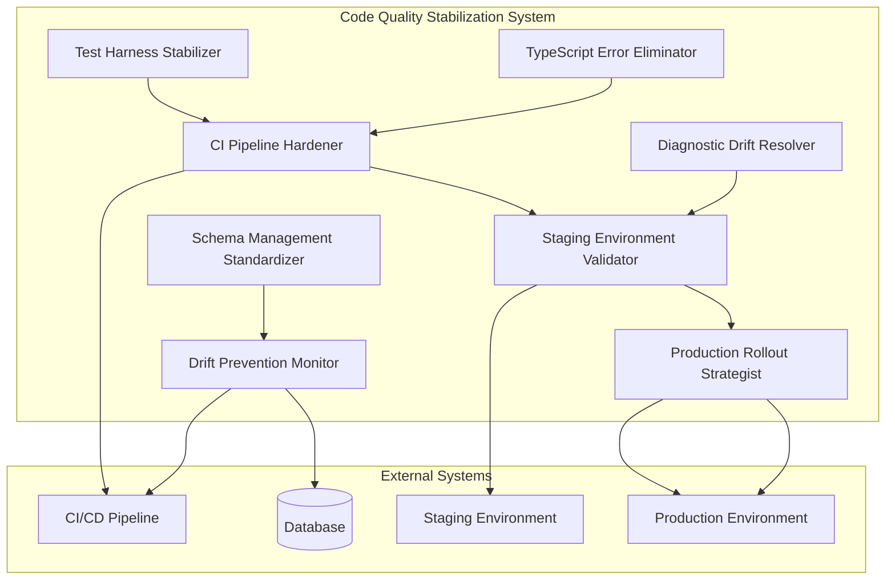

# Code Quality Stabilization Design

## Overview

The Code Quality Stabilization system addresses critical technical debt accumulated during the schema drift emergency response. This system provides a comprehensive approach to eliminate TypeScript errors, stabilize the test harness, resolve diagnostic issues, and implement robust CI/CD hardening to prevent future regressions.

The system is designed around eight core modules that work together to transform the codebase from its current state (~100+ TypeScript errors, 52 failing tests, 14 diagnostic issues) to a production-ready state with zero errors, reliable tests, and automated prevention of quality regressions.

## Architecture

### System Architecture



### Component Interaction Flow

1. **TypeScript Error Eliminator** processes source files to eliminate compilation errors
2. **Test Harness Stabilizer** fixes test infrastructure and ensures reliable test execution
3. **Diagnostic Drift Resolver** addresses specific diagnostic issues in critical files
4. **CI Pipeline Hardener** implements validation gates to prevent regression
5. **Staging Environment Validator** proves changes in staging before production
6. **Production Rollout Strategist** manages safe deployment with rollback capability
7. **Schema Management Standardizer** establishes standards for future changes
8. **Drift Prevention Monitor** provides ongoing monitoring and prevention

## Components and Interfaces

### TypeScript Error Eliminator

**Purpose:** Systematically eliminate TypeScript compilation errors across the codebase.

**Key Features:**

- Error prioritization by file churn and criticality
- Batch processing of related errors
- Progress tracking and reporting
- Allowlist management for unfixable errors

**Interface:**

```typescript
interface TypeScriptErrorEliminator {
  scanErrors(): Promise<TypeScriptError[]>;
  prioritizeErrors(errors: TypeScriptError[]): PrioritizedError[];
  fixErrorBatch(errors: PrioritizedError[]): Promise<FixResult>;
  validateFixes(): Promise<ValidationResult>;
  generateAllowlist(unfixableErrors: TypeScriptError[]): Allowlist;
}

interface TypeScriptError {
  file: string;
  line: number;
  column: number;
  code: string;
  message: string;
  severity: "error" | "warning";
  category: "type" | "syntax" | "import" | "lint";
}

interface PrioritizedError extends TypeScriptError {
  priority: number;
  churnScore: number;
  dependencies: string[];
}
```

### Test Harness Stabilizer

**Purpose:** Fix test infrastructure issues and ensure reliable test execution.

**Key Features:**

- Test failure analysis and categorization
- Setup/teardown procedure fixes
- Mock and fixture repairs
- Test stability validation

**Interface:**

```typescript
interface TestHarnessStabilizer {
  analyzeFailures(): Promise<TestFailure[]>;
  categorizeFailures(failures: TestFailure[]): CategorizedFailures;
  fixInfrastructure(): Promise<InfrastructureFixResult>;
  stabilizeTests(): Promise<StabilizationResult>;
  validateStability(): Promise<StabilityReport>;
}

interface TestFailure {
  testFile: string;
  testName: string;
  error: string;
  category: "setup" | "mock" | "fixture" | "assertion" | "timeout";
  frequency: number;
}

interface CategorizedFailures {
  setup: TestFailure[];
  mocks: TestFailure[];
  fixtures: TestFailure[];
  assertions: TestFailure[];
  timeouts: TestFailure[];
}
```

### Diagnostic Drift Resolver

**Purpose:** Resolve specific diagnostic issues in critical files, particularly vipPortalAdmin.ts.

**Key Features:**

- File-specific diagnostic analysis
- Type issue resolution
- Runtime safety validation
- Regression prevention

**Interface:**

```typescript
interface DiagnosticDriftResolver {
  scanDiagnostics(file: string): Promise<Diagnostic[]>;
  resolveDiagnostics(diagnostics: Diagnostic[]): Promise<ResolutionResult>;
  validateSafety(): Promise<SafetyReport>;
  preventRegression(): Promise<PreventionResult>;
}

interface Diagnostic {
  file: string;
  line: number;
  column: number;
  code: string;
  message: string;
  severity: "error" | "warning" | "info";
  source: "typescript" | "eslint" | "custom";
}
```

### CI Pipeline Hardener

**Purpose:** Implement robust CI validation to prevent quality regressions.

**Key Features:**

- TypeScript checking in CI
- Migration linting
- Schema drift prevention
- Quality gate enforcement

**Interface:**

```typescript
interface CIPipelineHardener {
  addTypeScriptChecking(): Promise<CIConfiguration>;
  implementMigrationLinting(): Promise<LintingConfiguration>;
  hardenSchemaDriftPrevention(): Promise<DriftPreventionConfig>;
  enforceQualityGates(): Promise<QualityGateConfig>;
}

interface CIConfiguration {
  workflows: WorkflowConfig[];
  checks: CheckConfig[];
  gates: GateConfig[];
}

interface MigrationLintRule {
  operation: "DROP" | "RENAME" | "MODIFY";
  severity: "error" | "warning";
  message: string;
  allowExceptions: boolean;
}
```

## Data Models

### Error Tracking Models

```typescript
interface ErrorReport {
  timestamp: Date;
  totalErrors: number;
  errorsByCategory: Record<string, number>;
  errorsByFile: Record<string, number>;
  prioritizedErrors: PrioritizedError[];
  fixProgress: FixProgress;
}

interface FixProgress {
  totalFixed: number;
  remainingErrors: number;
  allowlistedErrors: number;
  estimatedCompletion: Date;
}
```

### Test Stability Models

```typescript
interface TestStabilityReport {
  timestamp: Date;
  totalTests: number;
  passingTests: number;
  failingTests: number;
  skippedTests: number;
  flakiness: FlakinessMetrics;
  stabilityScore: number;
}

interface FlakinessMetrics {
  flakyTests: string[];
  stabilityPercentage: number;
  averageRunTime: number;
  timeoutRate: number;
}
```

### CI/CD Quality Models

```typescript
interface QualityGateStatus {
  typeScriptCheck: boolean;
  testExecution: boolean;
  schemaDriftCheck: boolean;
  migrationLinting: boolean;
  overallStatus: "pass" | "fail" | "warning";
}

interface DeploymentValidation {
  environment: "staging" | "production";
  schemaValidation: ValidationResult;
  smokeTests: SmokeTestResult[];
  rollbackPlan: RollbackPlan;
  approvalStatus: "pending" | "approved" | "rejected";
}
```

## Correctness Properties

_A property is a characteristic or behavior that should hold true across all valid executions of a system-essentially, a formal statement about what the system should do. Properties serve as the bridge between human-readable specifications and machine-verifiable correctness guarantees._

### Property Reflection

After reviewing all properties identified in the prework, I've identified several areas where properties can be consolidated or where redundancy exists:

**Consolidation Opportunities:**

- Properties 1, 5, and 11 all test command exit codes and error counts - these can be combined into comprehensive validation properties
- Properties 6, 8, and 9 all test test execution results - these can be combined into test stability properties
- Properties 15, 18, and 21 all test schema validation in different environments - these can be combined into environment validation properties
- Properties 12 and 17 both test CI blocking behavior - these can be combined into CI enforcement properties

**Redundancy Elimination:**

- Property 10 (vipPortalAdmin diagnostics) is subsumed by Property 1 (overall TypeScript errors) since diagnostics are part of TypeScript checking
- Property 20 (production schema validation) is redundant with Property 15 (staging schema validation) - they test the same validation logic in different environments

The consolidated properties below eliminate redundancy while maintaining comprehensive validation coverage.

### Property 1: TypeScript Compilation Success

_For any_ codebase state after error elimination, running `pnpm check` should return exit code 0 with no TypeScript errors, and the error count should be reduced from baseline (~100+) to 0 or documented allowlist.

**Validates: Requirements 1.1, 1.5, 3.1, 3.4**

### Property 2: CI TypeScript Enforcement

_For any_ code change that introduces TypeScript errors, the CI pipeline should block the change and prevent deployment with clear error messages.

**Validates: Requirements 1.4, 4.5**

### Property 3: Test Execution Stability

_For any_ test suite execution, running `pnpm test` should return exit code 0 with 0 failing tests (or documented skips), and tests should pass consistently across multiple runs, reducing failures from baseline (52) to 0 or documented skips.

**Validates: Requirements 2.1, 2.3, 2.4, 2.5**

### Property 4: VIP Portal Admin Functionality

_For any_ access to vipPortalAdmin leaderboard functionality, the system should return successful responses without runtime errors, ensuring JSON guards and defaults prevent crashes.

**Validates: Requirements 3.3, 3.5**

### Property 5: Schema Drift CI Prevention

_For any_ schema change that introduces drift, the CI workflow should block PRs and pushes, preventing deployment until drift is resolved.

**Validates: Requirements 4.1**

### Property 6: Migration Linting Enforcement

_For any_ migration file containing dangerous operations (DROP, RENAME, narrowing MODIFY), the migration linting system should block the migration and provide clear error messages.

**Validates: Requirements 4.2, 7.4**

### Property 7: CI Configuration Completeness

_For any_ CI pipeline configuration after hardening, the system should include TypeScript checking, schema validation, and migration linting steps.

**Validates: Requirements 4.3**

### Property 8: Environment Schema Validation

_For any_ environment (staging, production) after deployment, running schema validation should return 0 drift issues and confirm proper SSL/host configuration.

**Validates: Requirements 5.2, 5.3, 6.4**

### Property 9: Deployment Backup Procedures

_For any_ deployment to staging or production, the system should execute database backup procedures before applying changes.

**Validates: Requirements 5.1**

### Property 10: Smoke Test Validation

_For any_ environment after deployment, running smoke tests for critical flows (inventory alerts, vip portal, batches, purchase orders, returns, communications) should pass without errors.

**Validates: Requirements 5.4, 5.5, 6.5**

### Property 11: Deployment Process Consistency

_For any_ production deployment, the system should follow the same validation sequence as staging, ensuring process consistency.

**Validates: Requirements 6.3**

### Property 12: Migration Template Compliance

_For any_ new migration file, the system should use ADD/widen-only operations with MySQL version guards, DESCRIBE verification, and rollback stubs.

**Validates: Requirements 7.2, 7.3**

### Property 13: Database Configuration Centralization

_For any_ database utility or connection, the system should use centralized host guard and SSL defaults to prevent configuration drift.

**Validates: Requirements 8.2**

### Property 14: Drift Detection Response

_For any_ detected schema drift, the monitoring system should trigger alerts and blocking mechanisms with clear action plans.

**Validates: Requirements 8.3, 8.4**

## Error Handling

### TypeScript Error Handling

```typescript
class TypeScriptErrorHandler {
  async handleCompilationErrors(errors: TypeScriptError[]): Promise<void> {
    try {
      const prioritized = this.prioritizeErrors(errors);
      const batches = this.createFixBatches(prioritized);

      for (const batch of batches) {
        await this.processBatch(batch);
      }
    } catch (error) {
      throw new CodeQualityError("TypeScript error elimination failed", {
        cause: error,
        context: { errorCount: errors.length },
      });
    }
  }

  private prioritizeErrors(errors: TypeScriptError[]): PrioritizedError[] {
    return errors
      .map(error => ({
        ...error,
        priority: this.calculatePriority(error),
        churnScore: this.getFileChurnScore(error.file),
      }))
      .sort((a, b) => b.priority - a.priority);
  }
}
```

### Test Failure Handling

```typescript
class TestFailureHandler {
  async handleTestFailures(failures: TestFailure[]): Promise<void> {
    const categorized = this.categorizeFailures(failures);

    // Fix infrastructure issues first
    if (categorized.setup.length > 0) {
      await this.fixSetupIssues(categorized.setup);
    }

    // Fix mocks and fixtures
    if (categorized.mocks.length > 0) {
      await this.fixMockIssues(categorized.mocks);
    }

    // Validate fixes
    const validation = await this.validateFixes();
    if (!validation.success) {
      throw new TestStabilityError("Test stabilization failed", {
        cause: validation.error,
        remainingFailures: validation.remainingFailures,
      });
    }
  }
}
```

### CI Pipeline Error Handling

```typescript
class CIPipelineErrorHandler {
  async handlePipelineFailures(failure: PipelineFailure): Promise<void> {
    switch (failure.type) {
      case "typescript":
        await this.handleTypeScriptFailure(failure);
        break;
      case "schema-drift":
        await this.handleSchemaDriftFailure(failure);
        break;
      case "migration-lint":
        await this.handleMigrationLintFailure(failure);
        break;
      default:
        throw new CIPipelineError(
          `Unknown pipeline failure type: ${failure.type}`,
          { failure }
        );
    }
  }

  private async handleTypeScriptFailure(
    failure: PipelineFailure
  ): Promise<void> {
    const errors = await this.extractTypeScriptErrors(failure.output);
    throw new TypeScriptValidationError("TypeScript validation failed in CI", {
      errors,
      suggestion: "Run `pnpm check` locally to fix errors before pushing",
    });
  }
}
```

## Testing Strategy

### Dual Testing Approach

The Code Quality Stabilization system requires both unit testing and property-based testing:

**Unit Tests:**

- Test specific error fixing algorithms
- Test CI configuration generation
- Test diagnostic resolution logic
- Test deployment validation procedures

**Property-Based Tests:**

- Verify error elimination properties across various codebases
- Test CI enforcement across different types of violations
- Validate deployment consistency across environments
- Test drift detection across various schema changes

### Property-Based Testing Requirements

The system uses **fast-check** for property-based testing with a minimum of 100 iterations per property. Each property-based test is tagged with a comment referencing the design document property:

```typescript
// **Feature: code-quality-stabilization, Property 1: TypeScript Compilation Success**
test("TypeScript compilation should succeed after error elimination", () => {
  fc.assert(
    fc.property(
      fc.array(
        fc.record({
          file: fc.string(),
          errors: fc.array(typeScriptErrorArbitrary),
        })
      ),
      async codebaseStates => {
        for (const state of codebaseStates) {
          const eliminator = new TypeScriptErrorEliminator();
          await eliminator.eliminateErrors(state.errors);

          const result = await runTypeScriptCheck();
          expect(result.exitCode).toBe(0);
          expect(result.errors).toHaveLength(0);
        }
      }
    ),
    { numRuns: 100 }
  );
});
```

### Unit Testing Requirements

Unit tests focus on specific components and integration points:

```typescript
describe("TypeScriptErrorEliminator", () => {
  it("should prioritize high-churn files", () => {
    const errors = [
      { file: "low-churn.ts", line: 1, message: "error" },
      { file: "high-churn.ts", line: 1, message: "error" },
    ];

    const eliminator = new TypeScriptErrorEliminator();
    const prioritized = eliminator.prioritizeErrors(errors);

    expect(prioritized[0].file).toBe("high-churn.ts");
  });
});
```

### Integration Testing

Integration tests verify end-to-end workflows:

```typescript
describe("Code Quality Stabilization Workflow", () => {
  it("should complete full stabilization process", async () => {
    // Setup test environment with known issues
    await setupTestEnvironment({
      typeScriptErrors: 50,
      testFailures: 20,
      diagnosticIssues: 5,
    });

    // Run stabilization
    const stabilizer = new CodeQualityStabilizer();
    const result = await stabilizer.stabilize();

    // Verify results
    expect(result.typeScriptErrors).toBe(0);
    expect(result.testFailures).toBe(0);
    expect(result.diagnosticIssues).toBe(0);
    expect(result.ciHardened).toBe(true);
  });
});
```

### Testing Configuration

The testing strategy requires specific configuration in the design document:

- **Property-based testing library:** fast-check
- **Minimum iterations per property:** 100
- **Property test tagging format:** `**Feature: code-quality-stabilization, Property {number}: {property_text}**`
- **Coverage requirements:** >80% for all stabilization components
- **Test environment:** Isolated test database and CI environment for validation
