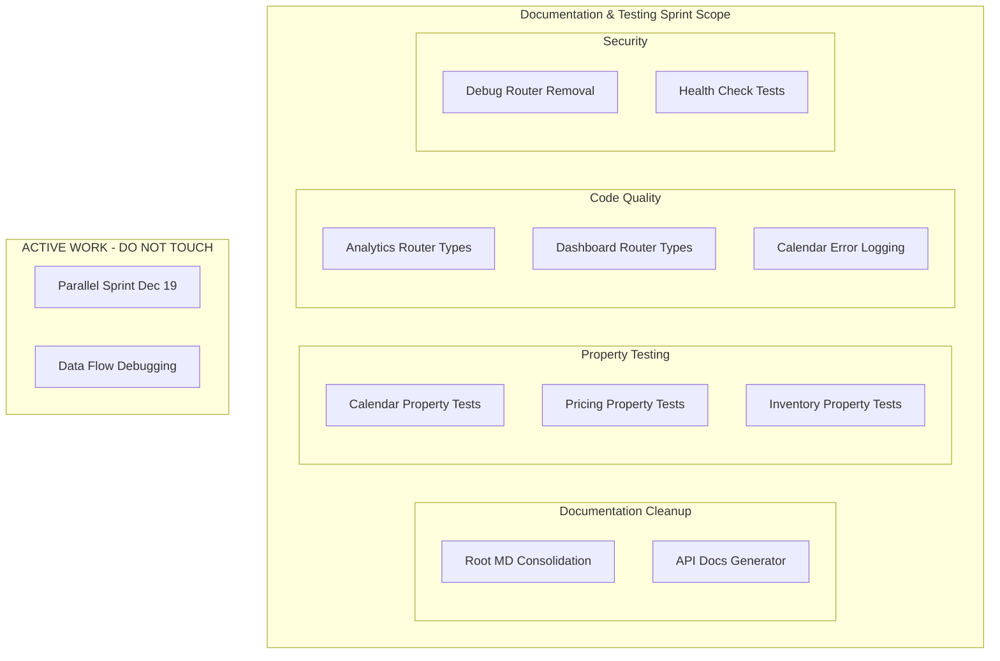

# Design Document: Documentation & Testing Sprint (Dec 19, 2025)

## Overview

This design document outlines the implementation approach for a documentation and testing sprint that can run safely alongside:
- **Parallel Sprint Dec 19** (2 agents on UX/Code Quality)
- **Active data flow debugging** (orders, ordersDb, data integrity)

The sprint focuses on documentation cleanup, property-based testing expansion, and infrastructure hardening in completely isolated modules.

**Sprint Duration:** 1-2 days
**Total Effort:** ~17 hours
**Parallelization:** 3 agents can work simultaneously

### Module Isolation Strategy

| Active Work (DO NOT TOUCH) | This Sprint (SAFE) |
|---------------------------|-------------------|
| `server/routers/comments.ts` | `server/routers/calendar*.ts` |
| `server/routers/todoTasks.ts` | `server/routers/analytics.ts` |
| `server/routers/vipPortal*.ts` | `server/routers/dashboard*.ts` |
| `server/todoTasksDb.ts` | `server/routers/pricing.ts` |
| `client/src/pages/ClientsListPage.tsx` | `server/routers/inventory.ts` |
| `client/src/pages/accounting/*.tsx` | `server/routers/monitoring.ts` |
| `client/src/components/widgets-v2/*` | `server/routers/debug.ts` |
| `client/src/components/layout/*` | Root `*.md` files |
| `server/ordersDb.ts` (data debugging) | `docs/` directory |
| `server/routers/orders.ts` (data debugging) | `scripts/` directory |

## Architecture

### Component Diagram



## Components and Interfaces

### 1. Root Documentation Consolidation

**Files to Archive:**
```
Root directory → docs/archive/legacy-reports/
├── AGENT_COMPLETION_REPORT_2025-11-14.md
├── AGENT_EXECUTION_PROMPTS.md
├── AGENT_EXECUTION_PROMPTS_V2.md
├── AI_AGENT_HANDOFF_DEPLOYMENT_ISSUE.md
├── BATCH2-QUICK-START.md
├── BETA-READINESS-ACTION-PLAN.md
├── ... (50+ files to archive)
```

**Files to Keep in Root:**
- README.md
- CHANGELOG.md
- DEPLOY.md
- .env.example files

### 2. Calendar Property Tests

**New File:** `server/routers/calendar.property.test.ts`

```typescript
// Property 1: Date range validity
// For any event, end date must be >= start date

// Property 2: Recurring event count
// For any recurring event with N occurrences, generating should produce exactly N events

// Property 3: Overlap detection
// For any two events, overlap detection should be symmetric

// Property 4: Timezone preservation
// For any event, converting to UTC and back should preserve the original time
```

### 3. Pricing Property Tests

**New File:** `server/routers/pricing.property.test.ts`

```typescript
// Property 1: Non-negative margins
// For any valid COGS and price, margin should be >= 0

// Property 2: Discount bounds
// For any discount, final price should be <= original price

// Property 3: COGS adjustment consistency
// For any COGS adjustment, recalculating should produce same result

// Property 4: Tier selection
// For any quantity, exactly one tier should match
```

### 4. Inventory Property Tests

**New File:** `server/routers/inventory.property.test.ts`

```typescript
// Property 1: Allocation bounds
// For any allocation, allocated <= available

// Property 2: Status transitions
// For any batch, only valid status transitions should succeed

// Property 3: Quantity invariants
// For any batch, onHand >= reserved + quarantine + hold

// Property 4: Transfer zero-sum
// For any transfer, source decrease == destination increase
```

### 5. Debug Router Removal

**Files to Modify:**
- `server/routers/debug.ts` - Wrap in DEV conditional or remove
- `server/routers.ts` - Conditionally register debug router

**Approach:**
```typescript
// server/routers.ts
import { debugRouter } from "./routers/debug";

export const appRouter = router({
  // ... other routers
  
  // Only include debug router in development
  ...(process.env.NODE_ENV !== 'production' && { debug: debugRouter }),
});
```

### 6. Analytics Router Types

**File:** `server/routers/analytics.ts`

**Pattern:**
```typescript
// Add explicit return types
interface AnalyticsMetrics {
  revenue: number;
  orders: number;
  avgOrderValue: number;
  // ...
}

// Add Zod schemas for inputs
const dateRangeSchema = z.object({
  startDate: z.string().datetime(),
  endDate: z.string().datetime(),
});
```

### 7. Dashboard Router Types

**Files:** `server/routers/dashboard.ts`, `server/routers/dashboardEnhanced.ts`

Same pattern as Analytics Router Types.

### 8. API Documentation Generator

**New File:** `scripts/generate-api-docs.ts`

```typescript
// Scan all routers in server/routers/
// Extract procedure names, input schemas, return types
// Generate markdown documentation
// Output to docs/api/
```

### 9. Health Check Tests

**New File:** `server/routers/monitoring.test.ts`

```typescript
describe('Health Check Endpoint', () => {
  it('should return database connectivity status');
  it('should return response time metrics');
  it('should report degraded status when dependency down');
  it('should return 200 OK when all healthy');
});
```

### 10. Calendar Error Logging

**Files to Modify:**
- `server/routers/calendar.ts`
- `server/routers/calendarFinancials.ts`
- `server/routers/calendarInvitations.ts`
- `server/routers/calendarMeetings.ts`
- `server/routers/calendarParticipants.ts`
- `server/routers/calendarRecurrence.ts`
- `server/routers/calendarReminders.ts`
- `server/routers/calendarViews.ts`

**Pattern:**
```typescript
import { logger } from '../_core/logger';

// Replace console.error with:
logger.error({
  operation: 'calendar.createEvent',
  userId: ctx.user?.id,
  eventId: input.id,
  error: error.message,
}, 'Calendar operation failed');
```

## Correctness Properties

*A property is a characteristic or behavior that should hold true across all valid executions of a system.*

### Property 1: Calendar date range validity
*For any* calendar event, the end date should be greater than or equal to the start date.
**Validates: Requirements 2.1**

### Property 2: Recurring event occurrence count
*For any* recurring event with a specified count, generating occurrences should produce exactly that count.
**Validates: Requirements 2.2**

### Property 3: Event overlap symmetry
*For any* two events A and B, if A overlaps B then B overlaps A.
**Validates: Requirements 2.3**

### Property 4: Timezone round-trip preservation
*For any* event time, converting to UTC and back to local should preserve the original time.
**Validates: Requirements 2.4**

### Property 5: Margin non-negativity
*For any* valid COGS and selling price where price >= COGS, the calculated margin should be non-negative.
**Validates: Requirements 3.1**

### Property 6: Discount upper bound
*For any* discount applied to a price, the final price should never exceed the original price.
**Validates: Requirements 3.2**

### Property 7: COGS adjustment idempotence
*For any* COGS adjustment calculation, applying the same adjustment twice should produce the same result as applying once.
**Validates: Requirements 3.3**

### Property 8: Tier selection uniqueness
*For any* quantity, exactly one pricing tier should match (no gaps, no overlaps).
**Validates: Requirements 3.4**

### Property 9: Allocation bounds
*For any* inventory allocation request, the allocated quantity should never exceed available stock.
**Validates: Requirements 4.1**

### Property 10: Batch status transition validity
*For any* batch status change, only valid transitions should succeed (e.g., AWAITING_INTAKE → LIVE is valid, CLOSED → LIVE is not).
**Validates: Requirements 4.2**

### Property 11: Quantity invariant preservation
*For any* batch, the on-hand quantity should always be >= reserved + quarantine + hold quantities.
**Validates: Requirements 4.3**

### Property 12: Transfer zero-sum
*For any* inventory transfer between locations, the decrease at source should equal the increase at destination.
**Validates: Requirements 4.4**

## Error Handling

### Logging Pattern
- Use Pino logger for all error logging
- Include structured context (userId, operation, entityId)
- Mask PII fields (email, phone, address)

### Test Error Handling
- Property tests should handle edge cases gracefully
- Invalid inputs should throw appropriate errors
- Error messages should be user-friendly

## Testing Strategy

### Property-Based Testing
- Use fast-check library
- Minimum 100 iterations per property
- Tag each test with: `**Feature: documentation-testing-sprint-dec19, Property {N}: {description}**`

### Unit Testing
- Health check endpoint tests
- API documentation generator tests

### Test File Locations
```
server/routers/calendar.property.test.ts
server/routers/pricing.property.test.ts
server/routers/inventory.property.test.ts
server/routers/monitoring.test.ts
scripts/generate-api-docs.test.ts
```
