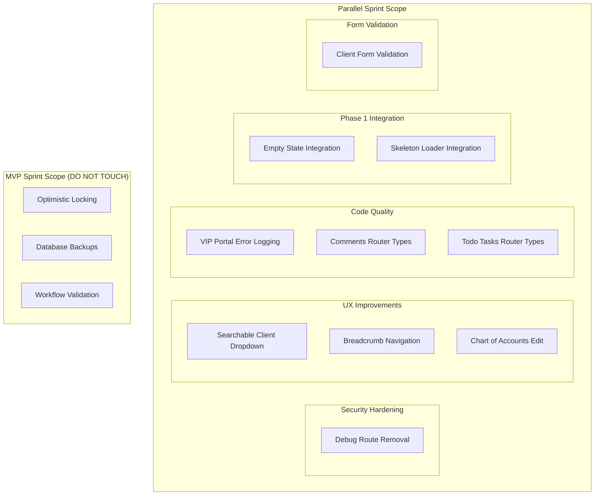

# Design Document: Parallel Sprint (Dec 19, 2025)

## Overview

This design document outlines the implementation approach for a parallel sprint that can run safely alongside the MVP Sprint (Phases 2-3). The sprint focuses on code quality improvements, security hardening, and UX enhancements in modules that are isolated from the MVP's data integrity and workflow validation work.

**Sprint Duration:** 2-3 days
**Total Effort:** ~18.5 hours
**Parallelization:** 2 agents can work simultaneously

### Module Isolation Strategy

To ensure no conflicts with MVP Sprint work:

| MVP Sprint (Phases 2-3) | Parallel Sprint |
|------------------------|-----------------|
| `server/ordersDb.ts` (optimistic locking) | `server/routers/comments.ts` |
| `server/routers/orders.ts` (workflow validation) | `server/routers/todoTasks.ts` |
| `server/_core/optimisticLocking.ts` | `server/routers/vipPortal*.ts` |
| `scripts/backup-database.sh` | `client/src/components/widgets-v2/` |
| Workflow validation scripts | `client/src/pages/accounting/` |

## Architecture

### Component Diagram



## Components and Interfaces

### 1. Debug Route Removal (BUG-011)

**Files to Modify:**
- `client/src/App.tsx` - Remove `/orders-debug` route
- `server/routers/orders.ts` - Remove `testEndpoint` if exists

**Approach:**
- Conditionally render debug routes based on `import.meta.env.DEV`
- Remove any server-side debug endpoints

### 2. Searchable Client Dropdown (UX-013)

**New Component:** `client/src/components/ui/client-combobox.tsx`

```typescript
interface ClientComboboxProps {
  value?: number;
  onChange: (clientId: number | undefined) => void;
  placeholder?: string;
  disabled?: boolean;
}
```

**Implementation:**
- Use shadcn/ui Combobox pattern
- Debounced search (300ms)
- Virtual scrolling for large lists
- Keyboard navigation support

### 3. Breadcrumb Navigation (UX-009)

**Integration Points:**
- `client/src/components/layout/AppShell.tsx`
- Route configuration in `client/src/App.tsx`

**Breadcrumb Configuration:**
```typescript
interface BreadcrumbConfig {
  path: string;
  label: string;
  parent?: string;
}

const breadcrumbMap: Record<string, BreadcrumbConfig> = {
  '/': { path: '/', label: 'Home' },
  '/clients': { path: '/clients', label: 'Clients', parent: '/' },
  '/clients/:id': { path: '/clients/:id', label: 'Client Details', parent: '/clients' },
  // ... etc
};
```

### 4. Chart of Accounts Edit (UX-014)

**Files to Modify:**
- `client/src/pages/accounting/ChartOfAccounts.tsx`

**Implementation:**
- Add edit button to each row
- Create/reuse edit modal component
- Wire up to existing `accounting.updateAccount` mutation

### 5. VIP Portal Error Logging (QUAL-001 subset)

**Files to Modify:**
- `server/routers/vipPortal.ts`
- `server/routers/vipPortalAdmin.ts`
- `server/routers/vipPortalAuth.ts`

**Logging Pattern:**
```typescript
import { logger } from '../_core/logger';

// Replace console.error with:
logger.error({
  operation: 'vipPortal.getProfile',
  userId: ctx.user?.id,
  sessionId: ctx.session?.id,
  error: error.message,
  stack: error.stack,
}, 'VIP Portal operation failed');
```

### 6-7. TypeScript Type Fixes

**Files to Modify:**
- `server/routers/comments.ts`
- `server/routers/todoTasks.ts`
- `server/todoTasksDb.ts`

**Pattern:**
```typescript
// Before
const result = await db.query.comments.findMany();

// After
const result: Comment[] = await db.query.comments.findMany();
```

### 8. Empty State Integration

**Files to Modify:**
- `client/src/components/widgets-v2/*.tsx`

**Pattern:**
```typescript
import { EmptyState } from '@/components/ui/empty-state';

// In widget render:
if (!data || data.length === 0) {
  return (
    <EmptyState
      icon={<IconName />}
      title="No data yet"
      description="Create your first item to get started"
      action={<Button>Create</Button>}
    />
  );
}
```

### 9. Skeleton Loader Integration

**Files to Modify:**
- `client/src/pages/ClientsListPage.tsx`
- `client/src/pages/accounting/Invoices.tsx`
- Other list pages as time permits

**Pattern:**
```typescript
import { TableSkeleton } from '@/components/ui/skeleton-loaders';

// In page render:
if (isLoading) {
  return <TableSkeleton rows={10} columns={5} />;
}
```

### 10. Client Form Validation

**Files to Modify:**
- `client/src/pages/ClientsListPage.tsx` (client creation modal)

**Validation Schema:**
```typescript
const clientFormSchema = z.object({
  name: z.string().min(1, 'Name is required'),
  email: z.string().email('Invalid email format').optional().or(z.literal('')),
  phone: z.string().regex(/^\+?[\d\s-()]+$/, 'Invalid phone format').optional().or(z.literal('')),
  // ... other fields
});
```

## Data Models

No new database tables required. This sprint focuses on frontend components and code quality improvements.

## Correctness Properties

*A property is a characteristic or behavior that should hold true across all valid executions of a system-essentially, a formal statement about what the system should do. Properties serve as the bridge between human-readable specifications and machine-verifiable correctness guarantees.*

### Property 1: Client search filtering returns matching results
*For any* search string and client list, all returned clients should contain the search string (case-insensitive) in their name.
**Validates: Requirements 2.2**

### Property 2: Search result pagination limits visible items
*For any* search result set with more than 10 items, the initially visible list should contain exactly 10 items.
**Validates: Requirements 2.3**

### Property 3: Breadcrumb path reflects current route
*For any* valid route in the application, the breadcrumb should display a path that matches the route hierarchy.
**Validates: Requirements 3.1**

### Property 4: Breadcrumb navigation is functional
*For any* breadcrumb item clicked, the application should navigate to the corresponding route.
**Validates: Requirements 3.2**

### Property 5: Deep breadcrumb paths are collapsed
*For any* route path with more than 4 levels, the breadcrumb should display collapsed middle items with an ellipsis.
**Validates: Requirements 3.3**

### Property 6: Edit button exists for all accounts
*For any* account displayed in the Chart of Accounts list, an edit button should be present and clickable.
**Validates: Requirements 4.1**

### Property 7: Account edit persistence
*For any* account edit operation that completes successfully, the account data should reflect the changes when queried.
**Validates: Requirements 4.3**

### Property 8: Cancel edit preserves original data
*For any* account edit operation that is cancelled, the original account data should remain unchanged.
**Validates: Requirements 4.4**

### Property 9: Structured error logging with required fields and PII masking
*For any* error logged in VIP Portal routers, the log entry should contain userId, sessionId, operation name, and any PII fields should be masked.
**Validates: Requirements 5.1, 5.2, 5.4**

### Property 10: Empty state renders for empty data
*For any* dashboard widget with no data, the EmptyState component should be rendered instead of an empty container.
**Validates: Requirements 8.1**

### Property 11: Empty state replaced when data loads
*For any* dashboard widget that transitions from empty to having data, the EmptyState component should be replaced with actual content.
**Validates: Requirements 8.4**

### Property 12: Skeleton loaders during loading state
*For any* list page in loading state, skeleton loaders should be displayed.
**Validates: Requirements 9.1**

### Property 13: Skeletons replaced after loading
*For any* list page that finishes loading, skeleton loaders should be replaced with actual content.
**Validates: Requirements 9.2**

### Property 14: Error state replaces skeletons on failure
*For any* list page that encounters a loading error, an error state should be displayed instead of skeletons.
**Validates: Requirements 9.3**

### Property 15: Email validation rejects invalid formats
*For any* string that is not a valid email format, the email input should display a validation error.
**Validates: Requirements 10.1**

### Property 16: Required field validation
*For any* required field that is empty, the form should display a validation error and highlight the field.
**Validates: Requirements 10.2**

### Property 17: Phone validation rejects invalid formats
*For any* string that is not a valid phone format, the phone input should display a validation error.
**Validates: Requirements 10.3**

### Property 18: Submit enabled when all validations pass
*For any* form state where all fields pass validation, the submit button should be enabled.
**Validates: Requirements 10.4**

## Error Handling

### Frontend Error Handling
- Use React Error Boundaries for component-level errors
- Display user-friendly error messages via toast notifications
- Log errors to console in development, to Sentry in production

### Backend Error Handling
- Use TRPCError for all API errors
- Include error context (operation, user, input) in logs
- Mask PII in error logs

## Testing Strategy

### Dual Testing Approach

**Unit Tests:**
- Test individual validation functions
- Test breadcrumb path generation
- Test search filtering logic
- Test PII masking utilities

**Property-Based Tests:**
- Use fast-check library for property-based testing
- Minimum 100 iterations per property
- Tag each test with: `**Feature: parallel-sprint-dec19, Property {number}: {property_text}**`

### Test File Locations
```
server/routers/comments.test.ts
server/routers/todoTasks.test.ts
server/routers/vipPortal.test.ts
client/src/components/ui/client-combobox.test.tsx
client/src/components/layout/Breadcrumb.test.tsx
client/src/pages/accounting/ChartOfAccounts.test.tsx
```

### Coverage Requirements
- Code quality fixes (Req 5-7): 80%+ coverage
- UI components (Req 2-4, 8-10): 70%+ coverage
- Security fixes (Req 1): Integration test coverage

