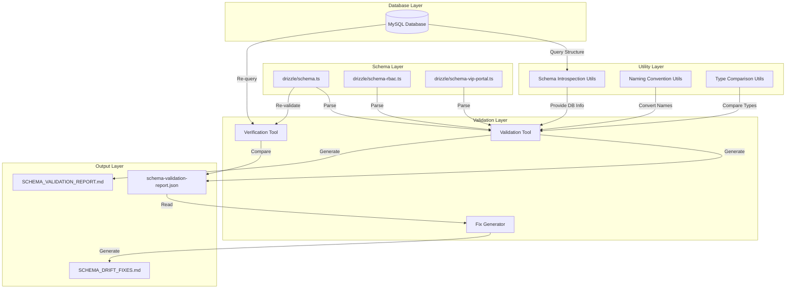
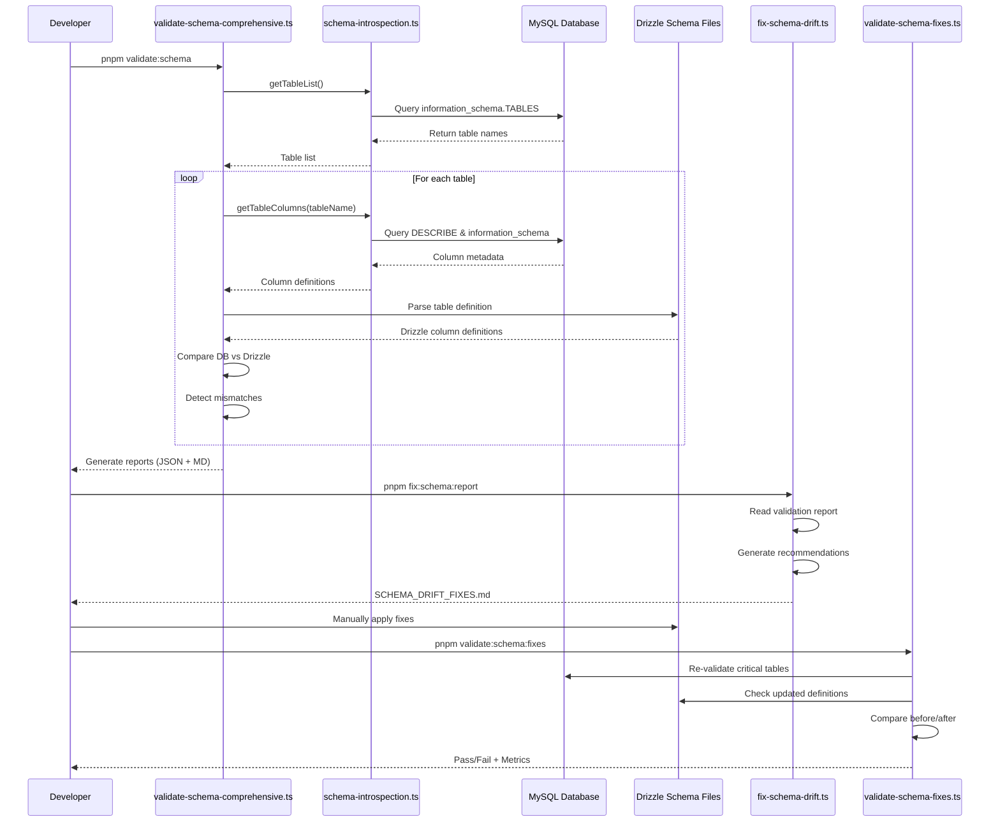

# Schema Validation System - Design Document

## Overview

The Schema Validation System is a comprehensive toolset for detecting, reporting, and fixing schema drift between Drizzle ORM schema definitions and the actual MySQL database structure. The system follows a database-first approach, treating the production database as the source of truth and recommending changes to Drizzle schema files to match reality.

The system consists of three main components:

1. **Validation Tool** - Introspects database and compares with Drizzle schemas
2. **Fix Generator** - Analyzes validation reports and generates fix recommendations
3. **Verification Tool** - Confirms that fixes were applied correctly

## Architecture

### High-Level Architecture



### Component Interaction Flow



## Components and Interfaces

### 1. Schema Introspection Utilities (`scripts/utils/schema-introspection.ts`)

**Purpose**: Provide reusable functions for querying database structure.

**Exports**:

```typescript
// Database introspection
export async function getTableList(db: MySql2Database): Promise<string[]>;
export async function getTableColumns(
  db: MySql2Database,
  tableName: string
): Promise<ColumnMetadata[]>;
export async function getEnumValues(
  db: MySql2Database,
  tableName: string,
  columnName: string
): Promise<string[]>;
export async function getForeignKeys(
  db: MySql2Database,
  tableName: string
): Promise<ForeignKeyMetadata[]>;
export async function getIndexes(
  db: MySql2Database,
  tableName: string
): Promise<IndexMetadata[]>;

// Naming convention utilities
export function camelToSnake(str: string): string;
export function snakeToCamel(str: string): string;

// Type comparison utilities
export function normalizeDataType(
  mysqlType: string,
  drizzleType: string
): { normalized: string; match: boolean };
export function compareColumnDefinitions(
  dbColumn: ColumnMetadata,
  schemaColumn: SchemaColumn
): ColumnDiff;
```

### 2. Validation Tool (`scripts/validate-schema-comprehensive.ts`)

**Purpose**: Main validation orchestrator that compares database with Drizzle schemas.

**Key Functions**:

```typescript
async function validateSchema(): Promise<ValidationReport>;
async function introspectDatabase(): Promise<DatabaseSchema>;
async function parseDrizzleSchemas(): Promise<DrizzleSchema>;
function compareSchemas(
  dbSchema: DatabaseSchema,
  drizzleSchema: DrizzleSchema
): ValidationIssue[];
function prioritizeIssues(issues: ValidationIssue[]): PrioritizedIssues;
function generateReports(issues: PrioritizedIssues): void;
```

**Execution Flow**:

1. Connect to database
2. Introspect all tables and columns
3. Parse all three Drizzle schema files
4. Compare database structure with Drizzle definitions
5. Prioritize issues (critical tables first)
6. Generate JSON and Markdown reports
7. Display color-coded console summary

### 3. Fix Generator (`scripts/fix-schema-drift.ts`)

**Purpose**: Read validation reports and generate actionable fix recommendations.

**Key Functions**:

```typescript
async function generateFixes(): Promise<void>;
function readValidationReport(): ValidationReport;
function prioritizeCriticalTables(report: ValidationReport): ValidationIssue[];
function generateFixRecommendation(issue: ValidationIssue): FixRecommendation;
function formatFixAsMarkdown(fixes: FixRecommendation[]): string;
```

**Output Format**:

- Summary of issues by table
- Before/after code examples
- Priority levels (Critical, High, Medium, Low)
- Implementation checklist

### 4. Verification Tool (`scripts/validate-schema-fixes.ts`)

**Purpose**: Verify that schema fixes were applied correctly.

**Key Functions**:

```typescript
async function verifyFixes(): Promise<VerificationResult>;
function loadPreviousReport(): ValidationReport | null;
function validateCriticalTables(): ValidationIssue[];
function compareBeforeAfter(
  before: ValidationReport,
  after: ValidationReport
): ImprovementMetrics;
function generateVerificationReport(result: VerificationResult): void;
```

**Exit Codes**:

- `0`: All critical tables pass validation
- `1`: Critical issues remain

## Data Models

### Core Data Structures

```typescript
// Column metadata from database
interface ColumnMetadata {
  columnName: string;
  dataType: string;
  isNullable: boolean;
  columnDefault: string | null;
  columnKey: "PRI" | "UNI" | "MUL" | "";
  extra: string; // e.g., 'auto_increment'
  columnType: string; // Full type with length/enum values
}

// Foreign key metadata
interface ForeignKeyMetadata {
  constraintName: string;
  columnName: string;
  referencedTableName: string;
  referencedColumnName: string;
}

// Index metadata
interface IndexMetadata {
  indexName: string;
  columnName: string;
  nonUnique: boolean;
  seqInIndex: number;
}

// Drizzle schema column
interface SchemaColumn {
  name: string;
  type: string;
  notNull: boolean;
  default: any;
  references: {
    table: string;
    column: string;
  } | null;
  enumValues: string[] | null;
}

// Validation issue
interface ValidationIssue {
  table: string;
  severity: "Critical" | "High" | "Medium" | "Low";
  category:
    | "ColumnName"
    | "DataType"
    | "Enum"
    | "Nullable"
    | "Default"
    | "ForeignKey"
    | "Missing"
    | "Extra";
  column: string;
  dbValue: any;
  drizzleValue: any;
  description: string;
}

// Validation report
interface ValidationReport {
  timestamp: string;
  totalTables: number;
  totalColumns: number;
  totalIssues: number;
  issuesBySeverity: {
    Critical: number;
    High: number;
    Medium: number;
    Low: number;
  };
  criticalTables: {
    [tableName: string]: ValidationIssue[];
  };
  allIssues: ValidationIssue[];
}

// Fix recommendation
interface FixRecommendation {
  table: string;
  issue: ValidationIssue;
  currentCode: string;
  recommendedCode: string;
  explanation: string;
  priority: "Critical" | "High" | "Medium" | "Low";
}

// Verification result
interface VerificationResult {
  passed: boolean;
  criticalTables: string[];
  issuesBefore: number;
  issuesAfter: number;
  issuesResolved: number;
  percentageImprovement: number;
  remainingIssues: ValidationIssue[];
}

// Column comparison diff
interface ColumnDiff {
  hasNameMismatch: boolean;
  hasTypeMismatch: boolean;
  hasNullableMismatch: boolean;
  hasDefaultMismatch: boolean;
  hasEnumMismatch: boolean;
  hasForeignKeyMismatch: boolean;
  details: string[];
}
```

### Critical Tables Configuration

```typescript
const CRITICAL_TABLES = [
  "inventory_movements", // or 'inventoryMovements' depending on schema
  "order_status_history",
  "invoices",
  "ledger_entries",
  "payments",
  "client_activity",
] as const;

type CriticalTable = (typeof CRITICAL_TABLES)[number];
```

## Correctness Properties

_A property is a characteristic or behavior that should hold true across all valid executions of a system-essentially, a formal statement about what the system should do. Properties serve as the bridge between human-readable specifications and machine-verifiable correctness guarantees._

### Property 1: Complete Table Discovery

_For any_ database state, querying information_schema.TABLES should return all tables that exist in the database, with no duplicates or omissions.
**Validates: Requirements 1.1**

### Property 2: Complete Column Metadata Extraction

_For any_ table in the database, querying its columns should return complete metadata including column name, data type, nullable status, default value, and key type for every column.
**Validates: Requirements 1.2**

### Property 3: Enum Value Extraction Completeness

_For any_ column with ENUM type, parsing the COLUMN_TYPE field should extract all valid enum values with no duplicates or omissions.
**Validates: Requirements 1.3**

### Property 4: Foreign Key Discovery Completeness

_For any_ table with foreign key constraints, querying information_schema.KEY_COLUMN_USAGE should return all foreign key relationships.
**Validates: Requirements 1.4**

### Property 5: Index Discovery Completeness

_For any_ table with indexes, querying information_schema.STATISTICS should return all index definitions.
**Validates: Requirements 1.5**

### Property 6: Schema Parsing Completeness

_For any_ valid Drizzle schema file, parsing should extract all table definitions present in the file.
**Validates: Requirements 2.1**

### Property 7: Column Definition Extraction Completeness

_For any_ column definition in a Drizzle schema, extraction should identify all metadata fields (name, type, nullable, default, references).
**Validates: Requirements 2.2**

### Property 8: CamelCase to Snake_case Conversion Consistency

_For any_ camelCase string, converting to snake_case should follow consistent rules (e.g., invoiceNumber → invoice_number, userId → user_id).
**Validates: Requirements 2.3, 7.1**

### Property 9: Snake_case Preservation

_For any_ snake_case string, it should remain unchanged when processed for database comparison.
**Validates: Requirements 2.4**

### Property 10: Enum Parsing Completeness

_For any_ enum definition in Drizzle schema, all enum values should be extracted.
**Validates: Requirements 2.5**

### Property 11: Column Name Mismatch Detection

_For any_ pair of column names where one is camelCase and one is snake_case, the system should correctly determine if they represent the same column after normalization.
**Validates: Requirements 3.1, 7.3**

### Property 12: Data Type Equivalence Detection

_For any_ pair of type definitions (MySQL and Drizzle), the system should correctly determine if they represent equivalent types after normalization (e.g., int(11) ≡ int, varchar(255) ≡ varchar({ length: 255 })).
**Validates: Requirements 3.2**

### Property 13: Enum Set Difference Detection

_For any_ two sets of enum values, the system should detect all missing, extra, or mismatched values.
**Validates: Requirements 3.3**

### Property 14: Nullable Constraint Matching

_For any_ column, the system should detect if NOT NULL in database matches .notNull() in Drizzle.
**Validates: Requirements 3.4**

### Property 15: Default Value Matching

_For any_ column with a default value, the system should detect if database default matches Drizzle default.
**Validates: Requirements 3.5**

### Property 16: Foreign Key Constraint Matching

_For any_ foreign key, the system should detect if database constraint matches .references() in Drizzle.
**Validates: Requirements 3.6**

### Property 17: Critical Table Prioritization

_For any_ validation report, the six critical tables should be prioritized (appear first or marked as high priority).
**Validates: Requirements 4.1**

### Property 18: Severity Assignment Consistency

_For any_ detected issue, a severity level should be assigned based on consistent rules (e.g., critical tables → Critical severity, type mismatches → High severity).
**Validates: Requirements 4.2**

### Property 19: JSON Report Validity

_For any_ validation run, the generated JSON file should be valid JSON and parseable.
**Validates: Requirements 4.3**

### Property 20: Markdown Report Generation

_For any_ validation run, a markdown file should be generated with all required sections.
**Validates: Requirements 4.4**

### Property 21: Validation Report Parsing Completeness

_For any_ validation report, parsing should extract all detected issues with no omissions.
**Validates: Requirements 5.1**

### Property 22: Fix Recommendation Prioritization

_For any_ fix report, critical tables should appear before non-critical tables.
**Validates: Requirements 5.2**

### Property 23: Column Name Fix Correctness

_For any_ column name mismatch, the recommended Drizzle definition should match the database column name after normalization.
**Validates: Requirements 5.3**

### Property 24: Data Type Fix Correctness

_For any_ type mismatch, the recommended Drizzle type should be equivalent to the database type.
**Validates: Requirements 5.4**

### Property 25: Enum Fix Correctness

_For any_ enum mismatch, the recommended enum values should exactly match the database enum values.
**Validates: Requirements 5.5**

### Property 26: Fix Report Generation Completeness

_For any_ fix generation run, the markdown file should contain before/after examples for all issues.
**Validates: Requirements 5.6**

### Property 27: Verification Scope Limitation

_For any_ verification run, only the six critical tables should be re-validated, not all tables.
**Validates: Requirements 6.1**

### Property 28: Issue Resolution Calculation Accuracy

_For any_ before/after comparison, the number of resolved issues should equal (issues before - issues after).
**Validates: Requirements 6.2**

### Property 29: Verification Report Metrics Completeness

_For any_ verification report, it should include issues before, issues after, issues resolved, and percentage improvement.
**Validates: Requirements 6.5**

### Property 30: Snake_case to CamelCase Conversion Consistency

_For any_ snake_case string, converting to camelCase should follow consistent rules (e.g., invoice_number → invoiceNumber, user_id → userId).
**Validates: Requirements 7.2**

### Property 31: Schema-Specific Conversion Behavior

_For any_ column from the main schema file, conversion to snake_case should always occur before database comparison.
**Validates: Requirements 7.4**

### Property 32: Schema-Specific Direct Comparison

_For any_ column from RBAC or VIP Portal schemas, no case conversion should occur before database comparison.
**Validates: Requirements 7.5**

### Property 33: Fix Target Consistency

_For any_ generated fix recommendation, the target should always be a Drizzle schema file, never the database.
**Validates: Requirements 8.1**

### Property 34: Missing Column Recommendation

_For any_ column that exists in database but not in Drizzle, a recommendation to add the column should be generated.
**Validates: Requirements 8.2**

### Property 35: Extra Column Detection

_For any_ column that exists in Drizzle but not in database, it should be flagged as requiring investigation.
**Validates: Requirements 8.3**

### Property 36: Type Mismatch Recommendation Direction

_For any_ data type mismatch, the recommendation should favor the database type over the Drizzle type.
**Validates: Requirements 8.4**

### Property 37: Enum Mismatch Recommendation Direction

_For any_ enum value mismatch, the recommendation should favor the database enum values over the Drizzle enum values.
**Validates: Requirements 8.5**

### Property 38: Validation Summary Statistics Display

_For any_ validation completion, summary statistics (total tables, total issues, breakdown by severity) should be displayed in console output.
**Validates: Requirements 9.4**

### Property 39: Validation Failure Guidance

_For any_ validation failure, the console output should include clear next steps for the developer.
**Validates: Requirements 9.5**

## Error Handling

### Database Connection Errors

```typescript
try {
  const db = await connectToDatabase();
} catch (error) {
  console.error("❌ Failed to connect to database");
  console.error("Ensure DATABASE_URL is set correctly");
  console.error("Error:", error.message);
  process.exit(1);
}
```

### Schema Parsing Errors

```typescript
try {
  const schema = await parseDrizzleSchema(filePath);
} catch (error) {
  console.error(`❌ Failed to parse schema file: ${filePath}`);
  console.error("Error:", error.message);
  // Continue with other schema files
}
```

### Report Generation Errors

```typescript
try {
  await fs.writeFile(
    "schema-validation-report.json",
    JSON.stringify(report, null, 2)
  );
} catch (error) {
  console.error("❌ Failed to write validation report");
  console.error("Error:", error.message);
  // Still display console output
}
```

### Graceful Degradation

- If one schema file fails to parse, continue with others
- If database query fails for one table, continue with others
- If report generation fails, still display console summary
- Always provide actionable error messages

## Testing Strategy

### Unit Testing

**Coverage Target**: 85%+ for utility functions

**Key Test Areas**:

- Naming convention conversions (camelToSnake, snakeToCamel)
- Type normalization and comparison
- Column diff calculation
- Severity assignment logic
- Report formatting functions

**Example Unit Tests**:

```typescript
describe("camelToSnake", () => {
  it("should convert simple camelCase", () => {
    expect(camelToSnake("userId")).toBe("user_id");
  });

  it("should handle consecutive capitals", () => {
    expect(camelToSnake("HTTPResponse")).toBe("http_response");
  });

  it("should preserve already snake_case", () => {
    expect(camelToSnake("user_id")).toBe("user_id");
  });
});

describe("normalizeDataType", () => {
  it("should match equivalent int types", () => {
    const result = normalizeDataType("int(11)", "int");
    expect(result.match).toBe(true);
  });

  it("should match equivalent varchar types", () => {
    const result = normalizeDataType(
      "varchar(255)",
      "varchar({ length: 255 })"
    );
    expect(result.match).toBe(true);
  });
});
```

### Property-Based Testing

**Framework**: fast-check (for TypeScript/Node.js)

**Configuration**: Minimum 100 iterations per property test

**Property Tests**:

```typescript
import fc from "fast-check";

// Property 8: CamelCase to Snake_case Conversion Consistency
describe("Property 8: CamelCase to Snake_case Conversion", () => {
  it("should consistently convert camelCase to snake_case", () => {
    fc.assert(
      fc.property(
        fc.string({ minLength: 1 }).filter(s => /^[a-z][a-zA-Z0-9]*$/.test(s)),
        camelStr => {
          const snake1 = camelToSnake(camelStr);
          const snake2 = camelToSnake(camelStr);
          // Conversion should be deterministic
          return snake1 === snake2 && /^[a-z][a-z0-9_]*$/.test(snake1);
        }
      ),
      { numRuns: 100 }
    );
  });
});

// Property 1: Complete Table Discovery
describe("Property 1: Complete Table Discovery", () => {
  it("should return all tables with no duplicates", async () => {
    const tables = await getTableList(db);
    const uniqueTables = [...new Set(tables)];
    // No duplicates
    expect(tables.length).toBe(uniqueTables.length);
    // All tables are strings
    expect(tables.every(t => typeof t === "string")).toBe(true);
  });
});

// Property 13: Enum Set Difference Detection
describe("Property 13: Enum Set Difference Detection", () => {
  it("should detect all enum differences", () => {
    fc.assert(
      fc.property(
        fc.array(fc.string(), { minLength: 1, maxLength: 10 }),
        fc.array(fc.string(), { minLength: 1, maxLength: 10 }),
        (dbEnums, drizzleEnums) => {
          const diff = compareEnumValues(dbEnums, drizzleEnums);
          const missing = dbEnums.filter(e => !drizzleEnums.includes(e));
          const extra = drizzleEnums.filter(e => !dbEnums.includes(e));

          return (
            diff.missing.length === missing.length &&
            diff.extra.length === extra.length
          );
        }
      ),
      { numRuns: 100 }
    );
  });
});

// Property 23: Column Name Fix Correctness
describe("Property 23: Column Name Fix Correctness", () => {
  it("should generate correct fix for column name mismatch", () => {
    fc.assert(
      fc.property(
        fc.string({ minLength: 1 }).filter(s => /^[a-z][a-z0-9_]*$/.test(s)),
        dbColumnName => {
          const drizzleColumnName = snakeToCamel(dbColumnName);
          const issue: ValidationIssue = {
            table: "test_table",
            severity: "High",
            category: "ColumnName",
            column: drizzleColumnName,
            dbValue: dbColumnName,
            drizzleValue: drizzleColumnName,
            description: "Column name mismatch",
          };

          const fix = generateFixRecommendation(issue);
          // Recommended code should use snake_case name
          return fix.recommendedCode.includes(dbColumnName);
        }
      ),
      { numRuns: 100 }
    );
  });
});
```

**Property Test Tags**:
Each property test must include a comment referencing the design document:

```typescript
// Feature: schema-validation-system, Property 8: CamelCase to Snake_case Conversion Consistency
```

### Integration Testing

**Test Scenarios**:

1. End-to-end validation workflow with test database
2. Fix generation from validation report
3. Verification after applying fixes
4. npm script execution

**Example Integration Test**:

```typescript
describe("Schema Validation Workflow", () => {
  it("should complete full validation workflow", async () => {
    // 1. Run validation
    const validationResult = await validateSchema();
    expect(validationResult.totalIssues).toBeGreaterThan(0);

    // 2. Generate fixes
    const fixes = await generateFixes();
    expect(fixes.length).toBeGreaterThan(0);

    // 3. Verify critical tables are prioritized
    const criticalFixes = fixes.filter(f => CRITICAL_TABLES.includes(f.table));
    expect(criticalFixes.length).toBeGreaterThan(0);
  });
});
```

### Manual Testing Checklist

- [ ] Run validation against actual production database
- [ ] Verify all six critical tables are detected
- [ ] Check that reports are generated correctly
- [ ] Apply recommended fixes manually
- [ ] Run verification to confirm fixes
- [ ] Test with all three schema files
- [ ] Verify color-coded console output
- [ ] Test error handling (invalid DATABASE_URL, missing files)

## Performance Considerations

### Database Query Optimization

- Use connection pooling for multiple queries
- Batch queries where possible
- Cache table list to avoid repeated queries
- Use indexes on information_schema queries

### Schema Parsing Optimization

- Parse schema files once and cache results
- Use streaming for large schema files
- Parallelize parsing of multiple schema files

### Report Generation Optimization

- Generate JSON and Markdown reports in parallel
- Stream large reports to disk
- Use template literals for markdown generation

### Expected Performance

- Validation of 50 tables: < 10 seconds
- Fix generation: < 2 seconds
- Verification: < 5 seconds

## Security Considerations

### Database Credentials

- Never log DATABASE_URL or credentials
- Use environment variables for sensitive data
- Ensure reports don't contain sensitive data

### File System Access

- Validate file paths before reading/writing
- Use path.join() to prevent directory traversal
- Set appropriate file permissions on generated reports

### Error Messages

- Don't expose database structure in public error messages
- Sanitize error messages before displaying
- Log detailed errors securely for debugging

## Deployment and Operations

### Prerequisites

- Node.js 18+
- Access to production MySQL database
- DATABASE_URL environment variable set
- Write permissions for report generation

### Installation

```bash
# Install dependencies (already in package.json)
pnpm install

# Verify database connection
pnpm db:studio
```

### Usage Workflow

```bash
# Step 1: Run comprehensive validation
pnpm validate:schema

# Step 2: Review reports
cat SCHEMA_VALIDATION_REPORT.md
cat schema-validation-report.json

# Step 3: Generate fix recommendations
pnpm fix:schema:report

# Step 4: Review fix recommendations
cat SCHEMA_DRIFT_FIXES.md

# Step 5: Manually apply fixes to drizzle/schema.ts
# (Edit the file based on recommendations)

# Step 6: Verify fixes were applied correctly
pnpm validate:schema:fixes

# Step 7: If verification passes, proceed to seeding
pnpm db:seed
```

### Monitoring and Logging

- Log validation runs with timestamps
- Track number of issues over time
- Alert on critical issues in CI/CD
- Archive validation reports for historical analysis

### CI/CD Integration

```yaml
# Example GitHub Actions workflow
- name: Validate Schema
  run: pnpm validate:schema:fixes

- name: Check exit code
  if: failure()
  run: |
    echo "Schema validation failed"
    cat SCHEMA_VALIDATION_REPORT.md
    exit 1
```

## Future Enhancements

### Phase 2 Enhancements

1. **Automatic Fix Application**: Apply fixes automatically with user confirmation
2. **Migration Generation**: Generate Drizzle migrations from detected drift
3. **Continuous Monitoring**: Run validation on schedule and alert on drift
4. **Visual Diff Tool**: Web UI for comparing schemas visually
5. **Historical Tracking**: Track schema drift over time with charts

### Phase 3 Enhancements

1. **Multi-Database Support**: Support PostgreSQL, SQLite
2. **Schema Versioning**: Track schema versions and changes
3. **Rollback Support**: Revert schema changes if needed
4. **Performance Profiling**: Identify slow queries and optimize
5. **Custom Rules**: Allow custom validation rules per project

## Appendix

### Naming Convention Examples

| CamelCase     | Snake_case     |
| ------------- | -------------- |
| userId        | user_id        |
| invoiceNumber | invoice_number |
| createdAt     | created_at     |
| isActive      | is_active      |
| HTTPResponse  | http_response  |
| XMLParser     | xml_parser     |

### Data Type Mappings

| MySQL Type    | Drizzle Type                         |
| ------------- | ------------------------------------ |
| int(11)       | int()                                |
| varchar(255)  | varchar({ length: 255 })             |
| decimal(15,2) | decimal({ precision: 15, scale: 2 }) |
| timestamp     | timestamp()                          |
| boolean       | boolean()                            |
| text          | text()                               |
| enum('A','B') | mysqlEnum(['A', 'B'])                |

### Critical Tables Details

| Table                | Purpose                    | Why Critical                    |
| -------------------- | -------------------------- | ------------------------------- |
| inventory_movements  | Track inventory changes    | Required for inventory seeding  |
| order_status_history | Track order status changes | Required for order seeding      |
| invoices             | Financial invoices         | Required for financial seeding  |
| ledger_entries       | Accounting ledger          | Required for accounting seeding |
| payments             | Payment records            | Required for payment seeding    |
| client_activity      | Client interaction logs    | Required for client seeding     |
