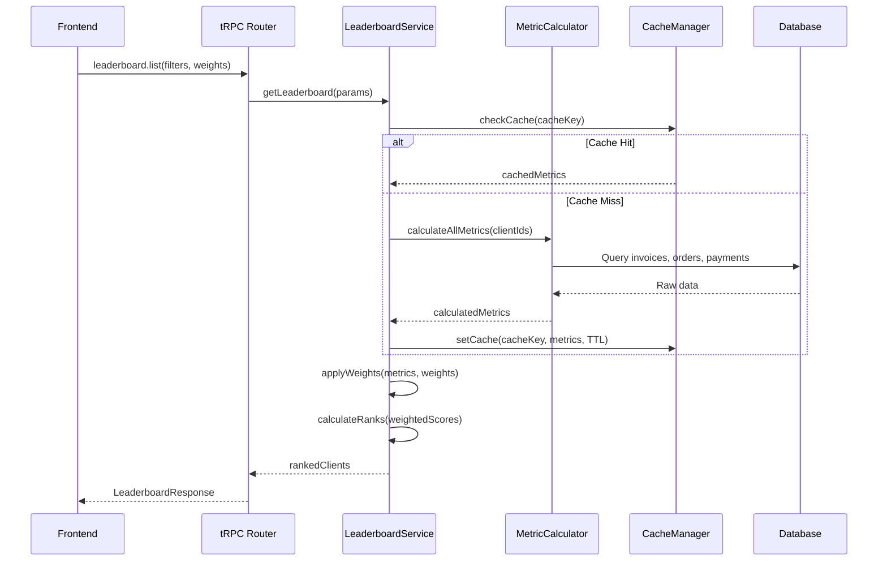

# Design Document: Unified Leaderboard System

## Overview

This document outlines the technical design for the Unified Leaderboard System, which consists of two main components:

1. **Internal Leaderboard** - A comprehensive analytics tool for TERP staff to rank and analyze clients
2. **VIP Portal Leaderboard** - A privacy-first client-facing leaderboard with anonymized competitor data

The system is built on a shared metric calculation engine with different presentation layers for internal vs. external users.

## Architecture

### High-Level Architecture

```
┌─────────────────────────────────────────────────────────────────────────────┐
│                              PRESENTATION LAYER                              │
├─────────────────────────────────────────────────────────────────────────────┤
│                                                                             │
│  ┌─────────────────────┐  ┌─────────────────────┐  ┌─────────────────────┐ │
│  │  Leaderboard Page   │  │  Dashboard Widget   │  │ Client Profile Card │ │
│  │  (Full Rankings)    │  │  (Top 5 Summary)    │  │ (Single Client)     │ │
│  └─────────────────────┘  └─────────────────────┘  └─────────────────────┘ │
│                                                                             │
│  ┌─────────────────────────────────────────────────────────────────────┐   │
│  │                    VIP Portal Leaderboard                            │   │
│  │                    (Privacy-Sanitized View)                          │   │
│  └─────────────────────────────────────────────────────────────────────┘   │
│                                                                             │
├─────────────────────────────────────────────────────────────────────────────┤
│                                API LAYER                                     │
├─────────────────────────────────────────────────────────────────────────────┤
│                                                                             │
│  ┌─────────────────────┐  ┌─────────────────────┐  ┌─────────────────────┐ │
│  │ leaderboard.list    │  │ leaderboard.getFor  │  │ leaderboard.config  │ │
│  │ (Internal Full)     │  │ Client (Profile)    │  │ (Weight Management) │ │
│  └─────────────────────┘  └─────────────────────┘  └─────────────────────┘ │
│                                                                             │
│  ┌─────────────────────────────────────────────────────────────────────┐   │
│  │              vipPortal.leaderboard.getLeaderboard                    │   │
│  │              (Privacy-Sanitized Response)                            │   │
│  └─────────────────────────────────────────────────────────────────────┘   │
│                                                                             │
├─────────────────────────────────────────────────────────────────────────────┤
│                              SERVICE LAYER                                   │
├─────────────────────────────────────────────────────────────────────────────┤
│                                                                             │
│  ┌─────────────────────────────────────────────────────────────────────┐   │
│  │                    LeaderboardService                                │   │
│  │  ┌─────────────┐  ┌─────────────┐  ┌─────────────┐  ┌────────────┐  │   │
│  │  │ MetricCalc  │  │ RankEngine  │  │ WeightMgr   │  │ CacheMgr   │  │   │
│  │  └─────────────┘  └─────────────┘  └─────────────┘  └────────────┘  │   │
│  └─────────────────────────────────────────────────────────────────────┘   │
│                                                                             │
│  ┌─────────────────────────────────────────────────────────────────────┐   │
│  │                    PrivacySanitizer                                  │   │
│  │  (Strips identifying info from VIP Portal responses)                 │   │
│  └─────────────────────────────────────────────────────────────────────┘   │
│                                                                             │
├─────────────────────────────────────────────────────────────────────────────┤
│                               DATA LAYER                                     │
├─────────────────────────────────────────────────────────────────────────────┤
│                                                                             │
│  ┌──────────┐ ┌──────────┐ ┌──────────┐ ┌──────────┐ ┌──────────────────┐  │
│  │ clients  │ │ invoices │ │ orders   │ │ payments │ │ leaderboard_*    │  │
│  └──────────┘ └──────────┘ └──────────┘ └──────────┘ │ (new tables)     │  │
│                                                       └──────────────────┘  │
└─────────────────────────────────────────────────────────────────────────────┘
```

### Component Interaction Flow



## Components and Interfaces

### Backend Components

#### 1. LeaderboardService (`server/services/leaderboardService.ts`)

```typescript
interface LeaderboardService {
  // Core ranking methods
  getLeaderboard(params: LeaderboardParams): Promise<LeaderboardResult>;
  getClientRanking(clientId: number): Promise<ClientRankingResult>;
  
  // Metric calculation
  calculateMetrics(clientIds: number[]): Promise<ClientMetrics[]>;
  calculateSingleMetric(clientId: number, metricType: MetricType): Promise<MetricValue>;
  
  // Weight management
  getUserWeights(userId: number): Promise<WeightConfig>;
  saveUserWeights(userId: number, weights: WeightConfig): Promise<void>;
  getDefaultWeights(clientType: ClientType): Promise<WeightConfig>;
  
  // Cache management
  invalidateCache(clientId?: number): Promise<void>;
  refreshCache(): Promise<void>;
}

interface LeaderboardParams {
  clientType?: 'ALL' | 'CUSTOMER' | 'SUPPLIER' | 'DUAL';
  metricCategory?: 'MASTER' | 'FINANCIAL' | 'ENGAGEMENT' | 'RELIABILITY' | 'GROWTH';
  weights?: WeightConfig;
  search?: string;
  sortBy?: MetricType;
  sortOrder?: 'asc' | 'desc';
  limit?: number;
  offset?: number;
}

interface LeaderboardResult {
  clients: RankedClient[];
  totalCount: number;
  metadata: {
    calculatedAt: Date;
    cacheHit: boolean;
    weightsApplied: WeightConfig;
    significanceWarnings: string[];
  };
}
```

#### 2. MetricCalculator (`server/services/metricCalculator.ts`)

```typescript
interface MetricCalculator {
  // Individual metric calculations
  calculateYtdRevenue(clientId: number): Promise<MetricResult>;
  calculateLifetimeValue(clientId: number): Promise<MetricResult>;
  calculateAverageOrderValue(clientId: number): Promise<MetricResult>;
  calculateProfitMargin(clientId: number): Promise<MetricResult>;
  calculateOrderFrequency(clientId: number): Promise<MetricResult>;
  calculateRecency(clientId: number): Promise<MetricResult>;
  calculateOnTimePaymentRate(clientId: number): Promise<MetricResult>;
  calculateAverageDaysToPay(clientId: number): Promise<MetricResult>;
  calculateCreditUtilization(clientId: number): Promise<MetricResult>;
  calculateYoyGrowth(clientId: number): Promise<MetricResult>;
  
  // Batch calculation
  calculateAllMetrics(clientId: number): Promise<ClientMetrics>;
  calculateMetricsBatch(clientIds: number[]): Promise<Map<number, ClientMetrics>>;
}

interface MetricResult {
  value: number | null;
  sampleSize: number;
  isSignificant: boolean;
  calculatedAt: Date;
  rawData?: {
    numerator?: number;
    denominator?: number;
    dataPoints?: number[];
  };
}

interface ClientMetrics {
  clientId: number;
  metrics: Record<MetricType, MetricResult>;
  masterScore: number | null;
  masterScoreBreakdown: MasterScoreBreakdown;
}
```

#### 3. PrivacySanitizer (`server/services/privacySanitizer.ts`)

```typescript
interface PrivacySanitizer {
  // Sanitize leaderboard for VIP Portal
  sanitizeForVipPortal(
    leaderboard: LeaderboardResult,
    requestingClientId: number,
    displayMode: 'blackbox' | 'transparent'
  ): SanitizedLeaderboardResult;
  
  // Validate no PII leakage
  validateNoIdentifiers(response: unknown): boolean;
}

interface SanitizedLeaderboardResult {
  clientRank: number;
  totalParticipants: number;
  clientMetricValue: number;
  entries: SanitizedEntry[];
  suggestions: string[];
  lastUpdated: string;
}

interface SanitizedEntry {
  rank: number;
  metricValue?: number; // Only in transparent mode
  isCurrentClient: boolean;
  // NO clientId, name, teriCode, or any identifier
}
```

### Frontend Components

#### 1. LeaderboardPage (`client/src/pages/LeaderboardPage.tsx`)

Full-page leaderboard with all features:
- Metric category tabs
- Client type filter
- Weight customization panel
- Sortable data table
- Search functionality
- Export options

#### 2. LeaderboardWidget (`client/src/components/dashboard/LeaderboardWidget.tsx`)

Compact dashboard widget:
- Configurable metric display
- Top 5/10/15 clients
- "Top Performers" or "Needs Attention" mode
- Click-through to full leaderboard

#### 3. ClientLeaderboardCard (`client/src/components/clients/ClientLeaderboardCard.tsx`)

Client profile integration:
- Current rank and percentile
- Rank breakdown by category
- Historical rank chart
- Gap to next rank
- Quick action buttons

#### 4. WeightCustomizer (`client/src/components/leaderboard/WeightCustomizer.tsx`)

Weight adjustment UI:
- Slider controls for each metric
- Auto-normalization display
- Visual weight distribution chart
- Reset to default button

#### 5. VIPLeaderboard (`client/src/components/vip-portal/Leaderboard.tsx`)

Enhanced VIP Portal component:
- Privacy-safe display
- Configurable metrics per admin settings
- Improvement suggestions
- Black box / transparent mode support

## Data Models

### New Database Tables

```sql
-- User weight preferences for internal leaderboard
CREATE TABLE leaderboard_weight_configs (
  id INT PRIMARY KEY AUTO_INCREMENT,
  user_id INT NOT NULL,
  config_name VARCHAR(100) NOT NULL DEFAULT 'default',
  client_type ENUM('CUSTOMER', 'SUPPLIER', 'ALL') NOT NULL DEFAULT 'ALL',
  weights JSON NOT NULL,
  is_active BOOLEAN NOT NULL DEFAULT true,
  created_at TIMESTAMP NOT NULL DEFAULT CURRENT_TIMESTAMP,
  updated_at TIMESTAMP NOT NULL DEFAULT CURRENT_TIMESTAMP ON UPDATE CURRENT_TIMESTAMP,
  deleted_at TIMESTAMP NULL,
  UNIQUE KEY idx_user_config_type (user_id, config_name, client_type),
  FOREIGN KEY (user_id) REFERENCES users(id) ON DELETE CASCADE,
  INDEX idx_user_active (user_id, is_active)
);

-- System default weights (admin-configurable)
CREATE TABLE leaderboard_default_weights (
  id INT PRIMARY KEY AUTO_INCREMENT,
  client_type ENUM('CUSTOMER', 'SUPPLIER', 'ALL') NOT NULL,
  weights JSON NOT NULL,
  updated_by INT NULL,
  created_at TIMESTAMP NOT NULL DEFAULT CURRENT_TIMESTAMP,
  updated_at TIMESTAMP NOT NULL DEFAULT CURRENT_TIMESTAMP ON UPDATE CURRENT_TIMESTAMP,
  UNIQUE KEY idx_client_type (client_type),
  FOREIGN KEY (updated_by) REFERENCES users(id) ON DELETE SET NULL
);

-- Cached metric calculations for performance
CREATE TABLE leaderboard_metric_cache (
  id INT PRIMARY KEY AUTO_INCREMENT,
  client_id INT NOT NULL,
  metric_type VARCHAR(50) NOT NULL,
  metric_value DECIMAL(15, 4) NULL,
  sample_size INT NOT NULL DEFAULT 0,
  is_significant BOOLEAN NOT NULL DEFAULT false,
  raw_data JSON NULL,
  calculated_at TIMESTAMP NOT NULL DEFAULT CURRENT_TIMESTAMP,
  expires_at TIMESTAMP NOT NULL,
  UNIQUE KEY idx_client_metric (client_id, metric_type),
  FOREIGN KEY (client_id) REFERENCES clients(id) ON DELETE CASCADE,
  INDEX idx_expires (expires_at),
  INDEX idx_metric_type (metric_type)
);

-- Historical ranking snapshots for trend analysis
CREATE TABLE leaderboard_rank_history (
  id INT PRIMARY KEY AUTO_INCREMENT,
  client_id INT NOT NULL,
  snapshot_date DATE NOT NULL,
  master_rank INT NULL,
  master_score DECIMAL(10, 4) NULL,
  financial_rank INT NULL,
  engagement_rank INT NULL,
  reliability_rank INT NULL,
  growth_rank INT NULL,
  total_clients INT NOT NULL,
  created_at TIMESTAMP NOT NULL DEFAULT CURRENT_TIMESTAMP,
  UNIQUE KEY idx_client_date (client_id, snapshot_date),
  FOREIGN KEY (client_id) REFERENCES clients(id) ON DELETE CASCADE,
  INDEX idx_snapshot_date (snapshot_date)
);

-- Dashboard widget configurations
CREATE TABLE dashboard_widget_configs (
  id INT PRIMARY KEY AUTO_INCREMENT,
  user_id INT NOT NULL,
  widget_type VARCHAR(50) NOT NULL,
  config JSON NOT NULL,
  position INT NOT NULL DEFAULT 0,
  is_visible BOOLEAN NOT NULL DEFAULT true,
  created_at TIMESTAMP NOT NULL DEFAULT CURRENT_TIMESTAMP,
  updated_at TIMESTAMP NOT NULL DEFAULT CURRENT_TIMESTAMP ON UPDATE CURRENT_TIMESTAMP,
  UNIQUE KEY idx_user_widget (user_id, widget_type),
  FOREIGN KEY (user_id) REFERENCES users(id) ON DELETE CASCADE
);
```

### TypeScript Types

```typescript
// Metric types
type MetricType = 
  | 'ytd_revenue'
  | 'lifetime_value'
  | 'average_order_value'
  | 'profit_margin'
  | 'order_frequency'
  | 'recency'
  | 'on_time_payment_rate'
  | 'average_days_to_pay'
  | 'credit_utilization'
  | 'yoy_growth';

type MetricCategory = 'MASTER' | 'FINANCIAL' | 'ENGAGEMENT' | 'RELIABILITY' | 'GROWTH';

type ClientType = 'ALL' | 'CUSTOMER' | 'SUPPLIER' | 'DUAL';

// Weight configuration
interface WeightConfig {
  [key: string]: number; // metric_type -> weight (0-100)
}

// Ranked client for internal leaderboard
interface RankedClient {
  clientId: number;
  clientName: string;
  teriCode: string;
  clientType: ClientType;
  rank: number;
  percentile: number;
  masterScore: number | null;
  metrics: Record<MetricType, MetricResult>;
  trend: 'up' | 'down' | 'stable';
  trendAmount: number;
}

// Master score breakdown
interface MasterScoreBreakdown {
  totalScore: number;
  contributions: {
    metricType: MetricType;
    weight: number;
    normalizedValue: number;
    contribution: number;
    isIncluded: boolean;
    excludeReason?: string;
  }[];
  excludedMetrics: MetricType[];
  effectiveWeights: WeightConfig;
}
```

## Correctness Properties

*A property is a characteristic or behavior that should hold true across all valid executions of a system-essentially, a formal statement about what the system should do. Properties serve as the bridge between human-readable specifications and machine-verifiable correctness guarantees.*

### Property 1: Weight Normalization Invariant
*For any* set of weight adjustments, the sum of all weights after normalization SHALL equal exactly 100%.
**Validates: Requirements 4.3**

### Property 2: Ranking Consistency
*For any* leaderboard calculation with the same input data and weights, the resulting rankings SHALL be identical and deterministic.
**Validates: Requirements 1.1, 4.4**

### Property 3: Statistical Significance Filtering
*For any* client, a metric SHALL only be included in their Master Score calculation if the sample size meets the minimum threshold for that metric type.
**Validates: Requirements 1.2, 6.1**

### Property 4: Client Type Filter Correctness
*For any* client type filter selection, all returned clients SHALL match the filter criteria (isBuyer/isSeller flags).
**Validates: Requirements 3.1-3.5**

### Property 5: VIP Portal Privacy - No Identifiers
*For any* VIP Portal leaderboard API response, the response SHALL NOT contain clientId, name, teriCode, email, or any other identifying field for clients other than the requesting client.
**Validates: Requirements 8.1, 8.2, 8.5**

### Property 6: VIP Portal Privacy - Transparent Mode
*For any* VIP Portal leaderboard in transparent mode, metric values MAY be shown but client identifiers SHALL still be stripped.
**Validates: Requirements 8.3**

### Property 7: Weight Persistence Round-Trip
*For any* saved weight configuration, loading the configuration SHALL return the exact same weights that were saved.
**Validates: Requirements 4.6**

### Property 8: Percentile Calculation Correctness
*For any* client at rank R out of N total clients, their percentile SHALL equal (R / N) * 100, rounded appropriately.
**Validates: Requirements 1.4**

### Property 9: Minimum Participants Threshold
*For any* VIP Portal leaderboard request where total VIP clients is less than the configured minimum, the System SHALL return an error or "not available" message.
**Validates: Requirements 12.1, 12.2**

### Property 10: Metric Calculation - YTD Revenue
*For any* client, YTD Revenue SHALL equal the sum of invoice.totalAmount where invoiceDate is in the current year and status is not VOID.
**Validates: Requirements 21.1**

### Property 11: Metric Calculation - On-Time Payment Rate
*For any* client with at least 5 paid invoices, On-Time Payment Rate SHALL equal (count of invoices paid by dueDate / total paid invoices) × 100.
**Validates: Requirements 21.3**

### Property 12: Search Filter Correctness
*For any* search query, all returned clients SHALL have a name or teriCode containing the search string (case-insensitive).
**Validates: Requirements 13.1**

### Property 13: Sort Order Correctness
*For any* sort operation on a metric column, the resulting list SHALL be ordered by that metric value in the specified direction (ascending or descending).
**Validates: Requirements 13.2**

### Property 14: Suggestion Tier Matching
*For any* VIP client, the improvement suggestions shown SHALL correspond to their tier (top/middle/bottom quartile based on percentile).
**Validates: Requirements 10.1-10.4**

### Property 15: Cache Invalidation
*For any* cache entry past its TTL, requesting that data SHALL trigger a fresh calculation rather than returning stale data.
**Validates: Requirements 22.2, 22.4**

## Error Handling

### Error Categories

| Error Type | HTTP Code | User Message | Internal Action |
|------------|-----------|--------------|-----------------|
| Insufficient Data | 200 (partial) | "Some metrics unavailable" | Return available metrics only |
| No Clients Match Filter | 200 (empty) | "No clients found" | Return empty array |
| Below Minimum Threshold | 400 | "Leaderboard requires more participants" | Log and return error |
| Cache Failure | 200 | (none - fallback to live calc) | Log warning, calculate live |
| Database Error | 500 | "Unable to load leaderboard" | Log error, alert ops |
| Invalid Weight Config | 400 | "Invalid weight configuration" | Return validation errors |
| Unauthorized (VIP) | 401 | "Session expired" | Redirect to login |

### Graceful Degradation

1. **Cache Miss**: Fall back to live calculation (may be slower)
2. **Partial Metrics**: Show available metrics, indicate missing ones
3. **Historical Data Missing**: Show current rank only, hide trend chart
4. **Single Metric Failure**: Calculate other metrics, exclude failed one

## Testing Strategy

### Unit Tests

- MetricCalculator: Test each metric calculation with known inputs
- WeightNormalizer: Test normalization edge cases (all zeros, single metric, etc.)
- PrivacySanitizer: Test that all identifiers are stripped
- RankCalculator: Test ranking with ties, edge cases

### Property-Based Tests

Using fast-check library:

```typescript
// Property 1: Weight normalization
test('weights always sum to 100%', () => {
  fc.assert(
    fc.property(
      fc.array(fc.integer({ min: 0, max: 100 }), { minLength: 1, maxLength: 10 }),
      (weights) => {
        const normalized = normalizeWeights(weights);
        const sum = Object.values(normalized).reduce((a, b) => a + b, 0);
        return Math.abs(sum - 100) < 0.01; // Allow floating point tolerance
      }
    )
  );
});

// Property 5: VIP Portal privacy
test('VIP response never contains other client identifiers', () => {
  fc.assert(
    fc.property(
      fc.array(arbitraryClient(), { minLength: 5, maxLength: 50 }),
      fc.integer({ min: 0 }),
      (clients, requestingIndex) => {
        const requestingClientId = clients[requestingIndex % clients.length].id;
        const response = sanitizeForVipPortal(clients, requestingClientId, 'transparent');
        
        return response.entries.every(entry => 
          entry.isCurrentClient || 
          (!('clientId' in entry) && !('name' in entry) && !('teriCode' in entry))
        );
      }
    )
  );
});
```

### Integration Tests

- Full leaderboard flow: Create clients → Calculate metrics → Rank → Verify order
- VIP Portal flow: Configure → Request → Verify sanitization
- Weight persistence: Save → Load → Verify equality
- Cache behavior: Request → Verify cache → Invalidate → Verify recalculation

### E2E Tests

- Internal user views leaderboard, adjusts weights, exports data
- VIP client views their ranking, sees suggestions
- Admin configures VIP portal leaderboard settings


## API Endpoints

### Internal Leaderboard Router (`server/routers/leaderboard.ts`)

```typescript
export const leaderboardRouter = router({
  // Get full leaderboard with rankings
  list: protectedProcedure
    .input(z.object({
      clientType: z.enum(['ALL', 'CUSTOMER', 'SUPPLIER', 'DUAL']).optional().default('ALL'),
      metricCategory: z.enum(['MASTER', 'FINANCIAL', 'ENGAGEMENT', 'RELIABILITY', 'GROWTH']).optional().default('MASTER'),
      weights: z.record(z.string(), z.number()).optional(),
      search: z.string().optional(),
      sortBy: z.string().optional(),
      sortOrder: z.enum(['asc', 'desc']).optional().default('desc'),
      limit: z.number().optional().default(25),
      offset: z.number().optional().default(0),
      forceRefresh: z.boolean().optional().default(false),
    }))
    .query(async ({ ctx, input }) => { /* ... */ }),

  // Get single client's ranking context (for profile page)
  getForClient: protectedProcedure
    .input(z.object({
      clientId: z.number(),
      includeHistory: z.boolean().optional().default(true),
      historyMonths: z.number().optional().default(6),
    }))
    .query(async ({ ctx, input }) => { /* ... */ }),

  // Get dashboard widget data
  getWidgetData: protectedProcedure
    .input(z.object({
      metric: z.string().optional().default('master_score'),
      mode: z.enum(['top', 'bottom']).optional().default('top'),
      limit: z.number().optional().default(5),
      clientType: z.enum(['ALL', 'CUSTOMER', 'SUPPLIER']).optional().default('ALL'),
    }))
    .query(async ({ ctx, input }) => { /* ... */ }),

  // Weight configuration management
  weights: router({
    // Get user's current weights
    get: protectedProcedure
      .input(z.object({
        clientType: z.enum(['CUSTOMER', 'SUPPLIER', 'ALL']).optional().default('ALL'),
      }))
      .query(async ({ ctx, input }) => { /* ... */ }),

    // Save user's custom weights
    save: protectedProcedure
      .input(z.object({
        clientType: z.enum(['CUSTOMER', 'SUPPLIER', 'ALL']),
        weights: z.record(z.string(), z.number()),
      }))
      .mutation(async ({ ctx, input }) => { /* ... */ }),

    // Reset to default weights
    reset: protectedProcedure
      .input(z.object({
        clientType: z.enum(['CUSTOMER', 'SUPPLIER', 'ALL']),
      }))
      .mutation(async ({ ctx, input }) => { /* ... */ }),

    // Get default weights (for display)
    getDefaults: protectedProcedure
      .input(z.object({
        clientType: z.enum(['CUSTOMER', 'SUPPLIER', 'ALL']),
      }))
      .query(async ({ ctx, input }) => { /* ... */ }),

    // Admin: Update default weights
    updateDefaults: adminProcedure
      .input(z.object({
        clientType: z.enum(['CUSTOMER', 'SUPPLIER', 'ALL']),
        weights: z.record(z.string(), z.number()),
      }))
      .mutation(async ({ ctx, input }) => { /* ... */ }),
  }),

  // Export functionality
  export: protectedProcedure
    .input(z.object({
      format: z.enum(['csv', 'pdf']),
      clientType: z.enum(['ALL', 'CUSTOMER', 'SUPPLIER', 'DUAL']).optional(),
      metricCategory: z.enum(['MASTER', 'FINANCIAL', 'ENGAGEMENT', 'RELIABILITY', 'GROWTH']).optional(),
      weights: z.record(z.string(), z.number()).optional(),
    }))
    .mutation(async ({ ctx, input }) => { /* ... */ }),

  // Cache management (admin)
  cache: router({
    invalidate: adminProcedure
      .input(z.object({
        clientId: z.number().optional(), // If not provided, invalidate all
      }))
      .mutation(async ({ ctx, input }) => { /* ... */ }),

    status: adminProcedure
      .query(async ({ ctx }) => { /* ... */ }),
  }),
});
```

### VIP Portal Leaderboard Enhancement (`server/routers/vipPortal.ts`)

```typescript
// Enhanced leaderboard sub-router within vipPortalRouter
leaderboard: router({
  // Get leaderboard for VIP client (privacy-sanitized)
  getLeaderboard: vipPortalProcedure
    .input(z.object({
      // No clientId needed - extracted from session
    }))
    .query(async ({ ctx }) => {
      const clientId = ctx.clientId; // From VIP session
      
      // 1. Get client's VIP portal config
      // 2. Check if leaderboard is enabled
      // 3. Check minimum participants threshold
      // 4. Calculate rankings
      // 5. SANITIZE response (critical!)
      // 6. Generate suggestions
      // 7. Return sanitized response
    }),

  // Get available metrics for this client's portal
  getAvailableMetrics: vipPortalProcedure
    .query(async ({ ctx }) => {
      // Returns which metrics are enabled for this client
    }),
}),
```

## Frontend Component Structure

### File Organization

```
client/src/
├── pages/
│   └── LeaderboardPage.tsx              # Full leaderboard page
│
├── components/
│   ├── leaderboard/
│   │   ├── index.ts                     # Barrel export
│   │   ├── LeaderboardTable.tsx         # Main data table
│   │   ├── LeaderboardFilters.tsx       # Client type, search filters
│   │   ├── MetricCategoryTabs.tsx       # Master/Financial/etc tabs
│   │   ├── WeightCustomizer.tsx         # Weight slider panel
│   │   ├── WeightVisualization.tsx      # Pie/bar chart of weights
│   │   ├── RankBadge.tsx                # Medal/rank display
│   │   ├── MetricCell.tsx               # Individual metric display
│   │   ├── TrendIndicator.tsx           # Up/down/stable arrow
│   │   └── ExportDialog.tsx             # Export options modal
│   │
│   ├── dashboard/
│   │   └── LeaderboardWidget.tsx        # Dashboard widget
│   │
│   ├── clients/
│   │   ├── ClientLeaderboardCard.tsx    # Profile page card
│   │   ├── RankHistoryChart.tsx         # Historical rank line chart
│   │   ├── RankBreakdown.tsx            # Category rank bars
│   │   └── GapToNextRank.tsx            # Gap analysis display
│   │
│   └── vip-portal/
│       └── Leaderboard.tsx              # Enhanced VIP leaderboard
│
├── hooks/
│   ├── useLeaderboard.ts                # Main leaderboard data hook
│   ├── useLeaderboardWeights.ts         # Weight management hook
│   ├── useClientRanking.ts              # Single client ranking hook
│   └── useLeaderboardWidget.ts          # Widget data hook
│
└── lib/
    └── leaderboard/
        ├── metricFormatters.ts          # Format metric values
        ├── weightNormalizer.ts          # Client-side normalization
        └── constants.ts                 # Metric definitions, defaults
```

### Key Component Props

```typescript
// LeaderboardTable
interface LeaderboardTableProps {
  data: RankedClient[];
  isLoading: boolean;
  sortBy: string;
  sortOrder: 'asc' | 'desc';
  onSort: (column: string) => void;
  onClientClick: (clientId: number) => void;
  visibleMetrics: MetricType[];
  showMasterScore: boolean;
}

// WeightCustomizer
interface WeightCustomizerProps {
  weights: WeightConfig;
  onChange: (weights: WeightConfig) => void;
  onApply: () => void;
  onReset: () => void;
  isApplying: boolean;
  clientType: ClientType;
}

// ClientLeaderboardCard
interface ClientLeaderboardCardProps {
  clientId: number;
  expanded?: boolean;
  showHistory?: boolean;
  showQuickActions?: boolean;
}

// LeaderboardWidget
interface LeaderboardWidgetProps {
  metric?: MetricType;
  mode?: 'top' | 'bottom';
  limit?: number;
  clientType?: ClientType;
  onConfigure?: () => void;
}
```

## Metric Calculation Details

### Calculation Formulas

```typescript
const METRIC_CALCULATIONS = {
  ytd_revenue: {
    query: `
      SELECT COALESCE(SUM(totalAmount), 0) as value,
             COUNT(*) as sample_size
      FROM invoices
      WHERE customerId = ? 
        AND YEAR(invoiceDate) = YEAR(CURRENT_DATE)
        AND status != 'VOID'
        AND deletedAt IS NULL
    `,
    minSampleSize: 1,
    direction: 'higher_better',
    format: 'currency',
  },

  average_days_to_pay: {
    query: `
      SELECT AVG(DATEDIFF(
        COALESCE(p.paymentDate, i.updatedAt),
        i.invoiceDate
      )) as value,
      COUNT(*) as sample_size
      FROM invoices i
      LEFT JOIN payments p ON p.invoiceId = i.id
      WHERE i.customerId = ?
        AND i.status = 'PAID'
        AND i.deletedAt IS NULL
    `,
    minSampleSize: 5,
    direction: 'lower_better',
    format: 'days',
  },

  on_time_payment_rate: {
    query: `
      SELECT 
        (SUM(CASE WHEN paymentDate <= dueDate THEN 1 ELSE 0 END) * 100.0 / COUNT(*)) as value,
        COUNT(*) as sample_size
      FROM invoices
      WHERE customerId = ?
        AND status = 'PAID'
        AND deletedAt IS NULL
    `,
    minSampleSize: 5,
    direction: 'higher_better',
    format: 'percentage',
  },

  order_frequency: {
    query: `
      SELECT COUNT(*) as value,
             COUNT(*) as sample_size
      FROM orders
      WHERE customerId = ?
        AND orderDate >= DATE_SUB(CURRENT_DATE, INTERVAL 90 DAY)
        AND deletedAt IS NULL
    `,
    minSampleSize: 1,
    direction: 'higher_better',
    format: 'count',
  },

  recency: {
    query: `
      SELECT DATEDIFF(CURRENT_DATE, MAX(orderDate)) as value,
             COUNT(*) as sample_size
      FROM orders
      WHERE customerId = ?
        AND deletedAt IS NULL
    `,
    minSampleSize: 1,
    direction: 'lower_better',
    format: 'days',
  },

  credit_utilization: {
    calculation: (client) => {
      const creditLimit = parseFloat(client.creditLimit) || 0;
      const totalOwed = parseFloat(client.totalOwed) || 0;
      if (creditLimit === 0) return { value: null, isSignificant: false };
      return {
        value: (totalOwed / creditLimit) * 100,
        isSignificant: creditLimit > 0,
      };
    },
    direction: 'optimal_range', // 60-80% is optimal
    optimalMin: 60,
    optimalMax: 80,
    format: 'percentage',
  },

  yoy_growth: {
    query: `
      SELECT 
        ((curr.total - prev.total) / NULLIF(prev.total, 0)) * 100 as value,
        curr.count + prev.count as sample_size
      FROM (
        SELECT COALESCE(SUM(totalAmount), 0) as total, COUNT(*) as count
        FROM invoices
        WHERE customerId = ? AND YEAR(invoiceDate) = YEAR(CURRENT_DATE)
      ) curr,
      (
        SELECT COALESCE(SUM(totalAmount), 0) as total, COUNT(*) as count
        FROM invoices
        WHERE customerId = ? AND YEAR(invoiceDate) = YEAR(CURRENT_DATE) - 1
      ) prev
    `,
    minSampleSize: 2, // Need data in both years
    direction: 'higher_better',
    format: 'percentage',
  },
};
```

### Normalization for Master Score

```typescript
function normalizeMetricValue(
  value: number,
  metricType: MetricType,
  allValues: number[]
): number {
  const config = METRIC_CALCULATIONS[metricType];
  
  // Handle optimal range metrics (like credit utilization)
  if (config.direction === 'optimal_range') {
    const { optimalMin, optimalMax } = config;
    if (value >= optimalMin && value <= optimalMax) {
      return 100; // Perfect score in optimal range
    }
    // Distance from optimal range, scaled
    const distanceFromOptimal = value < optimalMin 
      ? optimalMin - value 
      : value - optimalMax;
    return Math.max(0, 100 - distanceFromOptimal * 2);
  }
  
  // Standard min-max normalization
  const min = Math.min(...allValues);
  const max = Math.max(...allValues);
  
  if (max === min) return 50; // All same value
  
  let normalized = ((value - min) / (max - min)) * 100;
  
  // Invert for "lower is better" metrics
  if (config.direction === 'lower_better') {
    normalized = 100 - normalized;
  }
  
  return normalized;
}
```

## Caching Strategy

### Cache Keys

```typescript
const CACHE_KEYS = {
  // Individual client metrics
  clientMetrics: (clientId: number) => `leaderboard:metrics:${clientId}`,
  
  // Full leaderboard for a configuration
  leaderboard: (clientType: string, category: string) => 
    `leaderboard:full:${clientType}:${category}`,
  
  // User's weight config
  userWeights: (userId: number, clientType: string) => 
    `leaderboard:weights:${userId}:${clientType}`,
  
  // Default weights
  defaultWeights: (clientType: string) => 
    `leaderboard:defaults:${clientType}`,
};

const CACHE_TTL = {
  clientMetrics: 15 * 60 * 1000,    // 15 minutes
  leaderboard: 5 * 60 * 1000,       // 5 minutes
  userWeights: 24 * 60 * 60 * 1000, // 24 hours
  defaultWeights: 60 * 60 * 1000,   // 1 hour
};
```

### Cache Invalidation Triggers

| Event | Invalidate |
|-------|------------|
| Invoice created/updated | Client metrics, leaderboard |
| Payment recorded | Client metrics, leaderboard |
| Order created | Client metrics, leaderboard |
| Credit limit changed | Client metrics (credit_utilization) |
| User saves weights | User weights cache |
| Admin updates defaults | Default weights cache |
| Manual refresh requested | All caches for that query |

## Security Considerations

### VIP Portal Privacy Enforcement

```typescript
// CRITICAL: This function MUST be called before any VIP Portal response
function sanitizeForVipPortal(
  leaderboard: InternalLeaderboardResult,
  requestingClientId: number,
  displayMode: 'blackbox' | 'transparent'
): SanitizedLeaderboardResult {
  
  // Find requesting client's entry
  const clientEntry = leaderboard.clients.find(c => c.clientId === requestingClientId);
  if (!clientEntry) {
    throw new TRPCError({ code: 'NOT_FOUND', message: 'Client not in leaderboard' });
  }

  // Build sanitized entries - STRIP ALL IDENTIFIERS
  const sanitizedEntries = leaderboard.clients.map(client => {
    const entry: SanitizedEntry = {
      rank: client.rank,
      isCurrentClient: client.clientId === requestingClientId,
    };
    
    // Only include metric value in transparent mode
    if (displayMode === 'transparent') {
      entry.metricValue = client.metrics[leaderboard.primaryMetric]?.value ?? null;
    }
    
    // NEVER include these fields:
    // - clientId
    // - clientName
    // - teriCode
    // - email
    // - any other identifier
    
    return entry;
  });

  return {
    clientRank: clientEntry.rank,
    totalParticipants: leaderboard.clients.length,
    clientMetricValue: clientEntry.metrics[leaderboard.primaryMetric]?.value ?? 0,
    entries: sanitizedEntries,
    suggestions: generateSuggestions(clientEntry, leaderboard),
    lastUpdated: new Date().toISOString(),
  };
}

// Validation function to ensure no PII leakage
function validateNoIdentifiers(response: unknown): boolean {
  const json = JSON.stringify(response);
  
  // Check for common identifier patterns
  const dangerousPatterns = [
    /"clientId":/,
    /"client_id":/,
    /"name":/,
    /"clientName":/,
    /"teriCode":/,
    /"teri_code":/,
    /"email":/,
    /"phone":/,
  ];
  
  return !dangerousPatterns.some(pattern => pattern.test(json));
}
```

### Internal Leaderboard Authorization

```typescript
// All internal leaderboard endpoints require authentication
const leaderboardRouter = router({
  list: protectedProcedure // Requires valid user session
    .use(requirePermission('leaderboard:view')) // Optional: permission check
    .query(/* ... */),
    
  // Admin-only endpoints
  'weights.updateDefaults': adminProcedure
    .use(requirePermission('leaderboard:admin'))
    .mutation(/* ... */),
});
```

## Performance Optimizations

### Database Indexes

```sql
-- Optimize metric calculations
CREATE INDEX idx_invoices_customer_year ON invoices(customerId, YEAR(invoiceDate));
CREATE INDEX idx_invoices_customer_status ON invoices(customerId, status);
CREATE INDEX idx_orders_customer_date ON orders(customerId, orderDate);
CREATE INDEX idx_payments_invoice ON payments(invoiceId, paymentDate);

-- Optimize cache lookups
CREATE INDEX idx_metric_cache_lookup ON leaderboard_metric_cache(client_id, metric_type, expires_at);
CREATE INDEX idx_rank_history_lookup ON leaderboard_rank_history(client_id, snapshot_date DESC);
```

### Batch Processing

```typescript
// Calculate metrics for multiple clients in parallel
async function calculateMetricsBatch(clientIds: number[]): Promise<Map<number, ClientMetrics>> {
  const BATCH_SIZE = 50;
  const results = new Map<number, ClientMetrics>();
  
  // Process in batches to avoid overwhelming the database
  for (let i = 0; i < clientIds.length; i += BATCH_SIZE) {
    const batch = clientIds.slice(i, i + BATCH_SIZE);
    const batchResults = await Promise.all(
      batch.map(id => calculateAllMetrics(id))
    );
    batchResults.forEach((metrics, idx) => {
      results.set(batch[idx], metrics);
    });
  }
  
  return results;
}
```

### Client-Side Weight Calculations

```typescript
// Perform weight adjustments client-side for instant feedback
function recalculateMasterScores(
  clients: RankedClient[],
  newWeights: WeightConfig
): RankedClient[] {
  // Normalize weights
  const normalizedWeights = normalizeWeights(newWeights);
  
  // Recalculate master scores
  const withNewScores = clients.map(client => ({
    ...client,
    masterScore: calculateMasterScore(client.metrics, normalizedWeights),
  }));
  
  // Re-rank
  return withNewScores
    .sort((a, b) => (b.masterScore ?? 0) - (a.masterScore ?? 0))
    .map((client, idx) => ({
      ...client,
      rank: idx + 1,
      percentile: ((idx + 1) / withNewScores.length) * 100,
    }));
}
```

## Migration Plan

### Phase 1: Database Schema
1. Create new tables (leaderboard_weight_configs, etc.)
2. Add indexes for performance
3. Seed default weights

### Phase 2: Backend Services
1. Implement MetricCalculator
2. Implement LeaderboardService
3. Implement PrivacySanitizer
4. Create leaderboard router
5. Enhance VIP Portal router

### Phase 3: Frontend - Internal
1. Create LeaderboardPage
2. Create LeaderboardWidget
3. Create ClientLeaderboardCard
4. Integrate with dashboard

### Phase 4: Frontend - VIP Portal
1. Enhance existing Leaderboard component
2. Add admin configuration UI
3. Test privacy sanitization

### Phase 5: Testing & Polish
1. Property-based tests
2. Integration tests
3. Performance testing
4. Security audit for VIP Portal
