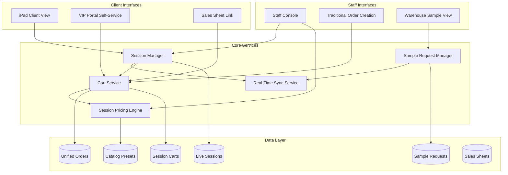
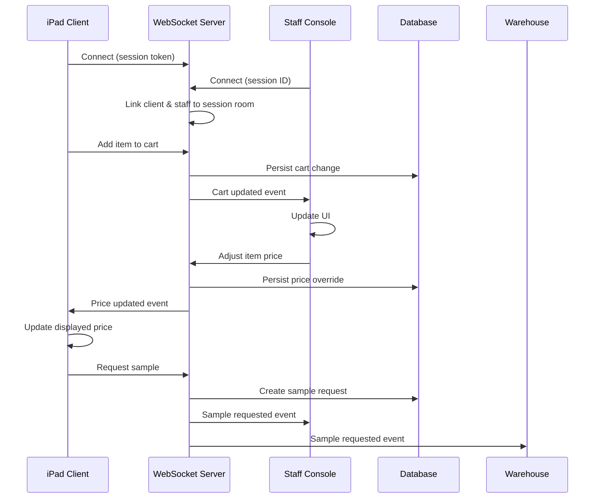

# Design Document: Unified Sales & Live Shopping System

## Overview

This design describes a unified sales system that consolidates TERP's fragmented sales tools (Orders, Quotes, Sales Sheets, Create Order) into a single, elegant workflow. The centerpiece is a **Live Shopping** experience enabling real-time collaborative shopping between clients (on iPad) and staff (on console), with all sales channels converging into a unified order pipeline.

The system introduces:
1. **Live Shopping Sessions** - Real-time collaborative shopping with sample requests and instant pricing adjustments
2. **Unified Order Model** - Single order table serving all sales channels with origin tracking
3. **Session Pricing Engine** - Flexible pricing overrides at item, batch, and order levels
4. **Real-time Sync** - WebSocket-based synchronization between client and staff views
5. **Sales Sheet Integration** - Shareable catalog views that convert to orders

## Architecture



### Real-Time Communication Flow



## Components and Interfaces

### 1. Live Shopping Session Manager

**Location:** `server/services/liveShoppingService.ts`

```typescript
interface LiveShoppingSession {
  id: string;
  sessionCode: string;  // Short code for easy entry
  clientId: number;
  staffId: number;
  status: 'ACTIVE' | 'PAUSED' | 'COMPLETED' | 'EXPIRED';
  catalogPresetId?: number;
  staffVisibilitySettings: {
    showCogs: boolean;
    showMargin: boolean;
  };
  startedAt: Date;
  lastActivityAt: Date;
  expiresAt: Date;
}

interface LiveShoppingService {
  // Session lifecycle
  createSession(clientId: number, staffId: number, presetId?: number): Promise<LiveShoppingSession>;
  getSession(sessionId: string): Promise<LiveShoppingSession | null>;
  getSessionByCode(code: string): Promise<LiveShoppingSession | null>;
  endSession(sessionId: string): Promise<void>;
  pauseSession(sessionId: string): Promise<void>;
  resumeSession(sessionId: string): Promise<void>;
  
  // Session state
  updateLastActivity(sessionId: string): Promise<void>;
  expireInactiveSessions(): Promise<number>;  // Returns count expired
  
  // Staff settings
  updateVisibilitySettings(sessionId: string, settings: Partial<StaffVisibilitySettings>): Promise<void>;
  
  // Conversion
  convertToOrder(sessionId: string): Promise<Order>;
  convertToDraft(sessionId: string): Promise<Order>;
  convertFromDraft(orderId: number, staffId: number): Promise<LiveShoppingSession>;
}
```

### 2. Session Cart Service

**Location:** `server/services/sessionCartService.ts`

```typescript
interface SessionCartItem {
  id: number;
  sessionId: string;
  batchId: number;
  quantity: number;
  basePrice: number;        // Client's standard price
  sessionPrice: number;     // After session overrides
  priceOverrides: PriceOverride[];
  sampleStatus?: 'REQUESTED' | 'IN_PROGRESS' | 'DELIVERED' | 'PASSED' | 'WANT_TO_BUY';
  addedAt: Date;
}

interface PriceOverride {
  id: number;
  type: 'ITEM' | 'BATCH' | 'ORDER';
  adjustmentType: 'DOLLAR' | 'PERCENTAGE';
  adjustmentValue: number;
  originalPrice: number;
  newPrice: number;
  reason?: string;
  visibleToClient: boolean;
  appliedBy: number;  // Staff ID
  appliedAt: Date;
}

interface SessionCartService {
  // Cart operations
  addItem(sessionId: string, batchId: number, quantity: number): Promise<SessionCartItem>;
  updateQuantity(sessionId: string, itemId: number, quantity: number): Promise<SessionCartItem>;
  removeItem(sessionId: string, itemId: number): Promise<void>;
  getCart(sessionId: string): Promise<SessionCart>;
  clearCart(sessionId: string): Promise<void>;
  
  // Pricing overrides
  applyItemOverride(itemId: number, override: PriceOverrideInput): Promise<SessionCartItem>;
  applyBatchOverride(sessionId: string, batchId: number, override: PriceOverrideInput): Promise<SessionCartItem[]>;
  applyOrderOverride(sessionId: string, override: PriceOverrideInput): Promise<SessionCart>;
  removeOverride(overrideId: number): Promise<void>;
  
  // Sample flow
  requestSample(sessionId: string, itemId: number): Promise<SessionCartItem>;
  acknowledgeSample(itemId: number, staffId: number): Promise<SessionCartItem>;
  deliverSample(itemId: number): Promise<SessionCartItem>;
  markSampleDecision(itemId: number, decision: 'WANT_TO_BUY' | 'PASSED'): Promise<SessionCartItem>;
  
  // Calculations
  calculateTotals(sessionId: string): Promise<CartTotals>;
  calculateMargins(sessionId: string): Promise<CartMargins>;  // Staff only
}

interface CartTotals {
  subtotal: number;
  discountTotal: number;
  total: number;
  itemCount: number;
}

interface CartMargins {
  totalCogs: number;
  totalMargin: number;
  marginPercentage: number;
  itemMargins: Array<{
    itemId: number;
    cogs: number;
    margin: number;
    marginPercentage: number;
  }>;
}
```

### 3. Real-Time Sync Service

**Location:** `server/services/realTimeSyncService.ts`

```typescript
type SessionEvent = 
  | { type: 'CART_ITEM_ADDED'; item: SessionCartItem }
  | { type: 'CART_ITEM_UPDATED'; item: SessionCartItem }
  | { type: 'CART_ITEM_REMOVED'; itemId: number }
  | { type: 'PRICE_OVERRIDE_APPLIED'; item: SessionCartItem; override: PriceOverride }
  | { type: 'SAMPLE_REQUESTED'; item: SessionCartItem }
  | { type: 'SAMPLE_STATUS_CHANGED'; item: SessionCartItem }
  | { type: 'CLIENT_VIEWING'; batchId: number }
  | { type: 'SESSION_ENDED'; reason: string };

interface RealTimeSyncService {
  // Connection management
  joinSession(sessionId: string, userId: string, role: 'CLIENT' | 'STAFF' | 'WAREHOUSE'): void;
  leaveSession(sessionId: string, userId: string): void;
  
  // Event broadcasting
  broadcastToSession(sessionId: string, event: SessionEvent): void;
  broadcastToStaff(sessionId: string, event: SessionEvent): void;
  broadcastToClient(sessionId: string, event: SessionEvent): void;
  broadcastToWarehouse(event: SessionEvent): void;
  
  // Client activity tracking
  trackClientView(sessionId: string, batchId: number): void;
  getClientActivity(sessionId: string): ClientActivity;
}
```

### 4. Unified Order Service

**Location:** `server/services/unifiedOrderService.ts`

```typescript
type OrderOrigin = 'LIVE_SHOPPING' | 'STAFF_CREATED' | 'VIP_SELF_SERVICE' | 'SALES_SHEET' | 'PHONE_ORDER';
type OrderStatus = 'DRAFT' | 'QUOTE' | 'PENDING_APPROVAL' | 'CONFIRMED' | 'PROCESSING' | 'SHIPPED' | 'DELIVERED' | 'CANCELLED';

interface UnifiedOrder {
  id: number;
  orderNumber: string;
  clientId: number;
  origin: OrderOrigin;
  status: OrderStatus;
  
  // Source tracking
  liveSessionId?: string;
  salesSheetId?: number;
  
  // Pricing
  subtotal: number;
  discountTotal: number;
  total: number;
  
  // Metadata
  createdBy: number;
  createdAt: Date;
  confirmedAt?: Date;
  expiresAt?: Date;  // For quotes/drafts
  
  // History
  statusHistory: OrderStatusChange[];
  priceAdjustments: PriceOverride[];
  modeTransitions: ModeTransition[];
}

interface ModeTransition {
  id: number;
  fromMode: 'DRAFT' | 'LIVE_SESSION' | 'SALES_SHEET';
  toMode: 'DRAFT' | 'LIVE_SESSION' | 'CONFIRMED';
  transitionedBy: number;
  transitionedAt: Date;
  notes?: string;
}

interface UnifiedOrderService {
  // Creation from different sources
  createFromLiveSession(sessionId: string, status: 'DRAFT' | 'CONFIRMED'): Promise<UnifiedOrder>;
  createFromSalesSheet(salesSheetId: number, selectedItems: number[]): Promise<UnifiedOrder>;
  createStaffOrder(clientId: number, staffId: number): Promise<UnifiedOrder>;
  
  // Status management
  confirmOrder(orderId: number): Promise<UnifiedOrder>;
  cancelOrder(orderId: number, reason: string): Promise<UnifiedOrder>;
  
  // Mode transitions
  convertDraftToLiveSession(orderId: number, staffId: number): Promise<LiveShoppingSession>;
  convertLiveSessionToDraft(sessionId: string): Promise<UnifiedOrder>;
  
  // Queries
  getOrder(orderId: number): Promise<UnifiedOrder>;
  listOrders(filters: OrderFilters): Promise<PaginatedResult<UnifiedOrder>>;
}
```

### 5. Sales Sheet Service

**Location:** `server/services/salesSheetService.ts`

```typescript
interface SalesSheet {
  id: number;
  name: string;
  clientId: number;
  items: SalesSheetItem[];
  shareToken: string;
  shareUrl: string;
  expiresAt?: Date;
  viewCount: number;
  lastViewedAt?: Date;
  createdBy: number;
  createdAt: Date;
}

interface SalesSheetItem {
  id: number;
  batchId: number;
  quantity: number;
  price: number;
  selected: boolean;  // Client's selection
  selectedQuantity?: number;
}

interface SalesSheetService {
  // Creation
  createSheet(clientId: number, items: SalesSheetItemInput[], staffId: number): Promise<SalesSheet>;
  
  // Sharing
  generateShareUrl(sheetId: number): Promise<string>;
  exportAsPlainText(sheetId: number): Promise<string>;
  exportAsPdf(sheetId: number): Promise<Buffer>;
  sendViaEmail(sheetId: number, email: string): Promise<void>;
  
  // Client interaction
  getSheetByToken(token: string): Promise<SalesSheet>;
  recordView(sheetId: number): Promise<void>;
  updateSelections(sheetId: number, selections: ItemSelection[]): Promise<SalesSheet>;
  
  // Conversion
  convertToOrder(sheetId: number): Promise<UnifiedOrder>;
  convertToLiveSession(sheetId: number, staffId: number): Promise<LiveShoppingSession>;
  
  // Analytics
  getSheetAnalytics(sheetId: number): Promise<SheetAnalytics>;
}
```

### 6. Catalog Preset Service

**Location:** `server/services/catalogPresetService.ts`

```typescript
interface CatalogPreset {
  id: number;
  name: string;
  isSystemDefault: boolean;
  filters: CatalogFilters;
  sortBy: string;
  sortOrder: 'asc' | 'desc';
  createdBy?: number;  // null for system presets
  createdAt: Date;
}

interface CatalogFilters {
  categories?: string[];
  grades?: string[];
  brands?: string[];
  priceMin?: number;
  priceMax?: number;
  stockLevel?: 'in_stock' | 'low_stock' | 'all';
  search?: string;
}

interface CatalogPresetService {
  // CRUD
  createPreset(preset: CatalogPresetInput): Promise<CatalogPreset>;
  updatePreset(presetId: number, updates: Partial<CatalogPresetInput>): Promise<CatalogPreset>;
  deletePreset(presetId: number): Promise<void>;
  
  // Queries
  getPreset(presetId: number): Promise<CatalogPreset>;
  listPresets(includeSystem: boolean): Promise<CatalogPreset[]>;
  getSystemDefaults(): Promise<CatalogPreset[]>;
  
  // Client assignment
  assignToClient(clientId: number, presetId: number): Promise<void>;
  getClientDefaultPreset(clientId: number): Promise<CatalogPreset | null>;
  
  // Save from current state
  saveCurrentAsPreset(name: string, filters: CatalogFilters, staffId: number): Promise<CatalogPreset>;
}
```

## Data Models

### Database Schema Extensions

```sql
-- Live Shopping Sessions
CREATE TABLE live_shopping_sessions (
  id VARCHAR(36) PRIMARY KEY,
  session_code VARCHAR(8) UNIQUE NOT NULL,
  client_id INT NOT NULL REFERENCES clients(id),
  staff_id INT NOT NULL REFERENCES users(id),
  status ENUM('ACTIVE', 'PAUSED', 'COMPLETED', 'EXPIRED') NOT NULL DEFAULT 'ACTIVE',
  catalog_preset_id INT REFERENCES catalog_presets(id),
  show_cogs BOOLEAN NOT NULL DEFAULT TRUE,
  show_margin BOOLEAN NOT NULL DEFAULT TRUE,
  started_at TIMESTAMP NOT NULL DEFAULT CURRENT_TIMESTAMP,
  last_activity_at TIMESTAMP NOT NULL DEFAULT CURRENT_TIMESTAMP,
  expires_at TIMESTAMP NOT NULL,
  created_at TIMESTAMP NOT NULL DEFAULT CURRENT_TIMESTAMP,
  updated_at TIMESTAMP NOT NULL DEFAULT CURRENT_TIMESTAMP ON UPDATE CURRENT_TIMESTAMP,
  deleted_at TIMESTAMP NULL,
  INDEX idx_session_code (session_code),
  INDEX idx_client_id (client_id),
  INDEX idx_status (status),
  INDEX idx_expires_at (expires_at)
);

-- Session Cart Items
CREATE TABLE session_cart_items (
  id INT AUTO_INCREMENT PRIMARY KEY,
  session_id VARCHAR(36) NOT NULL REFERENCES live_shopping_sessions(id) ON DELETE CASCADE,
  batch_id INT NOT NULL REFERENCES batches(id),
  quantity DECIMAL(15,4) NOT NULL,
  base_price DECIMAL(15,2) NOT NULL,
  session_price DECIMAL(15,2) NOT NULL,
  sample_status ENUM('REQUESTED', 'IN_PROGRESS', 'DELIVERED', 'PASSED', 'WANT_TO_BUY') NULL,
  sample_requested_at TIMESTAMP NULL,
  sample_delivered_at TIMESTAMP NULL,
  added_at TIMESTAMP NOT NULL DEFAULT CURRENT_TIMESTAMP,
  updated_at TIMESTAMP NOT NULL DEFAULT CURRENT_TIMESTAMP ON UPDATE CURRENT_TIMESTAMP,
  deleted_at TIMESTAMP NULL,
  INDEX idx_session_id (session_id),
  INDEX idx_batch_id (batch_id),
  INDEX idx_sample_status (sample_status)
);

-- Price Overrides (session-level)
CREATE TABLE session_price_overrides (
  id INT AUTO_INCREMENT PRIMARY KEY,
  session_id VARCHAR(36) NOT NULL REFERENCES live_shopping_sessions(id) ON DELETE CASCADE,
  cart_item_id INT REFERENCES session_cart_items(id) ON DELETE CASCADE,
  batch_id INT REFERENCES batches(id),
  override_type ENUM('ITEM', 'BATCH', 'ORDER') NOT NULL,
  adjustment_type ENUM('DOLLAR', 'PERCENTAGE') NOT NULL,
  adjustment_value DECIMAL(15,4) NOT NULL,
  original_price DECIMAL(15,2) NOT NULL,
  new_price DECIMAL(15,2) NOT NULL,
  reason VARCHAR(500),
  visible_to_client BOOLEAN NOT NULL DEFAULT TRUE,
  applied_by INT NOT NULL REFERENCES users(id),
  applied_at TIMESTAMP NOT NULL DEFAULT CURRENT_TIMESTAMP,
  deleted_at TIMESTAMP NULL,
  INDEX idx_session_id (session_id),
  INDEX idx_cart_item_id (cart_item_id)
);

-- Catalog Presets
CREATE TABLE catalog_presets (
  id INT AUTO_INCREMENT PRIMARY KEY,
  name VARCHAR(255) NOT NULL,
  is_system_default BOOLEAN NOT NULL DEFAULT FALSE,
  filters JSON NOT NULL,
  sort_by VARCHAR(50) NOT NULL DEFAULT 'name',
  sort_order ENUM('asc', 'desc') NOT NULL DEFAULT 'asc',
  created_by INT REFERENCES users(id),
  created_at TIMESTAMP NOT NULL DEFAULT CURRENT_TIMESTAMP,
  updated_at TIMESTAMP NOT NULL DEFAULT CURRENT_TIMESTAMP ON UPDATE CURRENT_TIMESTAMP,
  deleted_at TIMESTAMP NULL,
  INDEX idx_is_system_default (is_system_default)
);

-- Client Preset Assignments
CREATE TABLE client_catalog_preset_assignments (
  id INT AUTO_INCREMENT PRIMARY KEY,
  client_id INT NOT NULL REFERENCES clients(id) ON DELETE CASCADE,
  preset_id INT NOT NULL REFERENCES catalog_presets(id) ON DELETE CASCADE,
  assigned_by INT NOT NULL REFERENCES users(id),
  assigned_at TIMESTAMP NOT NULL DEFAULT CURRENT_TIMESTAMP,
  UNIQUE KEY uk_client_preset (client_id)
);

-- Extend orders table
ALTER TABLE orders ADD COLUMN origin ENUM('LIVE_SHOPPING', 'STAFF_CREATED', 'VIP_SELF_SERVICE', 'SALES_SHEET', 'PHONE_ORDER') NOT NULL DEFAULT 'STAFF_CREATED';
ALTER TABLE orders ADD COLUMN live_session_id VARCHAR(36) REFERENCES live_shopping_sessions(id);
ALTER TABLE orders ADD COLUMN sales_sheet_id INT REFERENCES sales_sheet_templates(id);
ALTER TABLE orders ADD COLUMN expires_at TIMESTAMP NULL;

-- Order Mode Transitions (audit trail)
CREATE TABLE order_mode_transitions (
  id INT AUTO_INCREMENT PRIMARY KEY,
  order_id INT NOT NULL REFERENCES orders(id) ON DELETE CASCADE,
  from_mode ENUM('DRAFT', 'LIVE_SESSION', 'SALES_SHEET') NOT NULL,
  to_mode ENUM('DRAFT', 'LIVE_SESSION', 'CONFIRMED') NOT NULL,
  transitioned_by INT NOT NULL REFERENCES users(id),
  transitioned_at TIMESTAMP NOT NULL DEFAULT CURRENT_TIMESTAMP,
  notes TEXT,
  INDEX idx_order_id (order_id)
);

-- Sales Sheet Enhancements
ALTER TABLE sales_sheet_templates ADD COLUMN share_token VARCHAR(64) UNIQUE;
ALTER TABLE sales_sheet_templates ADD COLUMN share_url VARCHAR(500);
ALTER TABLE sales_sheet_templates ADD COLUMN view_count INT NOT NULL DEFAULT 0;
ALTER TABLE sales_sheet_templates ADD COLUMN last_viewed_at TIMESTAMP NULL;

-- Sales Sheet Item Selections (client responses)
CREATE TABLE sales_sheet_selections (
  id INT AUTO_INCREMENT PRIMARY KEY,
  sales_sheet_id INT NOT NULL REFERENCES sales_sheet_templates(id) ON DELETE CASCADE,
  batch_id INT NOT NULL REFERENCES batches(id),
  selected BOOLEAN NOT NULL DEFAULT FALSE,
  selected_quantity DECIMAL(15,4),
  selected_at TIMESTAMP,
  INDEX idx_sales_sheet_id (sales_sheet_id)
);
```

## Correctness Properties

*A property is a characteristic or behavior that should hold true across all valid executions of a system-essentially, a formal statement about what the system should do. Properties serve as the bridge between human-readable specifications and machine-verifiable correctness guarantees.*

### Property 1: Unified Order Origin Tracking
*For any* order created through any entry point (live shopping, staff-created, VIP self-service, sales sheet), the order record SHALL have a non-null origin field matching the creation channel.
**Validates: Requirements 1.2, 15.2**

### Property 2: Draft Order Mutability
*For any* order with status DRAFT or QUOTE, modification operations (add item, remove item, change quantity, apply discount) SHALL succeed. *For any* order with status CONFIRMED or later, modification operations SHALL be rejected.
**Validates: Requirements 1.4**

### Property 3: Session Code Uniqueness
*For any* set of live shopping sessions created, all session codes SHALL be unique (no two sessions share the same code).
**Validates: Requirements 2.2**

### Property 4: Session Expiration
*For any* session with last_activity_at older than 30 minutes and status ACTIVE, running the expiration job SHALL transition status to EXPIRED.
**Validates: Requirements 2.5**

### Property 5: Client View COGS Exclusion
*For any* catalog or cart response sent to a client view (iPad, VIP portal, sales sheet link), the response SHALL NOT contain cogs, margin, or marginPercentage fields with non-null values.
**Validates: Requirements 3.2, 8.5**

### Property 6: Filter Application Correctness
*For any* catalog query with filters applied, all returned items SHALL match all specified filter criteria (category IN categories, grade IN grades, price >= priceMin, price <= priceMax).
**Validates: Requirements 3.3**

### Property 7: Sort Order Correctness
*For any* catalog query with sortBy and sortOrder specified, the returned items SHALL be in the correct order according to the sort field and direction.
**Validates: Requirements 3.4**

### Property 8: Sample Request State Machine
*For any* sample request, status transitions SHALL follow the valid state machine: REQUESTED → IN_PROGRESS → DELIVERED → (WANT_TO_BUY | PASSED). Invalid transitions SHALL be rejected.
**Validates: Requirements 4.1, 4.4, 4.5, 4.6**

### Property 9: Cart Quantity Validation
*For any* add-to-cart or update-quantity operation, if the requested quantity exceeds available inventory, the operation SHALL be rejected with an appropriate error.
**Validates: Requirements 5.2**

### Property 10: Cart Total Accuracy
*For any* cart, the calculated total SHALL equal the sum of (quantity × sessionPrice) for all items, minus any order-level discounts.
**Validates: Requirements 5.4**

### Property 11: Price Override Audit Trail
*For any* price override applied, the system SHALL record: original price, new price, adjustment type, adjustment value, reason (if provided), visibility flag, staff ID, and timestamp.
**Validates: Requirements 7.4**

### Property 12: Margin Calculation Accuracy
*For any* cart item, margin SHALL equal (sessionPrice - cogs), and marginPercentage SHALL equal ((sessionPrice - cogs) / sessionPrice × 100).
**Validates: Requirements 7.7**

### Property 13: Staff Visibility Preference Persistence
*For any* session where staff toggles COGS/margin visibility off, subsequent requests within that session SHALL respect the hidden state until toggled back on.
**Validates: Requirements 8.3**

### Property 14: Order Confirmation Inventory Reservation
*For any* order transitioning to CONFIRMED status, inventory for all line items SHALL be reserved (decremented from available quantity).
**Validates: Requirements 9.6**

### Property 15: Mode Transition Data Preservation
*For any* mode transition (draft↔live session, sales sheet→live session), all cart items, quantities, and price overrides SHALL be preserved in the destination mode.
**Validates: Requirements 16.4**

### Property 16: Mode Transition Audit
*For any* mode transition, an audit record SHALL be created with from_mode, to_mode, transitioned_by, and timestamp.
**Validates: Requirements 16.5**

### Property 17: Sales Sheet URL Uniqueness
*For any* set of sales sheets with share URLs generated, all share tokens SHALL be unique.
**Validates: Requirements 13.4**

### Property 18: Self-Service Order Status
*For any* order created via VIP self-service, if the client has auto-approval disabled, status SHALL be PENDING_APPROVAL. If auto-approval is enabled, status SHALL be CONFIRMED.
**Validates: Requirements 12.4, 12.5**

### Property 19: Preset Filter Application
*For any* live session started with a preset assigned, the initial catalog query SHALL have the preset's filters applied as defaults.
**Validates: Requirements 11.5**

### Property 20: Real-Time Event Delivery
*For any* cart modification event in an active session, the event SHALL be delivered to connected staff clients within 2 seconds.
**Validates: Requirements 6.1**

## Error Handling

### Session Errors
- **SESSION_NOT_FOUND**: Session ID/code does not exist
- **SESSION_EXPIRED**: Session has expired due to inactivity
- **SESSION_ALREADY_ENDED**: Attempting to modify an ended session
- **UNAUTHORIZED_SESSION_ACCESS**: User not authorized for this session

### Cart Errors
- **INSUFFICIENT_INVENTORY**: Requested quantity exceeds available stock
- **ITEM_NOT_IN_CART**: Attempting to modify non-existent cart item
- **INVALID_QUANTITY**: Quantity must be positive
- **BATCH_NOT_AVAILABLE**: Batch is not in LIVE status

### Pricing Errors
- **INVALID_OVERRIDE_TYPE**: Override type not recognized
- **INVALID_ADJUSTMENT**: Adjustment would result in negative price
- **OVERRIDE_NOT_FOUND**: Override ID does not exist

### Order Errors
- **ORDER_NOT_MODIFIABLE**: Order status does not allow modifications
- **INVALID_STATUS_TRANSITION**: Status transition not allowed
- **CONVERSION_FAILED**: Failed to convert session/sheet to order

## Testing Strategy

### Property-Based Testing Library
**Library:** fast-check (TypeScript)

### Unit Tests
- Session lifecycle (create, pause, resume, end, expire)
- Cart operations (add, update, remove, clear)
- Price override calculations
- Margin calculations
- Filter application logic
- Sort order verification

### Property-Based Tests
Each correctness property above will be implemented as a property-based test using fast-check with minimum 100 iterations. Tests will be tagged with format: `**Feature: unified-sales-live-shopping, Property {number}: {property_text}**`

### Integration Tests
- Full live shopping flow (create session → add items → request samples → apply discounts → confirm order)
- Sales sheet flow (create → share → client selects → convert to order)
- Mode transitions (draft ↔ live session)
- Real-time sync verification
- Multi-session concurrency

### E2E Tests
- iPad client view rendering and interactions
- Staff console monitoring and controls
- WebSocket connection stability
- Cross-device synchronization

## API Routes (tRPC)

### Live Shopping Router

**Location:** `server/routers/liveShopping.ts`

```typescript
export const liveShoppingRouter = router({
  // Session Management
  createSession: protectedProcedure
    .input(z.object({
      clientId: z.number(),
      presetId: z.number().optional(),
    }))
    .mutation(async ({ ctx, input }) => { /* ... */ }),
  
  getSession: protectedProcedure
    .input(z.object({ sessionId: z.string() }))
    .query(async ({ ctx, input }) => { /* ... */ }),
  
  getSessionByCode: publicProcedure
    .input(z.object({ code: z.string() }))
    .query(async ({ input }) => { /* ... */ }),
  
  endSession: protectedProcedure
    .input(z.object({ sessionId: z.string() }))
    .mutation(async ({ ctx, input }) => { /* ... */ }),
  
  pauseSession: protectedProcedure
    .input(z.object({ sessionId: z.string() }))
    .mutation(async ({ ctx, input }) => { /* ... */ }),
  
  resumeSession: protectedProcedure
    .input(z.object({ sessionId: z.string() }))
    .mutation(async ({ ctx, input }) => { /* ... */ }),
  
  updateVisibilitySettings: protectedProcedure
    .input(z.object({
      sessionId: z.string(),
      showCogs: z.boolean().optional(),
      showMargin: z.boolean().optional(),
    }))
    .mutation(async ({ ctx, input }) => { /* ... */ }),
  
  // Cart Operations
  addToCart: publicProcedure
    .input(z.object({
      sessionId: z.string(),
      batchId: z.number(),
      quantity: z.number().positive(),
    }))
    .mutation(async ({ input }) => { /* ... */ }),
  
  updateCartItem: publicProcedure
    .input(z.object({
      sessionId: z.string(),
      itemId: z.number(),
      quantity: z.number().positive(),
    }))
    .mutation(async ({ input }) => { /* ... */ }),
  
  removeFromCart: publicProcedure
    .input(z.object({
      sessionId: z.string(),
      itemId: z.number(),
    }))
    .mutation(async ({ input }) => { /* ... */ }),
  
  getCart: publicProcedure
    .input(z.object({ sessionId: z.string() }))
    .query(async ({ input }) => { /* ... */ }),
  
  // Sample Requests
  requestSample: publicProcedure
    .input(z.object({
      sessionId: z.string(),
      itemId: z.number(),
    }))
    .mutation(async ({ input }) => { /* ... */ }),
  
  acknowledgeSample: protectedProcedure
    .input(z.object({ itemId: z.number() }))
    .mutation(async ({ ctx, input }) => { /* ... */ }),
  
  deliverSample: protectedProcedure
    .input(z.object({ itemId: z.number() }))
    .mutation(async ({ ctx, input }) => { /* ... */ }),
  
  markSampleDecision: publicProcedure
    .input(z.object({
      itemId: z.number(),
      decision: z.enum(['WANT_TO_BUY', 'PASSED']),
    }))
    .mutation(async ({ input }) => { /* ... */ }),
  
  // Pricing Overrides
  applyItemOverride: protectedProcedure
    .input(z.object({
      itemId: z.number(),
      adjustmentType: z.enum(['DOLLAR', 'PERCENTAGE']),
      adjustmentValue: z.number(),
      reason: z.string().optional(),
      visibleToClient: z.boolean().default(true),
    }))
    .mutation(async ({ ctx, input }) => { /* ... */ }),
  
  applyBatchOverride: protectedProcedure
    .input(z.object({
      sessionId: z.string(),
      batchId: z.number(),
      adjustmentType: z.enum(['DOLLAR', 'PERCENTAGE']),
      adjustmentValue: z.number(),
      reason: z.string().optional(),
      visibleToClient: z.boolean().default(true),
    }))
    .mutation(async ({ ctx, input }) => { /* ... */ }),
  
  applyOrderOverride: protectedProcedure
    .input(z.object({
      sessionId: z.string(),
      adjustmentType: z.enum(['DOLLAR', 'PERCENTAGE']),
      adjustmentValue: z.number(),
      reason: z.string().optional(),
      visibleToClient: z.boolean().default(true),
    }))
    .mutation(async ({ ctx, input }) => { /* ... */ }),
  
  removeOverride: protectedProcedure
    .input(z.object({ overrideId: z.number() }))
    .mutation(async ({ ctx, input }) => { /* ... */ }),
  
  // Conversion
  convertToOrder: protectedProcedure
    .input(z.object({
      sessionId: z.string(),
      status: z.enum(['DRAFT', 'CONFIRMED']).default('CONFIRMED'),
    }))
    .mutation(async ({ ctx, input }) => { /* ... */ }),
  
  convertFromDraft: protectedProcedure
    .input(z.object({ orderId: z.number() }))
    .mutation(async ({ ctx, input }) => { /* ... */ }),
  
  // Staff Monitoring
  getActiveSessions: protectedProcedure
    .query(async ({ ctx }) => { /* ... */ }),
  
  getSessionActivity: protectedProcedure
    .input(z.object({ sessionId: z.string() }))
    .query(async ({ ctx, input }) => { /* ... */ }),
  
  // Catalog
  getCatalog: publicProcedure
    .input(z.object({
      sessionId: z.string(),
      filters: catalogFiltersSchema.optional(),
      sortBy: z.string().optional(),
      sortOrder: z.enum(['asc', 'desc']).optional(),
      page: z.number().default(1),
      pageSize: z.number().default(50),
    }))
    .query(async ({ input }) => { /* ... */ }),
});
```

### Sales Sheet Router

**Location:** `server/routers/salesSheets.ts` (enhanced)

```typescript
export const salesSheetsRouter = router({
  // Creation
  create: protectedProcedure
    .input(z.object({
      clientId: z.number(),
      name: z.string(),
      items: z.array(z.object({
        batchId: z.number(),
        quantity: z.number().positive(),
      })),
      expiresAt: z.date().optional(),
    }))
    .mutation(async ({ ctx, input }) => { /* ... */ }),
  
  // Sharing
  generateShareUrl: protectedProcedure
    .input(z.object({ sheetId: z.number() }))
    .mutation(async ({ ctx, input }) => { /* ... */ }),
  
  exportAsText: protectedProcedure
    .input(z.object({ sheetId: z.number() }))
    .query(async ({ ctx, input }) => { /* ... */ }),
  
  exportAsPdf: protectedProcedure
    .input(z.object({ sheetId: z.number() }))
    .mutation(async ({ ctx, input }) => { /* ... */ }),
  
  sendViaEmail: protectedProcedure
    .input(z.object({
      sheetId: z.number(),
      email: z.string().email(),
    }))
    .mutation(async ({ ctx, input }) => { /* ... */ }),
  
  // Client Access
  getByToken: publicProcedure
    .input(z.object({ token: z.string() }))
    .query(async ({ input }) => { /* ... */ }),
  
  updateSelections: publicProcedure
    .input(z.object({
      token: z.string(),
      selections: z.array(z.object({
        batchId: z.number(),
        selected: z.boolean(),
        quantity: z.number().optional(),
      })),
    }))
    .mutation(async ({ input }) => { /* ... */ }),
  
  // Conversion
  convertToOrder: protectedProcedure
    .input(z.object({ sheetId: z.number() }))
    .mutation(async ({ ctx, input }) => { /* ... */ }),
  
  convertToLiveSession: protectedProcedure
    .input(z.object({ sheetId: z.number() }))
    .mutation(async ({ ctx, input }) => { /* ... */ }),
  
  // Analytics
  getAnalytics: protectedProcedure
    .input(z.object({ sheetId: z.number() }))
    .query(async ({ ctx, input }) => { /* ... */ }),
});
```

### Catalog Presets Router

**Location:** `server/routers/catalogPresets.ts`

```typescript
export const catalogPresetsRouter = router({
  create: protectedProcedure
    .input(z.object({
      name: z.string(),
      filters: catalogFiltersSchema,
      sortBy: z.string().default('name'),
      sortOrder: z.enum(['asc', 'desc']).default('asc'),
    }))
    .mutation(async ({ ctx, input }) => { /* ... */ }),
  
  update: protectedProcedure
    .input(z.object({
      presetId: z.number(),
      name: z.string().optional(),
      filters: catalogFiltersSchema.optional(),
      sortBy: z.string().optional(),
      sortOrder: z.enum(['asc', 'desc']).optional(),
    }))
    .mutation(async ({ ctx, input }) => { /* ... */ }),
  
  delete: protectedProcedure
    .input(z.object({ presetId: z.number() }))
    .mutation(async ({ ctx, input }) => { /* ... */ }),
  
  list: protectedProcedure
    .input(z.object({ includeSystem: z.boolean().default(true) }))
    .query(async ({ ctx, input }) => { /* ... */ }),
  
  assignToClient: protectedProcedure
    .input(z.object({
      clientId: z.number(),
      presetId: z.number(),
    }))
    .mutation(async ({ ctx, input }) => { /* ... */ }),
  
  getClientDefault: protectedProcedure
    .input(z.object({ clientId: z.number() }))
    .query(async ({ ctx, input }) => { /* ... */ }),
  
  saveCurrentAsPreset: protectedProcedure
    .input(z.object({
      name: z.string(),
      filters: catalogFiltersSchema,
      sortBy: z.string(),
      sortOrder: z.enum(['asc', 'desc']),
    }))
    .mutation(async ({ ctx, input }) => { /* ... */ }),
});
```

### Unified Orders Router Extensions

**Location:** `server/routers/orders.ts` (enhanced)

```typescript
// Add to existing orders router
export const ordersRouter = router({
  // ... existing procedures ...
  
  // New unified procedures
  createFromLiveSession: protectedProcedure
    .input(z.object({
      sessionId: z.string(),
      status: z.enum(['DRAFT', 'CONFIRMED']).default('CONFIRMED'),
    }))
    .mutation(async ({ ctx, input }) => { /* ... */ }),
  
  createFromSalesSheet: protectedProcedure
    .input(z.object({
      salesSheetId: z.number(),
      selectedItems: z.array(z.number()),
    }))
    .mutation(async ({ ctx, input }) => { /* ... */ }),
  
  convertDraftToLiveSession: protectedProcedure
    .input(z.object({ orderId: z.number() }))
    .mutation(async ({ ctx, input }) => { /* ... */ }),
  
  listByOrigin: protectedProcedure
    .input(z.object({
      origin: z.enum(['LIVE_SHOPPING', 'STAFF_CREATED', 'VIP_SELF_SERVICE', 'SALES_SHEET', 'PHONE_ORDER']).optional(),
      status: z.enum(['DRAFT', 'QUOTE', 'PENDING_APPROVAL', 'CONFIRMED', 'PROCESSING', 'SHIPPED', 'DELIVERED', 'CANCELLED']).optional(),
      clientId: z.number().optional(),
      page: z.number().default(1),
      pageSize: z.number().default(20),
    }))
    .query(async ({ ctx, input }) => { /* ... */ }),
});
```

## Frontend Components

### Client iPad View Components

**Location:** `client/src/components/live-shopping/client/`

```
client/
├── LiveShoppingClientApp.tsx      # Main client app wrapper
├── CatalogBrowser.tsx             # Product browsing grid/list
├── ProductCard.tsx                # Individual product display
├── ProductFilters.tsx             # Filter sidebar/drawer
├── ShoppingCart.tsx               # Cart sidebar
├── CartItem.tsx                   # Individual cart item
├── SampleRequestButton.tsx        # Mark for sampling
├── PriceDisplay.tsx               # Shows price with optional discount
├── QuantitySelector.tsx           # Touch-friendly quantity input
├── SessionHeader.tsx              # Session info, client name
└── CheckoutSummary.tsx            # Final order summary
```

**Key Component: CatalogBrowser.tsx**

```typescript
interface CatalogBrowserProps {
  sessionId: string;
  initialFilters?: CatalogFilters;
  onAddToCart: (batchId: number, quantity: number) => void;
  onRequestSample: (batchId: number) => void;
}

export const CatalogBrowser = React.memo(function CatalogBrowser({
  sessionId,
  initialFilters,
  onAddToCart,
  onRequestSample,
}: CatalogBrowserProps) {
  const [filters, setFilters] = useState<CatalogFilters>(initialFilters ?? {});
  const [sortBy, setSortBy] = useState('name');
  const [sortOrder, setSortOrder] = useState<'asc' | 'desc'>('asc');
  
  const { data: catalog, isLoading } = trpc.liveShopping.getCatalog.useQuery({
    sessionId,
    filters,
    sortBy,
    sortOrder,
  });
  
  // ... render logic
});
```

### Staff Console Components

**Location:** `client/src/components/live-shopping/staff/`

```
staff/
├── StaffConsole.tsx               # Main staff dashboard
├── SessionList.tsx                # List of active sessions
├── SessionMonitor.tsx             # Single session monitoring view
├── ClientActivityFeed.tsx         # Real-time client actions
├── CartOverview.tsx               # Client's cart with staff controls
├── PricingControls.tsx            # Price adjustment panel
├── OverrideForm.tsx               # Apply discount form
├── MarginDisplay.tsx              # COGS/margin info (toggleable)
├── SampleRequestQueue.tsx         # Pending sample requests
├── SessionActions.tsx             # End session, convert to order
└── VisibilityToggle.tsx           # Show/hide COGS toggle
```

**Key Component: SessionMonitor.tsx**

```typescript
interface SessionMonitorProps {
  sessionId: string;
}

export const SessionMonitor = React.memo(function SessionMonitor({
  sessionId,
}: SessionMonitorProps) {
  const { data: session } = trpc.liveShopping.getSession.useQuery({ sessionId });
  const { data: cart } = trpc.liveShopping.getCart.useQuery({ sessionId });
  const { data: activity } = trpc.liveShopping.getSessionActivity.useQuery({ sessionId });
  
  const [showCogs, setShowCogs] = useState(true);
  const [showMargin, setShowMargin] = useState(true);
  
  // WebSocket subscription for real-time updates
  useSessionEvents(sessionId, {
    onCartUpdate: () => utils.liveShopping.getCart.invalidate({ sessionId }),
    onSampleRequest: () => utils.liveShopping.getSessionActivity.invalidate({ sessionId }),
  });
  
  // ... render logic
});
```

### Warehouse View Components

**Location:** `client/src/components/live-shopping/warehouse/`

```
warehouse/
├── WarehouseDashboard.tsx         # Main warehouse view
├── SampleRequestList.tsx          # All pending samples
├── SampleRequestCard.tsx          # Individual request with actions
└── LocationDisplay.tsx            # Where to find the item
```

### Sales Sheet Components

**Location:** `client/src/components/sales-sheets/`

```
sales-sheets/
├── SalesSheetCreator.tsx          # Staff creation interface
├── SalesSheetPreview.tsx          # Preview before sharing
├── ShareOptionsDialog.tsx         # Share via text/email/link/PDF
├── SalesSheetClientView.tsx       # Client-facing shared view
├── ItemSelectionList.tsx          # Client selection interface
└── SalesSheetAnalytics.tsx        # View/selection tracking
```

### Shared Components

**Location:** `client/src/components/live-shopping/shared/`

```
shared/
├── InventoryItem.tsx              # Reusable product display
├── PriceWithDiscount.tsx          # Price display with strikethrough
├── StockIndicator.tsx             # In stock/low/out badges
├── FilterChips.tsx                # Active filter display
├── SortDropdown.tsx               # Sort options
└── LoadingStates.tsx              # Skeleton loaders
```

## WebSocket Implementation

### Server-Side WebSocket Handler

**Location:** `server/websocket/liveShoppingWs.ts`

```typescript
import { WebSocketServer, WebSocket } from 'ws';
import { verifySessionToken } from '../services/liveShoppingService';

interface SessionConnection {
  ws: WebSocket;
  role: 'CLIENT' | 'STAFF' | 'WAREHOUSE';
  userId?: number;
}

const sessionRooms = new Map<string, Set<SessionConnection>>();

export function setupLiveShoppingWebSocket(wss: WebSocketServer) {
  wss.on('connection', async (ws, req) => {
    const url = new URL(req.url!, `http://${req.headers.host}`);
    const sessionId = url.searchParams.get('sessionId');
    const token = url.searchParams.get('token');
    const role = url.searchParams.get('role') as 'CLIENT' | 'STAFF' | 'WAREHOUSE';
    
    if (!sessionId || !role) {
      ws.close(4000, 'Missing sessionId or role');
      return;
    }
    
    // Verify session exists and is active
    const session = await verifySessionToken(sessionId, token);
    if (!session) {
      ws.close(4001, 'Invalid session');
      return;
    }
    
    // Add to session room
    if (!sessionRooms.has(sessionId)) {
      sessionRooms.set(sessionId, new Set());
    }
    
    const connection: SessionConnection = { ws, role };
    sessionRooms.get(sessionId)!.add(connection);
    
    ws.on('message', (data) => {
      const message = JSON.parse(data.toString());
      handleMessage(sessionId, connection, message);
    });
    
    ws.on('close', () => {
      sessionRooms.get(sessionId)?.delete(connection);
    });
  });
}

function broadcastToSession(sessionId: string, event: SessionEvent, excludeRoles?: string[]) {
  const room = sessionRooms.get(sessionId);
  if (!room) return;
  
  const message = JSON.stringify(event);
  for (const conn of room) {
    if (!excludeRoles?.includes(conn.role) && conn.ws.readyState === WebSocket.OPEN) {
      conn.ws.send(message);
    }
  }
}

function broadcastToStaff(sessionId: string, event: SessionEvent) {
  broadcastToSession(sessionId, event, ['CLIENT']);
}

function broadcastToWarehouse(event: SessionEvent) {
  // Broadcast to all warehouse connections across all sessions
  for (const [, room] of sessionRooms) {
    for (const conn of room) {
      if (conn.role === 'WAREHOUSE' && conn.ws.readyState === WebSocket.OPEN) {
        conn.ws.send(JSON.stringify(event));
      }
    }
  }
}
```

### Client-Side WebSocket Hook

**Location:** `client/src/hooks/useSessionEvents.ts`

```typescript
import { useEffect, useRef, useCallback } from 'react';

interface SessionEventHandlers {
  onCartUpdate?: (item: SessionCartItem) => void;
  onCartItemRemoved?: (itemId: number) => void;
  onPriceOverride?: (item: SessionCartItem, override: PriceOverride) => void;
  onSampleRequest?: (item: SessionCartItem) => void;
  onSampleStatusChange?: (item: SessionCartItem) => void;
  onClientViewing?: (batchId: number) => void;
  onSessionEnded?: (reason: string) => void;
}

export function useSessionEvents(
  sessionId: string,
  role: 'CLIENT' | 'STAFF' | 'WAREHOUSE',
  handlers: SessionEventHandlers
) {
  const wsRef = useRef<WebSocket | null>(null);
  const handlersRef = useRef(handlers);
  handlersRef.current = handlers;
  
  useEffect(() => {
    const wsUrl = `${import.meta.env.VITE_WS_URL}/live-shopping?sessionId=${sessionId}&role=${role}`;
    const ws = new WebSocket(wsUrl);
    wsRef.current = ws;
    
    ws.onmessage = (event) => {
      const data = JSON.parse(event.data) as SessionEvent;
      
      switch (data.type) {
        case 'CART_ITEM_ADDED':
        case 'CART_ITEM_UPDATED':
          handlersRef.current.onCartUpdate?.(data.item);
          break;
        case 'CART_ITEM_REMOVED':
          handlersRef.current.onCartItemRemoved?.(data.itemId);
          break;
        case 'PRICE_OVERRIDE_APPLIED':
          handlersRef.current.onPriceOverride?.(data.item, data.override);
          break;
        case 'SAMPLE_REQUESTED':
          handlersRef.current.onSampleRequest?.(data.item);
          break;
        case 'SAMPLE_STATUS_CHANGED':
          handlersRef.current.onSampleStatusChange?.(data.item);
          break;
        case 'CLIENT_VIEWING':
          handlersRef.current.onClientViewing?.(data.batchId);
          break;
        case 'SESSION_ENDED':
          handlersRef.current.onSessionEnded?.(data.reason);
          break;
      }
    };
    
    return () => {
      ws.close();
    };
  }, [sessionId, role]);
  
  const sendEvent = useCallback((event: Partial<SessionEvent>) => {
    if (wsRef.current?.readyState === WebSocket.OPEN) {
      wsRef.current.send(JSON.stringify(event));
    }
  }, []);
  
  return { sendEvent };
}
```

## Migration Strategy

### Phase 1: Database Schema (Week 1)
1. Create new tables: `live_shopping_sessions`, `session_cart_items`, `session_price_overrides`, `catalog_presets`, `client_catalog_preset_assignments`, `order_mode_transitions`, `sales_sheet_selections`
2. Add new columns to `orders` table: `origin`, `live_session_id`, `sales_sheet_id`, `expires_at`
3. Add new columns to `sales_sheet_templates`: `share_token`, `share_url`, `view_count`, `last_viewed_at`
4. Run migrations in production

### Phase 2: Backend Services (Week 2-3)
1. Implement `LiveShoppingService`
2. Implement `SessionCartService`
3. Implement `RealTimeSyncService` with WebSocket
4. Implement `CatalogPresetService`
5. Enhance `SalesSheetService`
6. Implement `UnifiedOrderService`
7. Create tRPC routers

### Phase 3: Frontend - Staff Console (Week 4)
1. Build `StaffConsole` component
2. Build `SessionMonitor` with real-time updates
3. Build `PricingControls` for overrides
4. Build `SampleRequestQueue`
5. Integrate WebSocket hooks

### Phase 4: Frontend - Client iPad View (Week 5)
1. Build `LiveShoppingClientApp`
2. Build `CatalogBrowser` with touch optimization
3. Build `ShoppingCart` with sample requests
4. Build `CheckoutSummary`
5. Test on actual iPad devices

### Phase 5: Sales Sheet Enhancement (Week 6)
1. Enhance `SalesSheetCreator`
2. Build `SalesSheetClientView` for shared links
3. Implement share via text/email/PDF
4. Build conversion flows

### Phase 6: Integration & Testing (Week 7)
1. End-to-end testing of all flows
2. Performance testing with concurrent sessions
3. WebSocket stress testing
4. Mobile/tablet responsiveness testing

### Phase 7: Migration & Deprecation (Week 8)
1. Migrate existing quotes to unified order model
2. Update existing order creation flows
3. Deprecate old quote-specific code
4. Update documentation

## Performance Considerations

### WebSocket Scaling
- Use Redis pub/sub for multi-server WebSocket broadcasting
- Implement connection pooling
- Set up heartbeat/ping-pong for connection health
- Implement reconnection logic with exponential backoff

### Database Optimization
- Index all foreign keys (already in schema)
- Use connection pooling
- Implement query result caching for catalog data
- Use optimistic locking for cart updates

### Frontend Optimization
- Use React.memo for all list items
- Implement virtual scrolling for large catalogs
- Use optimistic updates for cart operations
- Lazy load images with intersection observer

## Security Considerations

### Session Security
- Generate cryptographically secure session codes
- Validate session ownership on all operations
- Implement session timeout and cleanup
- Rate limit session creation

### Data Access Control
- Never expose COGS/margin to client views
- Validate staff permissions for pricing overrides
- Audit log all price changes
- Implement row-level security for multi-tenant scenarios

### WebSocket Security
- Validate session token on connection
- Implement message validation
- Rate limit messages per connection
- Close connections on invalid messages
