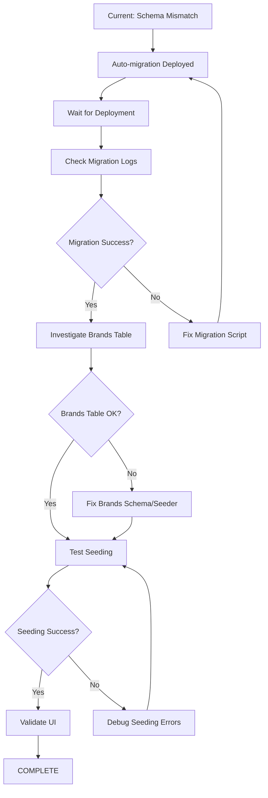

# Critical Requirements Analysis for DATA-011
## Comprehensive Review Before Production Deployment

**Date**: 2025-12-16  
**Context**: Seeding system failed due to schema mismatch  
**Question**: Are there other critical requirements we need to address first?

---

## ✅ FIXED: Primary Issue

### Schema Sync on Deployment
- **Problem**: Database schema not automatically synced with code changes
- **Impact**: `paymentTerms` column missing, seeding failures
- **Solution**: Added automatic migration via `post-deploy-migrate.sh`
- **Status**: ✅ IMPLEMENTED (commit ca98e132)

---

## 🔍 Additional Critical Requirements Identified

### 1. ⚠️ Migration Strategy (NEEDS DECISION)

**Current Implementation**:
```bash
pnpm drizzle-kit push
```

**Issue**: `drizzle-kit push` applies schema changes directly without creating migration files.

**Pros**:
- ✅ Fast and simple
- ✅ Works for development/small changes
- ✅ No migration file management

**Cons**:
- ❌ No migration history
- ❌ Harder to rollback
- ❌ Can't review changes before applying
- ❌ Not recommended for production

**Better Approach**:
```bash
# Generate migration file
pnpm drizzle-kit generate

# Apply migration
pnpm drizzle-kit migrate
```

**Recommendation**: 
- **For now**: Keep `push` for speed (we're still in early development)
- **Before production**: Switch to `generate` + `migrate` workflow
- **Action**: Document this as technical debt

**Priority**: 🟡 MEDIUM (not blocking, but should be addressed)

---

### 2. ✅ Health Check Timing (VERIFIED OK)

**Current Configuration**:
```yaml
initial_delay_seconds: 180  # 3 minutes
```

**Analysis**:
- Migrations typically take <30 seconds
- 180 seconds is sufficient buffer
- Health check uses `/health/live` (no DB dependency)

**Status**: ✅ NO ACTION NEEDED

---

### 3. ⚠️ Seeding System Schema Validation (NEEDS TESTING)

**Current State**:
- Seeding generators have schema validation
- But validation happens AFTER data generation
- Schema mismatches cause runtime errors

**Issues Found**:
1. ✅ `vendors.paymentTerms` - Fixed by auto-migration
2. ❓ `brands` table insert failure - Need to investigate
3. ❓ `products` seeding failure - Depends on brands
4. ❓ `batches` seeding failure - Depends on products
5. ❓ `orders` seeding failure - Depends on batches

**Root Cause**: Cascade failure from brands table issue

**Action Required**:
1. Check if `brands` table exists in schema
2. Verify `brands` table structure matches seeder
3. Test seeding after migration runs

**Priority**: 🔴 HIGH (blocking seeding validation)

---

### 4. ✅ Environment Variables (VERIFIED OK)

**Checked**:
- `DATABASE_URL`: ✅ Set, scope correct (`RUN_AND_BUILD_TIME`)
- `NODE_ENV`: ✅ Set to `production`
- `JWT_SECRET`: ✅ Set as SECRET
- `NEXTAUTH_SECRET`: ✅ Set as SECRET

**Status**: ✅ NO ACTION NEEDED

---

### 5. ⚠️ Concurrent Migration Safety (LOW RISK)

**Current**: 
- `instance_count: 1` (single instance)
- No migration locking mechanism

**Risk**:
- If scaled to multiple instances, concurrent migrations could conflict
- Each container would try to run migrations simultaneously

**Mitigation**:
- ✅ Currently safe (only 1 instance)
- ⚠️ Need locking if scaling (use database advisory locks)

**Action**: Document for future scaling

**Priority**: 🟢 LOW (not applicable yet)

---

### 6. ⚠️ Brands Table Investigation (CRITICAL)

**Error from seeding**:
```
products: Failed query: insert into `brands` (`id`, `name`, `deleted_at`, `vendorId`, `description`, `createdAt`, `updatedAt`) values (default, ?, default, default, ?, default, default)
params: TERP House Brand,Default brand for all products
```

**Possible Issues**:
1. `brands` table doesn't exist
2. `brands` table has different structure
3. Foreign key constraint on `vendorId`
4. Default value issues

**Investigation Needed**:
```bash
# Check if brands table exists in schema
grep -A 20 "export const brands" drizzle/schema.ts

# Check seeder expectations
grep -A 20 "brands" scripts/seed/seeders/seed-products.ts
```

**Priority**: 🔴 CRITICAL (blocking seeding)

---

## 📋 Action Plan

### Immediate (Before Next Deployment)

1. **Investigate brands table** 🔴
   ```bash
   # In console after deployment
   mysql -e "DESCRIBE brands" $DATABASE_NAME
   ```

2. **Wait for auto-migration to complete** 🔴
   - Deployment will trigger automatically
   - Migrations will run via post-deploy script
   - Monitor logs for success/failure

3. **Test seeding after migration** 🔴
   ```bash
   pnpm seed:new --dry-run --size=small
   pnpm seed:new --clean --size=small --force
   ```

### Short-term (This Week)

4. **Document migration strategy decision** 🟡
   - Decide: `push` vs `generate+migrate`
   - Update deployment docs
   - Add to technical debt if keeping `push`

5. **Add migration safety checks** 🟡
   - Verify schema before seeding
   - Add rollback documentation
   - Test backup/restore procedure

### Long-term (Before Production Launch)

6. **Implement proper migrations** 🟡
   - Switch from `push` to `generate+migrate`
   - Create migration history
   - Add migration testing to CI/CD

7. **Add migration locking** 🟢
   - Implement if scaling beyond 1 instance
   - Use database advisory locks
   - Test concurrent deployment scenarios

---

## 🎯 Critical Path to Success



---

## ✅ Summary: What's Blocking Us Now?

### Blocking (Must Fix Before Seeding Works)
1. 🔴 **Brands table issue** - Need to investigate after migration runs
2. 🔴 **Cascade failures** - Products, batches, orders depend on brands

### Non-Blocking (Can Address Later)
1. 🟡 **Migration strategy** - `push` works but not ideal for production
2. 🟡 **Migration safety** - Need better rollback procedures
3. 🟢 **Scaling concerns** - Only relevant when scaling beyond 1 instance

### Already Fixed
1. ✅ **Schema sync** - Auto-migration implemented
2. ✅ **Environment vars** - All configured correctly
3. ✅ **Health checks** - Timing is adequate

---

## 🚀 Next Steps

1. **Monitor deployment** (5 minutes)
   - Watch for auto-migration in logs
   - Verify no errors during startup

2. **Investigate brands table** (10 minutes)
   - Check schema definition
   - Compare with seeder expectations
   - Fix mismatch if found

3. **Re-test seeding** (15 minutes)
   - Run dry-run first
   - Execute actual seeding
   - Validate data in UI

4. **Document findings** (10 minutes)
   - Update this analysis
   - Add to deployment checklist
   - Create issue for migration strategy

**Total Time**: ~40 minutes to complete validation

---

## 📞 Decision Points

### For User to Decide:

**Q1**: Should we switch from `drizzle-kit push` to `generate+migrate` now or later?
- **Now**: More work, but proper production setup
- **Later**: Faster to validate, but technical debt

**Q2**: Do we need to support concurrent deployments/scaling soon?
- **Yes**: Need to add migration locking now
- **No**: Can defer until scaling is needed

**Q3**: What's the acceptable downtime for migrations?
- **Current**: ~30 seconds per deployment
- **Future**: May need zero-downtime migrations

---

**Conclusion**: The main blocker is the **brands table issue**. Everything else is either fixed or can be addressed later. Once we fix brands, seeding should work end-to-end.
