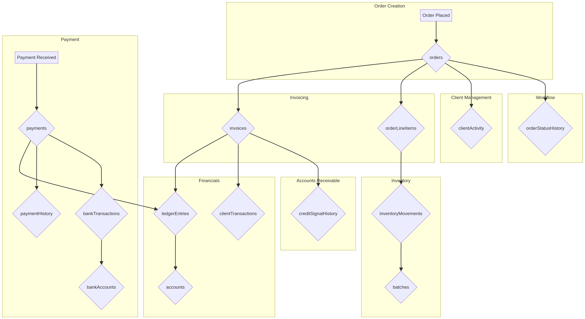
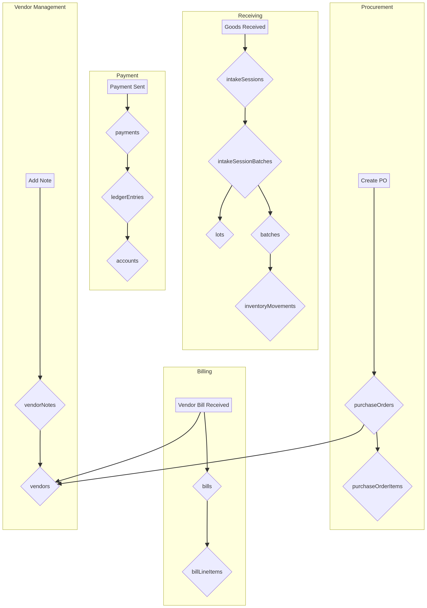
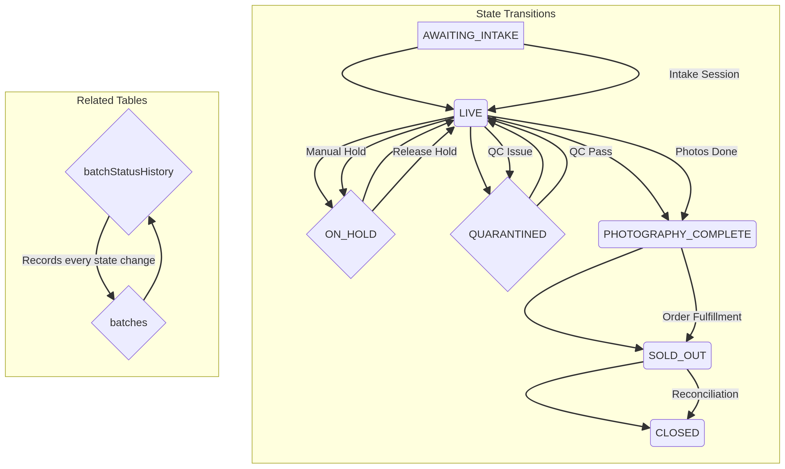
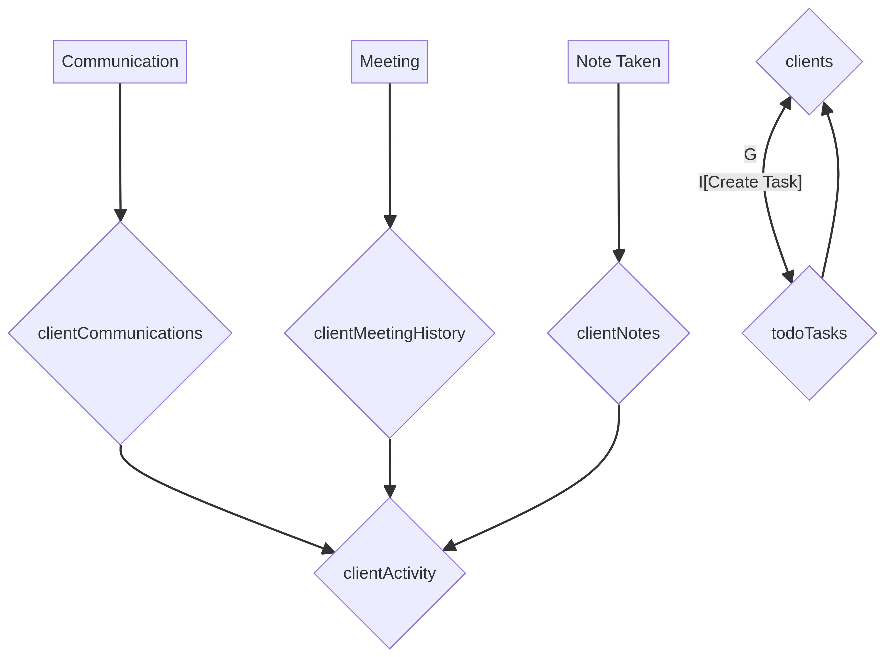

# DATA-001: Operational Flow Mapping

**Objective:** Map complete operational flows for all major business processes, showing every table touched during each operation. This document serves as the blueprint for building operationally coherent data generators.

---

## 1. Order-to-Cash Flow

**Description:** The complete lifecycle from a customer placing an order to the payment being received and reconciled.

## 2. Procure-to-Pay Flow

**Description:** The process of acquiring goods from vendors, from purchase order to final payment.

## 3. Inventory Workflow Lifecycle

**Description:** The state transitions of an inventory batch from receipt to final sale.

## 4. Events & Calendar Flow

**Description:** The process of scheduling, managing, and completing events with clients or internal teams.

## 5. Client Relationship Management Flow

**Description:** The ongoing interaction with clients, including communication, activities, and notes.

