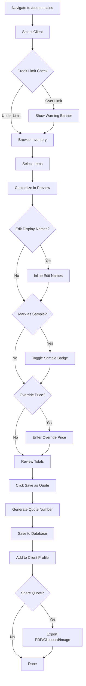
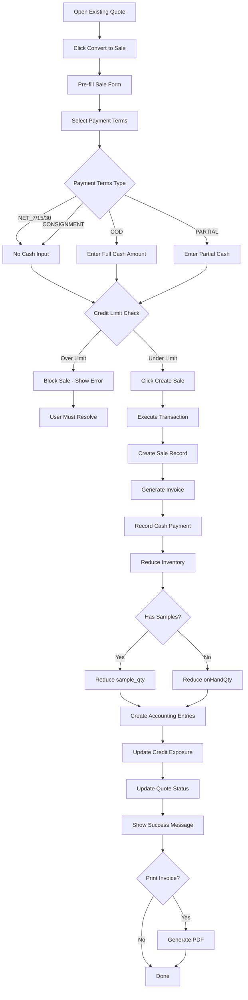
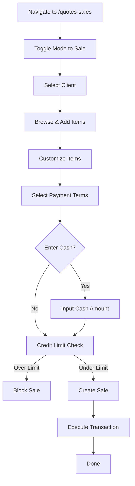

# Quote/Sales Module - User Workflows & UI Flows

**Created:** October 25, 2025  
**Purpose:** Visual representation of user workflows and UI interactions

---

## 🔄 Workflow Diagrams

### Workflow 1: Create Quote



### Workflow 2: Convert Quote to Sale



### Workflow 3: Direct Sale (No Quote)



---

## 🎨 UI State Flows

### Credit Alert Banner States

```
State 1: No Client Selected
┌────────────────────────────────────────┐
│ ℹ️ Select a client to view credit info │
└────────────────────────────────────────┘

State 2: Under 60% Utilization (Green)
┌─────────────────────────────────────────────────────────────┐
│ ✅ Credit Available                                         │
│ Limit: $50,000 | Used: $25,000 | Available: $25,000        │
│ [████████░░░░░░░░░░] 50%                                    │
└─────────────────────────────────────────────────────────────┘

State 3: 60-80% Utilization (Amber)
┌─────────────────────────────────────────────────────────────┐
│ ⚠️ Moderate Credit Usage                                    │
│ Limit: $50,000 | Used: $38,500 | Available: $11,500        │
│ [████████████████░░░░] 77%                                  │
│ [Expand Details ▼]                                          │
└─────────────────────────────────────────────────────────────┘

State 4: 80-100% Utilization (Red Warning)
┌─────────────────────────────────────────────────────────────┐
│ 🚨 Approaching Credit Limit                                 │
│ Limit: $50,000 | Used: $47,000 | Available: $3,000         │
│ [██████████████████████░] 94%                               │
│ ⚠️ This quote will exceed limit by $2,000                  │
│ [Expand Details ▼]                                          │
└─────────────────────────────────────────────────────────────┘

State 5: Over 100% Utilization (Red Error)
┌─────────────────────────────────────────────────────────────┐
│ ⛔ Credit Limit Exceeded                                    │
│ Limit: $50,000 | Used: $51,000 | Over Limit: $1,000        │
│ [████████████████████████] 102%                             │
│ ❌ Cannot create sale - credit limit exceeded              │
│ [Contact Manager] [Adjust Quote]                            │
└─────────────────────────────────────────────────────────────┘
```

### Item Display States

```
State 1: Regular Item
┌────────────────────────────────────────┐
│ Blue Dream                             │
│ [Edit Name] [Mark as Sample]           │
│ Qty: 10 | Price: $150.00               │
│ [Override Price] [Remove]              │
└────────────────────────────────────────┘

State 2: Item with Edited Display Name
┌────────────────────────────────────────┐
│ Premium Flower ✏️                      │
│ (System: Blue Dream)                   │
│ [Edit Name] [Mark as Sample]           │
│ Qty: 10 | Price: $150.00               │
│ [Override Price] [Remove]              │
└────────────────────────────────────────┘

State 3: Sample Item
┌────────────────────────────────────────┐
│ OG Kush 🎁 SAMPLE                      │
│ [Edit Name] [Remove Sample]            │
│ Qty: 2 | FREE                          │
│ [Remove]                               │
└────────────────────────────────────────┘

State 4: Sample with Custom Name
┌────────────────────────────────────────┐
│ Trial Pack ✏️ 🎁 SAMPLE               │
│ (System: OG Kush)                      │
│ [Edit Name] [Remove Sample]            │
│ Qty: 2 | FREE                          │
│ [Remove]                               │
└────────────────────────────────────────┘

State 5: Item with Price Override
┌────────────────────────────────────────┐
│ Blue Dream                             │
│ [Edit Name] [Mark as Sample]           │
│ Qty: 10 | Price: $̶1̶5̶0̶.̶0̶0̶ $140.00 💰 │
│ [Clear Override] [Remove]              │
└────────────────────────────────────────┘
```

### Payment Terms Selection States

```
State 1: NET Terms (No Cash Input)
┌────────────────────────────────────────┐
│ Payment Terms                          │
│ ○ NET 7 Days                           │
│ ○ NET 15 Days                          │
│ ● NET 30 Days                          │
│ ○ Cash on Delivery                     │
│ ○ Partial Payment                      │
│ ○ Consignment                          │
│                                        │
│ Due Date: Nov 24, 2025                 │
└────────────────────────────────────────┘

State 2: COD (Full Cash Input)
┌────────────────────────────────────────┐
│ Payment Terms                          │
│ ○ NET 7 Days                           │
│ ○ NET 15 Days                          │
│ ○ NET 30 Days                          │
│ ● Cash on Delivery                     │
│ ○ Partial Payment                      │
│ ○ Consignment                          │
│                                        │
│ Cash Payment: [$1,500.00]              │
│ ✅ Full payment received               │
└────────────────────────────────────────┘

State 3: Partial Payment
┌────────────────────────────────────────┐
│ Payment Terms                          │
│ ○ NET 7 Days                           │
│ ○ NET 15 Days                          │
│ ○ NET 30 Days                          │
│ ○ Cash on Delivery                     │
│ ● Partial Payment                      │
│ ○ Consignment                          │
│                                        │
│ Total Amount: $1,500.00                │
│ Cash Payment: [$500.00]                │
│ Remaining Due: $1,000.00               │
│ Due Date: Nov 24, 2025                 │
└────────────────────────────────────────┘
```

---

## 🖥️ Screen Layouts

### Desktop Layout (1920x1080)

```
┌──────────────────────────────────────────────────────────────────┐
│ TERP - Quote & Sales Creator                          [User ▼]   │
├──────────────────────────────────────────────────────────────────┤
│                                                                   │
│  [Client: Acme Corp ▼]  [Mode: ● Quote  ○ Sale]                 │
│                                                                   │
│  ┌────────────────────────────────────────────────────────────┐  │
│  │ 💳 Credit Alert                                            │  │
│  │ Limit: $50,000 | Used: $38,500 | Available: $11,500       │  │
│  │ [████████████████░░░░] 77% ⚠️ Approaching Limit           │  │
│  └────────────────────────────────────────────────────────────┘  │
│                                                                   │
│  ┌─────────────────────────┬──────────────────────────────────┐  │
│  │ Inventory Browser       │ Quote Preview                    │  │
│  │ (60% width)             │ (40% width)                      │  │
│  │                         │                                  │  │
│  │ [Search inventory...]   │ Quote #Q-2025-001                │  │
│  │                         │ Client: Acme Corp                │  │
│  │ ┌─────────────────────┐ │ Valid Until: Nov 30, 2025        │  │
│  │ │☐ Blue Dream         │ │                                  │  │
│  │ │  Category: Flower   │ │ ┌──────────────────────────────┐ │  │
│  │ │  Qty: 100           │ │ │ 1. Blue Dream                │ │  │
│  │ │  Base: $100         │ │ │    [Edit] [Sample]           │ │  │
│  │ │  Retail: $150       │ │ │    Qty: 10 | $150.00         │ │  │
│  │ │  [Add]              │ │ │    [Override] [Remove]       │ │  │
│  │ └─────────────────────┘ │ ├──────────────────────────────┤ │  │
│  │                         │ │ 2. OG Kush 🎁 SAMPLE         │ │  │
│  │ ┌─────────────────────┐ │ │    Qty: 2 | FREE             │ │  │
│  │ │☐ OG Kush            │ │ │    [Edit] [Remove]           │ │  │
│  │ │  Category: Flower   │ │ └──────────────────────────────┘ │  │
│  │ │  Qty: 75            │ │                                  │  │
│  │ │  Base: $90          │ │ Subtotal: $1,500.00              │  │
│  │ │  Retail: $135       │ │ Tax (0%): $0.00                  │  │
│  │ │  [Add]              │ │ Discount: $0.00                  │  │
│  │ └─────────────────────┘ │ ─────────────────                │  │
│  │                         │ Total: $1,500.00                 │  │
│  │ [Select All]            │                                  │  │
│  │ [Clear Selection]       │ Samples: 2 items (not charged)   │  │
│  │ [Add Selected (0)]      │                                  │  │
│  │                         │ [Save as Quote] [Create Sale]    │  │
│  └─────────────────────────┴──────────────────────────────────┘  │
│                                                                   │
└──────────────────────────────────────────────────────────────────┘
```

### Mobile Layout (375x667)

```
┌─────────────────────────┐
│ ☰  Quote Creator   [⋮]  │
├─────────────────────────┤
│                         │
│ [Client: Acme ▼]        │
│ [● Quote  ○ Sale]       │
│                         │
│ ┌─────────────────────┐ │
│ │ 💳 Credit Alert     │ │
│ │ $11.5K Available    │ │
│ │ [████████░░] 77%    │ │
│ │ [Details ▼]         │ │
│ └─────────────────────┘ │
│                         │
│ [Inventory] [Preview]   │
│ ─────────────────────── │
│                         │
│ [Search...]             │
│                         │
│ ┌─────────────────────┐ │
│ │ Blue Dream          │ │
│ │ Flower | 100 units  │ │
│ │ $100 → $150         │ │
│ │ [Add to Quote]      │ │
│ └─────────────────────┘ │
│                         │
│ ┌─────────────────────┐ │
│ │ OG Kush             │ │
│ │ Flower | 75 units   │ │
│ │ $90 → $135          │ │
│ │ [Add to Quote]      │ │
│ └─────────────────────┘ │
│                         │
│ [Select All]            │
│                         │
├─────────────────────────┤
│ 2 items | $1,500        │
│ [View Quote]            │
└─────────────────────────┘
```

---

## 🔀 State Transitions

### Quote Status Lifecycle

```
DRAFT
  ↓ (User clicks "Send to Client")
SENT
  ↓ (Client opens quote link)
VIEWED
  ↓ (Client accepts)
ACCEPTED
  ↓ (User converts to sale)
CONVERTED → Links to Sale
  
Alternative paths:
DRAFT/SENT/VIEWED
  ↓ (Client rejects)
REJECTED

DRAFT/SENT/VIEWED
  ↓ (Valid until date passes)
EXPIRED
```

### Sale Status Lifecycle

```
PENDING (Created, not paid)
  ↓ (Partial payment received)
PARTIAL
  ↓ (Full payment received)
PAID
  
Alternative paths:
PENDING
  ↓ (Due date passes without payment)
OVERDUE

PENDING/PARTIAL/OVERDUE
  ↓ (User cancels sale)
CANCELLED
```

---

## 🎯 Interaction Patterns

### Inline Display Name Editing

```
1. User clicks item display name
   → Text becomes editable input field
   → Original name shown below in gray
   
2. User types new name
   → Auto-save on blur
   → Show ✏️ icon to indicate custom name
   
3. User can revert
   → Click "Reset to Original"
   → Custom name cleared
```

### Sample Toggle Interaction

```
1. User clicks "Mark as Sample"
   → Item price changes to FREE
   → Green 🎁 badge appears
   → Item excluded from total
   → Sample count increments
   
2. User clicks "Remove Sample"
   → Item price restored
   → Badge removed
   → Item included in total
   → Sample count decrements
```

### Price Override Interaction

```
1. User clicks "Override Price"
   → Modal opens with current price
   → User enters new price
   
2. User confirms
   → Original price shown with strikethrough
   → New price shown in bold
   → 💰 icon indicates override
   
3. User can clear
   → Click "Clear Override"
   → Original price restored
```

---

## 📊 Data Flow Diagrams

### Quote Creation Data Flow

```
User Input (Client, Items, Customizations)
  ↓
Frontend Validation (Credit limit, required fields)
  ↓
tRPC Mutation: quotes.create
  ↓
Backend Processing:
  - Generate quote number
  - Calculate totals (exclude samples)
  - Save to database
  ↓
Response: { quoteId, quoteNumber }
  ↓
Frontend Updates:
  - Show success toast
  - Add to client profile
  - Enable share options
```

### Sale Creation Data Flow

```
User Input (Quote/Items, Payment Terms, Cash)
  ↓
Frontend Validation (Credit limit, payment amount)
  ↓
tRPC Mutation: sales.create
  ↓
Backend Transaction:
  1. Validate credit limit
  2. Create sale record
  3. Generate invoice
  4. Record payment (if cash)
  5. Reduce inventory (regular + samples)
  6. Create accounting entries
  7. Update credit exposure
  8. Update quote status (if from quote)
  ↓
Response: { saleId, invoiceId, saleNumber }
  ↓
Frontend Updates:
  - Show success message
  - Navigate to invoice view
  - Offer print/email options
```

---

## ✅ Validation Rules

### Quote Validation
- ✅ Client must be selected
- ✅ At least 1 item (regular or sample)
- ✅ Display names max 255 characters
- ✅ Valid until date must be future
- ✅ Override prices must be positive

### Sale Validation
- ✅ Client must be selected
- ✅ At least 1 non-sample item (samples alone not allowed)
- ✅ Payment terms must be selected
- ✅ Cash payment ≤ total amount
- ✅ Credit limit not exceeded (or override permission)
- ✅ Sufficient inventory for all items

---

**Status:** 📋 Ready for User Review

**Next Step:** User reviews workflows and UI flows for approval.

