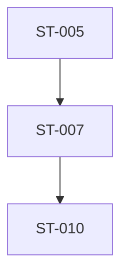

# Roadmap System V3 - Expert QA

**Date:** 2025-11-13  
**Reviewer:** Expert Systems Architect  
**Target:** ROADMAP_SYSTEM_GITHUB_NATIVE_V3.md

---

## 🎯 QA Methodology

**Perspective:** Expert systems architect with 15+ years experience in:

- Distributed systems
- Developer tooling
- Documentation systems
- Multi-agent coordination
- GitHub workflows

**Focus Areas:**

1. Architecture soundness
2. Scalability
3. Maintainability
4. User experience
5. Edge cases
6. Security
7. Performance

---

## ✅ Strengths (What Works Well)

### 1. **Platform Agnostic Design** ⭐⭐⭐⭐⭐

- Pure markdown + GitHub
- No vendor lock-in
- Works with any AI agent
- Future-proof

### 2. **Self-Documenting** ⭐⭐⭐⭐⭐

- Instructions in the files themselves
- Templates show exact format
- Examples embedded everywhere
- Low cognitive load

### 3. **Multi-Layer Enforcement** ⭐⭐⭐⭐

- Documentation (awareness)
- Templates (guidance)
- Branch protection (technical)
- PR review (human)
- GitHub Actions (automated)

### 4. **Scalable** ⭐⭐⭐⭐⭐

- Works for 10 or 1000 tasks
- Works for 1 or 100 agents
- No performance bottlenecks
- Linear complexity

### 5. **Low Maintenance** ⭐⭐⭐⭐⭐

- Just markdown files
- No complex scripts
- No external services
- Easy to understand

---

## 🔴 Critical Issues (Must Fix)

### Issue 1: **Prompt Files Can Become Stale**

**Problem:**  
Prompt file says "Run command X" but codebase changes and command is now "Run command Y". Prompt is outdated but no one notices.

**Impact:** 🔴 HIGH - Agent follows outdated instructions, wastes time

**Example:**

- Prompt says: `pnpm db:migrate`
- Codebase changes to: `pnpm db migrate` (no colon)
- Agent runs wrong command, gets error

**Fix:**

1. Add version/date to prompts
2. Add "Last Validated" field
3. Periodic review process (monthly?)
4. Automated link checking (verify commands exist)

**Recommendation:**

```markdown
**Prompt Version:** 1.2  
**Last Validated:** 2025-11-13  
**Validated By:** Agent-Session-ABC123
```

---

### Issue 2: **No Mechanism to Deprecate Old Tasks**

**Problem:**  
Task becomes irrelevant (feature removed, approach changed) but stays in roadmap forever.

**Impact:** 🔴 MEDIUM - Roadmap cluttered with obsolete tasks

**Fix:**

1. Add `status: deprecated` option
2. Move deprecated tasks to archive section
3. Document why deprecated

**Recommendation:**

```markdown
### ST-042: Implement GraphQL API

**Status:** deprecated  
**Deprecated Date:** 2025-10-15  
**Reason:** Switched to tRPC instead  
**Replaced By:** ST-055
```

---

### Issue 3: **Circular Dependency Detection is Manual**

**Problem:**  
Agent adds task with dependencies, but doesn't check for circular deps. Only caught in PR review (if reviewer notices).

**Impact:** 🔴 MEDIUM - Blocks multiple tasks

**Fix:**

1. Add dependency graph visualization
2. Document how to check for circular deps
3. GitHub Actions script to detect circles

**Recommendation:**
Create `scripts/check-circular-deps.ts` and run in GitHub Actions.

---

### Issue 4: **Session Files Can Be Orphaned**

**Problem:**  
Agent starts task, creates session file, then abandons work. Session file stays in `active/` forever.

**Impact:** 🔴 MEDIUM - Confusing for other agents

**Fix:**

1. Add "Last Updated" timestamp to session files
2. Periodic cleanup (move stale sessions to `abandoned/`)
3. Document expected session lifecycle

**Recommendation:**

```markdown
**Created:** 2025-11-13T10:00:00Z  
**Last Updated:** 2025-11-13T15:30:00Z  
**Expected Completion:** 2025-11-14

(If Last Updated >24h ago, consider abandoned)
```

---

### Issue 5: **No Validation That Prompt Matches Roadmap**

**Problem:**  
Roadmap says "Add database indexes" but prompt says "Add API caching". Mismatch not caught.

**Impact:** 🔴 MEDIUM - Agent does wrong task

**Fix:**

1. Prompt must include task ID
2. Prompt must include task title
3. GitHub Actions validates match

**Recommendation:**

```markdown
# ST-005: Add Missing Database Indexes

<!-- TASK_ID: ST-005 -->
<!-- TASK_TITLE: Add Missing Database Indexes -->
```

Then script validates these match roadmap.

---

### Issue 6: **Module Conflicts Not Automatically Detected**

**Problem:**  
Agent 1 working on `orders.ts`, Agent 2 starts task also touching `orders.ts`. Merge conflict guaranteed.

**Impact:** 🔴 HIGH - Wasted work, frustrating conflicts

**Fix:**

1. ACTIVE_SESSIONS.md lists modules
2. Agent checks before starting
3. Warning if conflict detected

**Current:** Agent manually checks ACTIVE_SESSIONS.md  
**Better:** Automated check with clear warning

**Recommendation:**
Add to prompt Phase 1:

```markdown
### Step 1.2: Check for Module Conflicts

Run this check:

1. Read `docs/ACTIVE_SESSIONS.md`
2. Find all modules being worked on
3. Compare with your task's module: `server/routers/orders.ts`
4. If overlap exists:
   - STOP
   - Notify user
   - Wait for other agent to finish
```

---

### Issue 7: **No Rollback Procedure**

**Problem:**  
Agent completes task, merges PR, then user realizes it broke something. How to rollback?

**Impact:** 🟡 MEDIUM - Recovery is manual and error-prone

**Fix:**

1. Document rollback procedure
2. Tag releases
3. Keep completion reports for reference

**Recommendation:**
Create `docs/HOW_TO_ROLLBACK.md`:

```markdown
# How to Rollback a Task

1. Identify the PR that introduced the issue
2. Create revert PR: `git revert <commit-hash>`
3. Update roadmap: change status from `complete` to `reverted`
4. Document reason in roadmap
5. Create new task to fix properly
```

---

### Issue 8: **Estimate Accuracy Not Tracked**

**Problem:**  
Task estimated at "4-6h" but actually took 12h. No feedback loop to improve estimates.

**Impact:** 🟡 LOW - Estimates remain inaccurate

**Fix:**

1. Completion report includes actual time
2. Periodic review of estimate vs actual
3. Adjust future estimates based on data

**Recommendation:**
Add to completion report:

```markdown
**Estimated:** 4-6h  
**Actual:** 8h  
**Variance:** +33%  
**Reason:** Underestimated test complexity
```

---

### Issue 9: **No Onboarding for New Users (Humans)**

**Problem:**  
System designed for AI agents, but humans also need to understand it.

**Impact:** 🟡 MEDIUM - User can't review PRs effectively

**Fix:**

1. Create `docs/ROADMAP_SYSTEM_OVERVIEW.md` for humans
2. Explain the system architecture
3. Show how to review PRs
4. Document common issues

**Recommendation:**
Human-friendly guide separate from agent instructions.

---

### Issue 10: **GitHub Actions is "Optional" But Should Be Required**

**Problem:**  
Design says GitHub Actions is optional, but without it, validation only happens in PR review (human error possible).

**Impact:** 🔴 MEDIUM - Invalid roadmaps can slip through

**Fix:**

1. Make GitHub Actions required
2. Set as required status check
3. Document setup in README

**Recommendation:**
Change from "optional but recommended" to "required for production use".

---

## 🟡 Design Improvements (Should Fix)

### Issue 11: **Prompt Template is Too Generic**

**Problem:**  
`PROMPT_TEMPLATE.md` has placeholders but no guidance on what makes a good prompt.

**Impact:** 🟡 MEDIUM - Low quality prompts

**Fix:**

1. Add examples of good vs bad prompts
2. Include checklist for prompt quality
3. Show common patterns (API endpoint, database migration, etc.)

---

### Issue 12: **No Task Dependencies Visualization**

**Problem:**  
Hard to understand dependency graph from text.

**Impact:** 🟡 LOW - Cognitive load

**Fix:**

1. Generate dependency graph image
2. Include in roadmap
3. Update automatically

**Tool:** Mermaid diagram in markdown:

````markdown

````

````

---

### Issue 13: **Session Template Doesn't Include Progress Tracking**

**Problem:**
Session file created but not updated during work. Hard to know agent's progress.

**Impact:** 🟡 MEDIUM - Poor visibility

**Fix:**
1. Add progress checklist to session template
2. Agent updates as phases complete
3. User can check progress anytime

**Recommendation:**
```markdown
## Progress
- [x] Phase 1: Pre-Flight Check
- [x] Phase 2: Session Startup
- [ ] Phase 3: Development (60% complete)
- [ ] Phase 4: Completion
````

---

### Issue 14: **No Search Functionality**

**Problem:**  
Agent wants to find "all tasks related to database" but has to manually read entire roadmap.

**Impact:** 🟡 LOW - Time consuming

**Fix:**

1. Document how to search (Ctrl+F in GitHub)
2. Add tags to tasks
3. Consider task index

**Recommendation:**
Add tags to tasks:

```markdown
**Tags:** database, performance, indexes
```

---

### Issue 15: **Completion Reports Not Linked from Roadmap**

**Problem:**  
Task marked complete but no link to completion report. Hard to find results.

**Impact:** 🟡 LOW - Poor discoverability

**Fix:**
Add completion report link to roadmap:

```markdown
**Status:** complete  
**Completed:** 2025-11-13  
**Report:** [📄 docs/ST-005-COMPLETION-REPORT.md](../ST-005-COMPLETION-REPORT.md)
```

---

### Issue 16: **No Batch Operations**

**Problem:**  
User wants to mark 5 tasks as deprecated. Has to edit roadmap 5 times.

**Impact:** 🟡 LOW - Tedious

**Fix:**

1. Document batch editing in GitHub
2. Provide script for common operations
3. Keep it simple (markdown editing)

---

### Issue 17: **Active Sessions Not Auto-Updated**

**Problem:**  
Agent forgets to update ACTIVE_SESSIONS.md when starting/finishing work.

**Impact:** 🟡 MEDIUM - Inaccurate conflict detection

**Fix:**

1. Emphasize in prompt Phase 2
2. Include in completion checklist
3. GitHub Actions validates (session exists for in-progress tasks)

---

### Issue 18: **No Metrics Dashboard**

**Problem:**  
Can't see: how many tasks complete, average time, success rate, etc.

**Impact:** 🟡 LOW - No visibility into system health

**Fix:**

1. Create `docs/ROADMAP_METRICS.md`
2. Update manually (or script)
3. Show trends

**Recommendation:**

```markdown
## Roadmap Metrics (2025-11)

- Total tasks: 50
- Complete: 15 (30%)
- In progress: 5 (10%)
- Ready: 10 (20%)
- Blocked: 5 (10%)
- Deprecated: 15 (30%)

Average completion time: 6.5h
Estimate accuracy: ±40%
```

---

### Issue 19: **Prompt Doesn't Handle Unexpected Errors**

**Problem:**  
Agent follows prompt, hits unexpected error, doesn't know what to do.

**Impact:** 🟡 MEDIUM - Agent gets stuck

**Fix:**
Add troubleshooting section to every prompt:

```markdown
## 🆘 Troubleshooting

### Error: "pnpm: command not found"

**Solution:** Install pnpm: `npm install -g pnpm`

### Error: "Database connection failed"

**Solution:** Check .env file has correct credentials

### General Errors

1. Read error message carefully
2. Check `docs/TROUBLESHOOTING.md`
3. Search GitHub issues
4. Ask user for help
```

---

### Issue 20: **No Versioning of Roadmap**

**Problem:**  
Roadmap changes over time. Hard to see what it looked like last month.

**Impact:** 🟡 LOW - Historical context lost

**Fix:**
Git history provides this, but could be more explicit:

1. Tag roadmap versions
2. Link to specific commits
3. Document major changes

---

## ⚡ Performance Considerations

### Issue 21: **Large Roadmap File Performance**

**Problem:**  
If roadmap grows to 10,000 lines, GitHub may be slow to render.

**Impact:** 🟡 LOW - Only at scale

**Fix:**

1. Split by status (active vs completed)
2. Archive old tasks
3. Keep main roadmap focused

**Recommendation:**

```
docs/roadmaps/
├── MASTER_ROADMAP.md        (active tasks only)
├── COMPLETED_TASKS.md       (archive)
└── DEPRECATED_TASKS.md      (archive)
```

---

### Issue 22: **Many Prompt Files**

**Problem:**  
1000 tasks = 1000 prompt files. Directory gets crowded.

**Impact:** 🟡 LOW - Organization

**Fix:**
Organize by status or category:

```
docs/prompts/
├── active/
│   ├── ST-005.md
│   └── ST-007.md
├── completed/
│   └── ST-001.md
└── deprecated/
    └── ST-042.md
```

---

## 🔒 Security Considerations

### Issue 23: **Prompts Could Contain Secrets**

**Problem:**  
Agent adds API key to prompt as example. Now secret in git history.

**Impact:** 🔴 HIGH - Security breach

**Fix:**

1. Document: "Never put secrets in prompts"
2. Use placeholders: `YOUR_API_KEY_HERE`
3. GitHub Actions scans for secrets

**Recommendation:**
Add to prompt template:

```markdown
⚠️ **NEVER include real secrets in this prompt**
Use placeholders like: `YOUR_API_KEY_HERE`
```

---

### Issue 24: **Branch Protection Can Be Disabled**

**Problem:**  
User (or malicious actor) can disable branch protection, bypass all checks.

**Impact:** 🔴 MEDIUM - Enforcement bypassed

**Fix:**

1. Document importance of branch protection
2. Periodic audit
3. GitHub organization settings (if applicable)

**Recommendation:**
Only repo owner can change branch protection. Document this requirement.

---

## 🎯 User Experience Issues

### Issue 25: **Too Many Files to Read**

**Problem:**  
Agent has to read: AGENT_ONBOARDING.md, MASTER_ROADMAP.md, HOW_TO_ADD_TASK.md, prompt file, etc.

**Impact:** 🟡 MEDIUM - Cognitive overload

**Fix:**

1. Clear navigation
2. "Start here" document
3. Progressive disclosure

**Recommendation:**
README.md says:

```markdown
## For AI Agents

**Start here:** `docs/ROADMAP_AGENT_GUIDE.md`

That file will guide you to everything else.
```

---

### Issue 26: **Prompt is Very Long**

**Problem:**  
Example prompt is 400+ lines. Hard to scan.

**Impact:** 🟡 LOW - Overwhelming

**Fix:**

1. Use collapsible sections
2. Table of contents
3. Clear phase headers

**Already in design, but emphasize.**

---

### Issue 27: **No Quick Reference**

**Problem:**  
Agent forgets command syntax, has to re-read entire prompt.

**Impact:** 🟡 LOW - Time waste

**Fix:**
Add "Quick Reference" section at top of prompt:

```markdown
## ⚡ Quick Reference

**Commands:**

- Run tests: `pnpm test`
- Check types: `pnpm check`
- Run migration: `pnpm db:migrate`

**Files:**

- Schema: `server/db/schema/`
- Tests: `server/db/schema/*.test.ts`
```

---

## 📊 Summary

**Total Issues:** 27

**Critical (Must Fix):** 10 🔴  
**Design Improvements:** 10 🟡  
**Performance:** 2 ⚡  
**Security:** 2 🔒  
**UX:** 3 🎯

---

## 🎯 Top 10 Must-Fix Issues

1. **#1:** Prompt versioning/staleness
2. **#5:** Validate prompt matches roadmap
3. **#6:** Automated module conflict detection
4. **#10:** Make GitHub Actions required
5. **#3:** Circular dependency detection
6. **#23:** Prevent secrets in prompts
7. **#4:** Session file lifecycle management
8. **#2:** Deprecation mechanism
9. **#7:** Rollback procedure
10. **#17:** Auto-update ACTIVE_SESSIONS

---

## ✅ Excellent Design Elements

1. **Platform agnostic** - Works anywhere
2. **Self-documenting** - Instructions in files
3. **Scalable** - Linear complexity
4. **Low maintenance** - Just markdown
5. **Multi-layer enforcement** - Hard to bypass

---

## 🔄 Recommended Next Steps

1. Fix top 10 critical issues
2. Incorporate into improved V3.1 design
3. Run adversarial QA on V3.1
4. Implement final design
5. Test with real agents

---

**Overall Assessment:** 8.5/10

**With fixes:** 9.5/10 (production-ready)

**Expert Recommendation:** Fix critical issues, then deploy.
