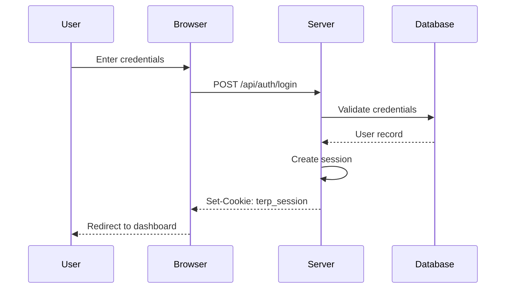
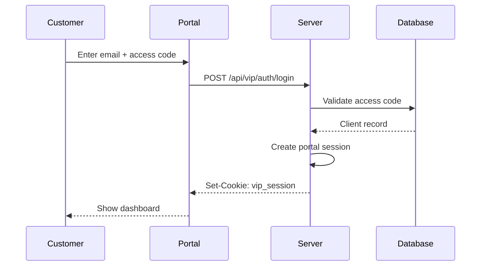

# TERP Authentication Guide

**Last Updated:** 2025-12-31

---

## Overview

TERP uses a hybrid authentication system:

1. **Session-based authentication** for web application users
2. **VIP Portal authentication** for customer-facing portal access

Both systems use HTTP-only cookies for secure session management.

---

## Web Application Authentication

### Login Flow



### Login Endpoint

**Endpoint:** `POST /api/auth/login`

**Request:**

```json
{
  "email": "user@example.com",
  "password": "password123"
}
```

**Success Response (200):**

```json
{
  "success": true,
  "user": {
    "id": 1,
    "email": "user@example.com",
    "name": "John Doe",
    "role": "admin",
    "permissions": ["accounting:read", "inventory:write", "orders:*"]
  }
}
```

**Error Response (401):**

```json
{
  "success": false,
  "error": "Invalid email or password"
}
```

### Logout Endpoint

**tRPC Procedure:** `auth.logout`

**Request:**

```typescript
const logout = trpc.auth.logout.useMutation();
await logout.mutateAsync();
```

**Response:**

```json
{
  "success": true
}
```

### Get Current User

**tRPC Procedure:** `auth.me`

**Request:**

```typescript
const { data: user } = trpc.auth.me.useQuery();
```

**Response (Authenticated):**

```json
{
  "id": 1,
  "email": "user@example.com",
  "name": "John Doe",
  "role": "admin"
}
```

**Response (Not Authenticated):**

```json
null
```

---

## Session Management

### Session Cookie

| Property | Value               |
| -------- | ------------------- |
| Name     | `terp_session`      |
| HttpOnly | `true`              |
| Secure   | `true` (production) |
| SameSite | `Lax`               |
| Max-Age  | 30 days             |
| Path     | `/`                 |

### Session Storage

Sessions are stored in the database with the following structure:

```typescript
interface Session {
  id: string; // UUID
  userId: number; // Reference to user
  token: string; // Session token (hashed)
  expiresAt: Date; // Expiration timestamp
  createdAt: Date; // Creation timestamp
  lastAccessedAt: Date; // Last activity
  userAgent: string; // Browser/client info
  ipAddress: string; // Client IP
}
```

### Session Lifecycle

1. **Creation:** On successful login
2. **Validation:** On each authenticated request
3. **Refresh:** Last accessed timestamp updated on activity
4. **Expiration:** After 30 days of inactivity
5. **Revocation:** On logout or security events

---

## Role-Based Access Control (RBAC)

### Permission Structure

Permissions follow the format: `{resource}:{action}`

**Resources:**

- `accounting` - Financial operations
- `inventory` - Product/batch management
- `orders` - Order management
- `clients` - Customer management
- `admin` - Administrative functions
- `analytics` - Reporting and analytics
- `calendar` - Scheduling features
- `vipPortal` - Customer portal

**Actions:**

- `read` - View data
- `create` - Create new records
- `update` - Modify existing records
- `delete` - Remove records
- `*` - All actions (wildcard)

### Built-in Roles

| Role         | Description           | Key Permissions                              |
| ------------ | --------------------- | -------------------------------------------- |
| `admin`      | Full system access    | `*:*`                                        |
| `manager`    | Operations management | `orders:*`, `inventory:*`, `clients:*`       |
| `sales`      | Sales operations      | `orders:*`, `clients:read`, `inventory:read` |
| `warehouse`  | Inventory operations  | `inventory:*`, `orders:read`                 |
| `accounting` | Financial operations  | `accounting:*`, `orders:read`                |
| `viewer`     | Read-only access      | `*:read`                                     |

### Permission Check Example

```typescript
// Server-side permission check
import { requirePermission } from "../_core/permissionMiddleware";

export const ordersRouter = router({
  create: protectedProcedure
    .use(requirePermission("orders:create"))
    .input(createOrderSchema)
    .mutation(async ({ input, ctx }) => {
      // Only users with orders:create permission can reach here
      return await createOrder(input, ctx.user);
    }),
});
```

### Client-side Permission Check

```typescript
import { useAuth } from "@/hooks/useAuth";

function CreateOrderButton() {
  const { user, hasPermission } = useAuth();

  if (!hasPermission("orders:create")) {
    return null; // Hide button if no permission
  }

  return <Button onClick={handleCreate}>Create Order</Button>;
}
```

---

## VIP Portal Authentication

The VIP Portal uses a separate authentication system for customers.

### Portal Login Flow



### Portal Login Endpoint

**Endpoint:** `POST /api/vip/auth/login`

**Request:**

```json
{
  "email": "customer@example.com",
  "accessCode": "ABC123"
}
```

**Success Response:**

```json
{
  "success": true,
  "client": {
    "id": 1,
    "name": "Acme Corp",
    "email": "customer@example.com",
    "portalEnabled": true
  }
}
```

### Portal Session

| Property | Value               |
| -------- | ------------------- |
| Name     | `vip_session`       |
| HttpOnly | `true`              |
| Secure   | `true` (production) |
| SameSite | `Strict`            |
| Max-Age  | 30 days             |

### Admin Impersonation

Administrators can impersonate customers for support purposes:

**tRPC Procedure:** `vipPortalAdmin.clients.impersonate`

**Request:**

```typescript
const impersonate = trpc.vipPortalAdmin.clients.impersonate.useMutation();
const { sessionUrl } = await impersonate.mutateAsync({ clientId: 123 });
```

**Impersonation Session:**

- Token prefix: `imp_`
- Max duration: 2 hours
- Audit logged
- Visual indicator in portal UI

---

## Security Best Practices

### Password Requirements

- Minimum 8 characters
- At least one uppercase letter
- At least one lowercase letter
- At least one number
- At least one special character

### Rate Limiting

| Endpoint       | Limit        | Window     | Lockout    |
| -------------- | ------------ | ---------- | ---------- |
| Login          | 5 attempts   | 15 minutes | 30 minutes |
| Password Reset | 3 requests   | 1 hour     | 1 hour     |
| API General    | 100 requests | 1 minute   | None       |

### Session Security

1. **Token Rotation:** Sessions are rotated on privilege escalation
2. **IP Binding:** Optional IP address binding for sensitive accounts
3. **Concurrent Sessions:** Configurable limit per user
4. **Force Logout:** Admins can terminate all sessions for a user

### Audit Logging

All authentication events are logged:

```typescript
interface AuthAuditLog {
  timestamp: Date;
  event:
    | "login"
    | "logout"
    | "failed_login"
    | "password_change"
    | "session_revoked";
  userId: number | null;
  email: string;
  ipAddress: string;
  userAgent: string;
  success: boolean;
  details: Record<string, unknown>;
}
```

---

## Troubleshooting

### Common Issues

**"Session expired" error:**

- Session has exceeded 30-day limit
- User was logged out by admin
- Session was invalidated due to security event

**"Unauthorized" error on protected endpoint:**

- Cookie not being sent (check SameSite settings)
- Session token is invalid
- User lacks required permission

**"Too many login attempts":**

- Rate limit exceeded
- Wait for lockout period to expire
- Contact admin to unlock account

### Debug Mode

In development, enable auth debugging:

```bash
AUTH_DEBUG=true pnpm dev
```

This logs:

- Session validation attempts
- Permission checks
- Token operations

---

## API Reference

### Auth Router Endpoints

| Procedure     | Type     | Auth Required | Description         |
| ------------- | -------- | ------------- | ------------------- |
| `auth.me`     | Query    | No            | Get current user    |
| `auth.logout` | Mutation | Yes           | End current session |

### RBAC Router Endpoints

| Procedure              | Type     | Permission    | Description           |
| ---------------------- | -------- | ------------- | --------------------- |
| `rbacUsers.list`       | Query    | `admin:read`  | List users with roles |
| `rbacUsers.assignRole` | Mutation | `admin:write` | Assign role to user   |
| `rbacRoles.list`       | Query    | `admin:read`  | List available roles  |
| `rbacRoles.create`     | Mutation | `admin:write` | Create new role       |
| `rbacPermissions.list` | Query    | `admin:read`  | List permissions      |

---

_Documentation generated as part of the Documentation & Testing Infrastructure Sprint_
