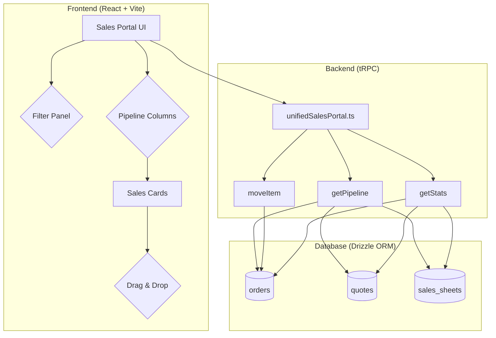

# Unified Sales Portal (USP) Architecture

**Version:** 1.0  
**Status:** Active  
**Last Updated:** December 23, 2025

## 1. Overview

The Unified Sales Portal (USP) provides a centralized, Kanban-style interface for managing the entire sales pipeline, from initial lead to final fulfillment. It consolidates previously fragmented tools into a single, intuitive workflow, improving efficiency and providing a holistic view of the sales process.

This document outlines the final, as-built architecture of the USP, including its key components, data models, and API endpoints. It serves as the single source of truth for the current implementation, superseding earlier design specifications.

## 2. System Architecture

The USP is composed of a frontend component built with React and a backend powered by a tRPC router. The architecture is designed to be modular and scalable, allowing for future enhancements.

### Deprecated Components

The following components from the original "Live Shopping" design have been **deprecated** and are not part of the current USP implementation:

- **Live Shopping Sessions:** The concept of real-time, collaborative shopping sessions has been deferred. The current focus is on a unified pipeline for existing sales entities.
- **Session-based Pricing:** All pricing is now based on the standard pricing rules. Session-specific overrides are not implemented.
- **Real-Time Sync Service:** As there are no live sessions, the WebSocket-based real-time synchronization is not required.

## 3. Data Model

The USP leverages existing data models for orders, quotes, and sales sheets. The key element is the use of status fields within these models to determine which pipeline stage an item belongs to.

- **`orders`:** The primary table for sales. The `orderStatus` and `orderType` fields are used to categorize items into the Sales and Fulfilled stages.
- **`quotes`:** Used for the Quotes stage.
- **`sales_sheets`:** Used for the Sales Sheets stage.

## 4. API Endpoints

The backend functionality is exposed through a single tRPC router, `unifiedSalesPortal.ts`.

### `getPipeline`

- **Description:** Fetches all items for the sales pipeline, applying specified filters.
- **Input:** `limit`, `cursor`, `includeDeleted`, `includeClosed`, `search`, `minValue`, `maxValue`, `dateFrom`, `dateTo`
- **Output:** A collection of sales sheets, quotes, and orders, categorized by pipeline stage.

### `moveItem`

- **Description:** Moves an item from one pipeline stage to another by updating its status.
- **Input:** `itemId`, `fromStage`, `toStage`
- **Output:** The updated item.

### `getStats`

- **Description:** Retrieves statistics for the pipeline, including the total number of items and their aggregate value for each stage.
- **Input:** None
- **Output:** An object containing counts and totals for each pipeline stage.

## 5. Frontend Components

- **Sales Portal UI:** The main container for the USP, including the stats cards and pipeline columns.
- **Filter Panel:** A collapsible panel containing controls for filtering the pipeline view.
- **Pipeline Columns:** Four columns representing the stages of the sales process: Sales Sheets, Quotes, Sales, and Fulfilled.
- **Sales Cards:** Individual cards representing items in the pipeline, displaying key information and allowing for drag-and-drop interaction.
- **Drag & Drop:** Implemented using a lightweight drag-and-drop library to allow users to move cards between columns.
