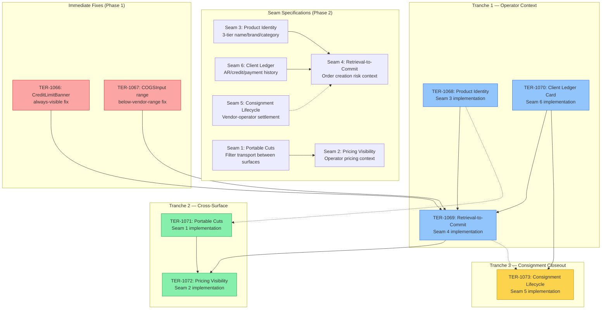

# P2 Dependency Graph

**Date**: 2026-04-07  
**Scope**: Phase 2 — Remaining work across 3 tranches + immediate fixes

---

## 1. Seam Dependency Diagram



---

## 2. Issue Mapping: Original → Tranche Structure

### Original Issues (TER-1047 to TER-1065)

| Original Issue | Title / Area                          | Maps To            | Tranche         |
| -------------- | ------------------------------------- | ------------------ | --------------- |
| TER-1047       | Credit limit always-visible in orders | TER-1066           | Immediate Fixes |
| TER-1048       | COGS below-vendor-range UX            | TER-1067           | Immediate Fixes |
| TER-1049       | Product identity 3-tier rendering     | TER-1068           | Tranche 1       |
| TER-1050       | Product identity in search results    | TER-1068           | Tranche 1       |
| TER-1051       | Order creator risk context card       | TER-1069           | Tranche 1       |
| TER-1052       | AR aging summary in orders            | TER-1069, TER-1070 | Tranche 1       |
| TER-1053       | Payment velocity display              | TER-1070           | Tranche 1       |
| TER-1054       | Client ledger card component          | TER-1070           | Tranche 1       |
| TER-1055       | Consignment batch indicator           | TER-1073           | Tranche 3       |
| TER-1056       | Consignment settlement flow           | TER-1073           | Tranche 3       |
| TER-1057       | Portable filter transport             | TER-1071           | Tranche 2       |
| TER-1058       | URL deep link filters                 | TER-1071           | Tranche 2       |
| TER-1059       | Pricing context in order creator      | TER-1072           | Tranche 2       |
| TER-1060       | Margin target comparison              | TER-1072           | Tranche 2       |
| TER-1061       | Historical price comparison           | TER-1072           | Tranche 2       |
| TER-1062       | Inventory velocity in browser         | TER-1072           | Tranche 2       |
| TER-1063       | Batch age in order context            | TER-1068           | Tranche 1       |
| TER-1064       | Saved view cross-surface              | TER-1071           | Tranche 2       |
| TER-1065       | Vendor payment status in orders       | TER-1073           | Tranche 3       |

### Tranche Issues (TER-1066 to TER-1076)

| Issue               | Title                                 | Seam | Dependencies                           | Effort |
| ------------------- | ------------------------------------- | ---- | -------------------------------------- | ------ |
| **Immediate Fixes** |                                       |      |                                        |        |
| TER-1066            | CreditLimitBanner always-visible      | S4   | None                                   | Small  |
| TER-1067            | COGSInput below-range UX improvements | S4   | None                                   | Small  |
| **Tranche 1**       |                                       |      |                                        |        |
| TER-1068            | Product Identity (Seam 3)             | S3   | None                                   | Medium |
| TER-1069            | Retrieval-to-Commit Context (Seam 4)  | S4   | TER-1066, TER-1067, TER-1068, TER-1070 | Large  |
| TER-1070            | Client Ledger Card (Seam 6)           | S6   | None                                   | Medium |
| **Tranche 2**       |                                       |      |                                        |        |
| TER-1071            | Portable Cuts (Seam 1)                | S1   | None (but benefits from TER-1068)      | Medium |
| TER-1072            | Pricing Visibility (Seam 2)           | S2   | TER-1069, TER-1071                     | Large  |
| **Tranche 3**       |                                       |      |                                        |        |
| TER-1073            | Consignment Lifecycle (Seam 5)        | S5   | TER-1070                               | Large  |

---

## 3. Critical Path Analysis

### Critical Path (longest dependency chain)

```
TER-1066 (Immediate) ──→ TER-1069 (Tranche 1) ──→ TER-1072 (Tranche 2)
         ↗                        ↗
TER-1067 (Immediate)    TER-1068 (Tranche 1)
                         TER-1070 (Tranche 1)
```

**Bottleneck:** TER-1069 (Retrieval-to-Commit) has the most inbound dependencies — it requires all immediate fixes and two other Tranche 1 items to be complete.

### Parallelization Opportunities

| Can Be Parallel      | Items                                                                    |
| -------------------- | ------------------------------------------------------------------------ |
| **Immediate fixes**  | TER-1066 ∥ TER-1067 (no dependency between them)                         |
| **Tranche 1 starts** | TER-1068 ∥ TER-1070 (independent of each other and of immediate fixes)   |
| **Tranche 2 starts** | TER-1071 can start once specs are done (no code dependency on Tranche 1) |
| **Tranche 3**        | TER-1073 can start design once TER-1070 (Client Ledger) is specced       |

### Recommended Execution Order

```
Week 1:  TER-1066 + TER-1067 (immediate fixes)
         TER-1068 start (product identity — no blockers)
         TER-1070 start (client ledger — no blockers)

Week 2:  TER-1068 complete
         TER-1070 complete
         TER-1069 start (retrieval-to-commit — all deps met)
         TER-1071 start (portable cuts — independent)

Week 3:  TER-1069 complete
         TER-1071 complete
         TER-1072 start (pricing visibility — deps met)

Week 4:  TER-1072 complete
         TER-1073 start (consignment — TER-1070 done)

Week 5:  TER-1073 complete
```

### Risk Factors

| Risk                                              | Severity | Mitigation                                               |
| ------------------------------------------------- | -------- | -------------------------------------------------------- |
| TER-1069 scope creep (Seam 4 has many gaps)       | High     | Audit document (seam4-audit.md) scopes what's in vs. out |
| TER-1073 requires schema changes for consignment  | Medium   | Start design early in Tranche 1 timeline                 |
| TER-1072 requires server-side pricing history API | Medium   | Spec API contract during Tranche 1                       |
| Two filter type systems complicate Seam 1         | Low      | Translation layer already designed in seam1-spec.md      |

---

## 4. Spec Document Map

| Document                         | Location                                      | Status           |
| -------------------------------- | --------------------------------------------- | ---------------- |
| Seam 4 Audit                     | `docs/initiatives/p2-tranche1/seam4-audit.md` | ✅ Complete      |
| Seam 3 Spec                      | `docs/initiatives/p2-tranche1/seam3-spec.md`  | ✅ Complete      |
| Seam 1 Spec                      | `docs/initiatives/p2-tranche2/seam1-spec.md`  | ✅ Complete      |
| Dependency Graph                 | `docs/initiatives/p2-dependency-graph.md`     | ✅ This document |
| Seam 2 Spec (Pricing Visibility) | TBD                                           | Pending          |
| Seam 5 Spec (Consignment)        | TBD                                           | Pending          |
| Seam 6 Spec (Client Ledger)      | TBD                                           | Pending          |
