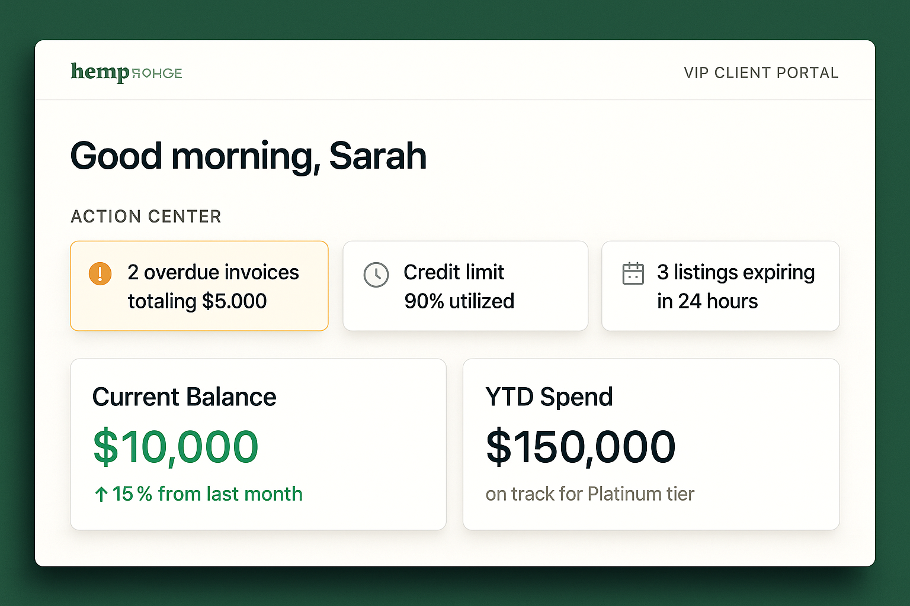
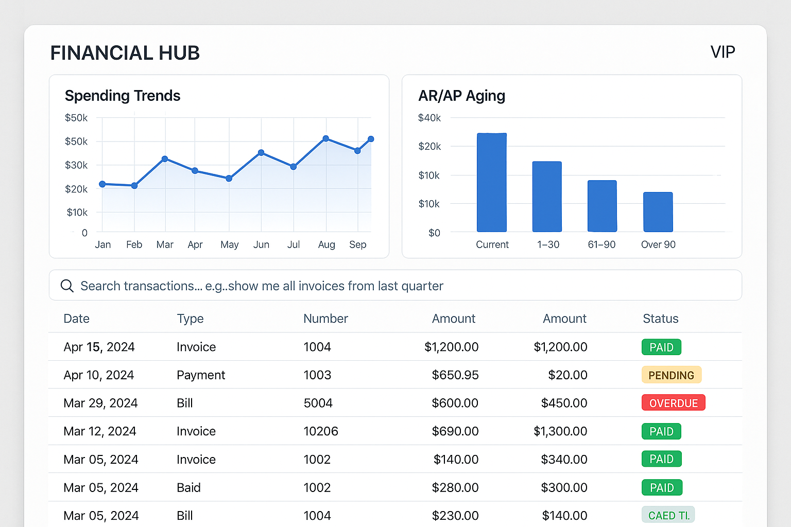
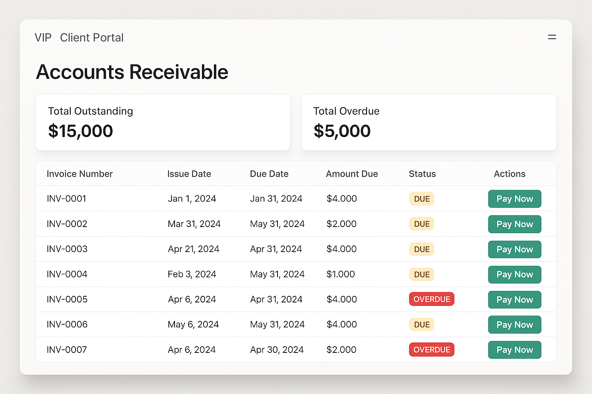
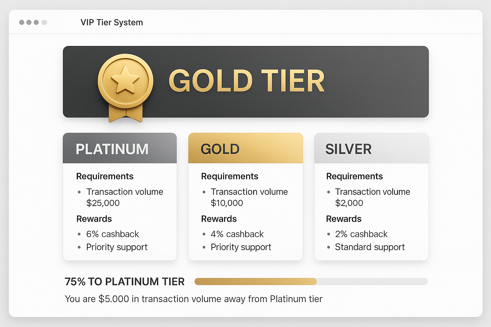
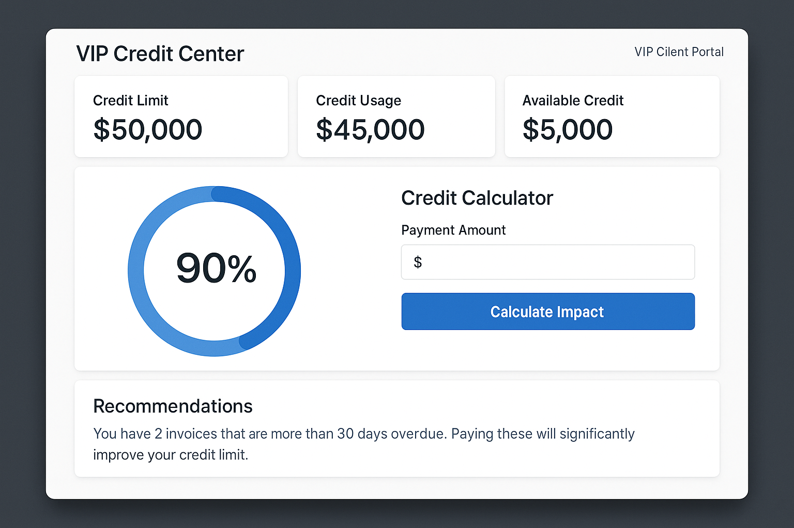
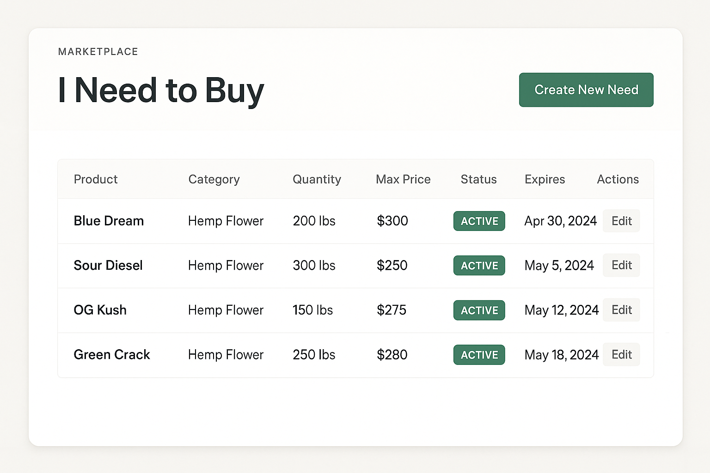
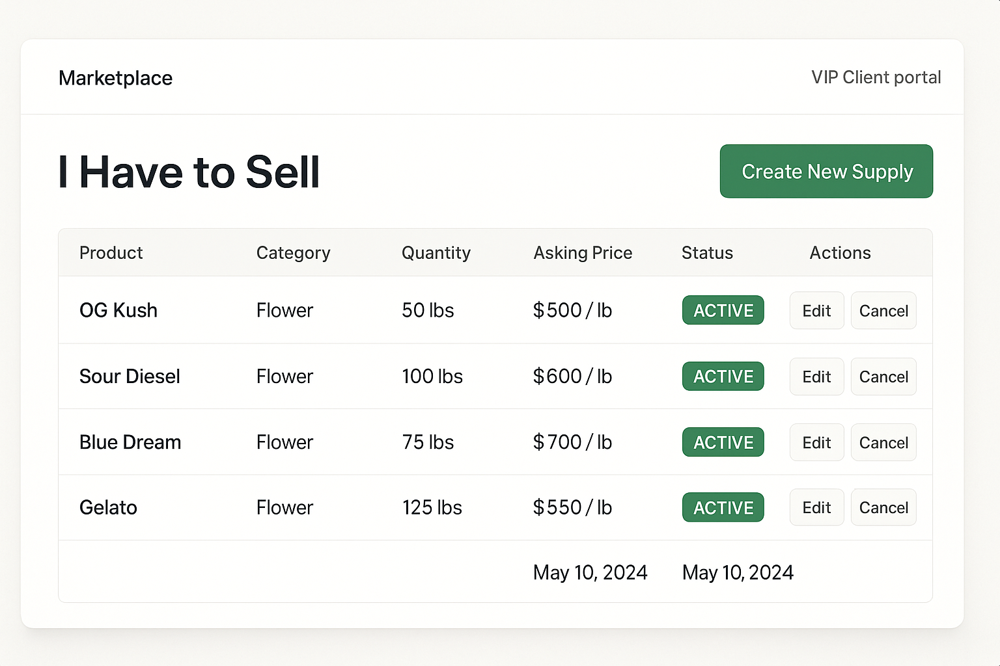
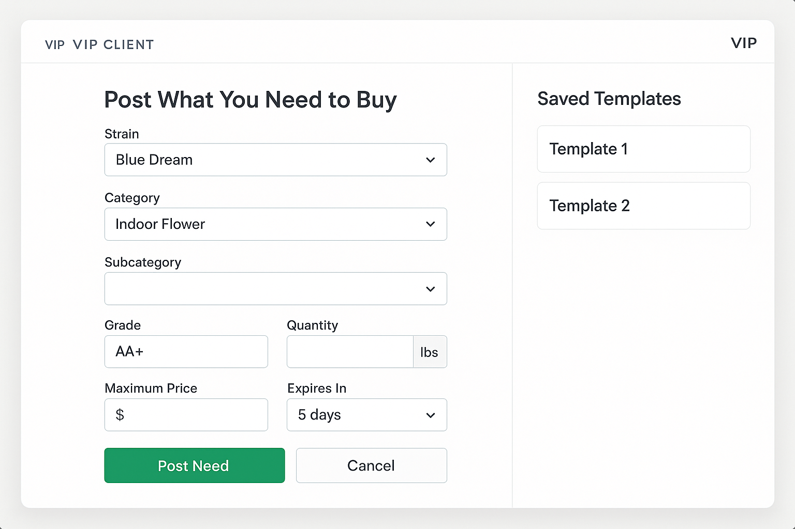
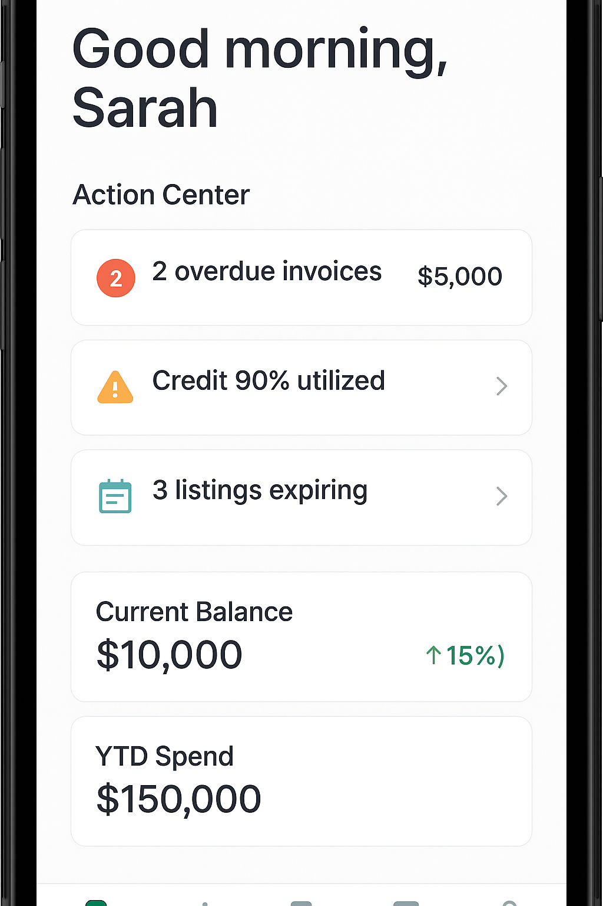
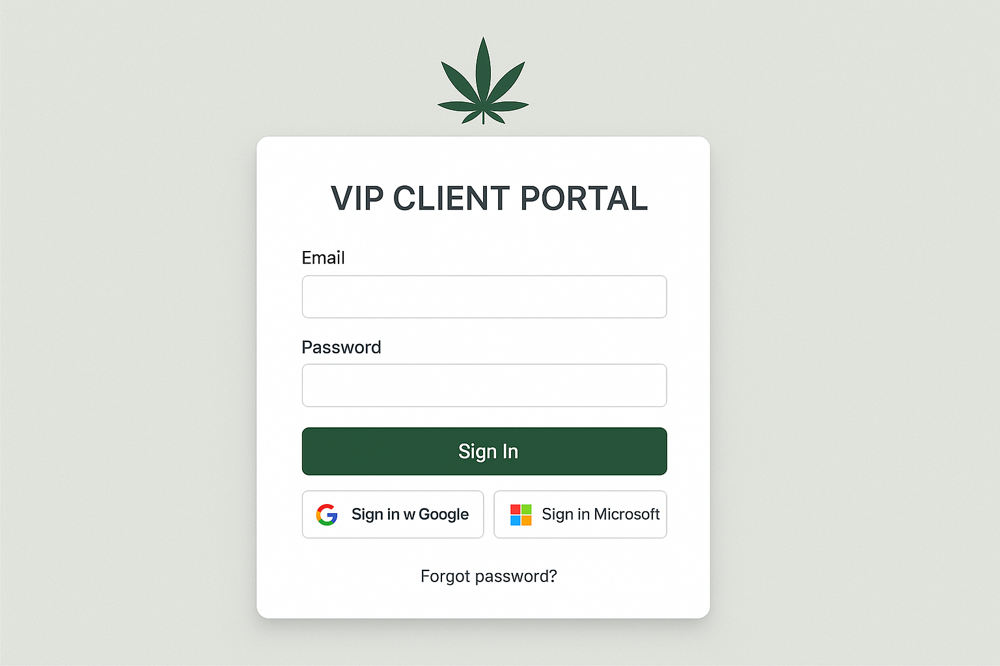

# VIP Client Portal - High-Resolution Mockups Overview

**Version:** 2.0  
**Author:** Manus AI  
**Date:** October 30, 2025

This document provides an overview of the high-resolution product mockups for the VIP Client Portal. These mockups visualize the key screens and user flows described in the feature specification.

---

## Mockup Gallery

### 1. Dashboard (Desktop)

The dashboard is the first screen clients see after logging in. It features a personalized greeting, an Action Center with urgent alerts, and contextual KPIs showing trends and progress toward VIP tiers.

**Key Features Shown:**
- Feature #11: Personalized Greeting
- Feature #12: Action Center - Overdue Invoices Alert
- Feature #13: Action Center - Credit Utilization Alert
- Feature #14: Action Center - Expiring Listings Alert
- Feature #15: Contextual KPI - Current Balance with Trend
- Feature #16: Contextual KPI - YTD Spend with Tier Progress

---

### 2. Financial Hub (Desktop)

The Financial Hub provides a comprehensive view of all financial data with interactive charts and a smart search feature for quick access to transaction history.

**Key Features Shown:**
- Feature #24: Spending Trends Chart
- Feature #25: AR/AP Aging Chart
- Feature #26: Smart Search - Natural Language
- Feature #18: Transaction History Table

---

### 3. Accounts Receivable (Desktop)

The Accounts Receivable page displays all outstanding invoices with clear status indicators and direct payment buttons for immediate action.

**Key Features Shown:**
- Feature #27: Accounts Receivable (AR) Table
- Feature #28: AR Summary Totals
- Feature #31: Direct Invoice Payment - Credit Card
- Feature #32: Direct Invoice Payment - ACH

---

### 4. VIP Tier System (Desktop)

The VIP Tier System page showcases the client's current tier status and provides a clear path to advancement with specific, data-driven recommendations.

**Key Features Shown:**
- Feature #33: VIP Tier Assignment
- Feature #34: Tier Status Display
- Feature #35: Tier Requirements Display
- Feature #36: Tier Rewards Display
- Feature #37: Tier Progress Indicator
- Feature #38: Data-Driven Tier Recommendations

---

### 5. Interactive Credit Center (Desktop)

The Interactive Credit Center provides transparency into credit status with an interactive calculator that allows clients to model the impact of payments on their credit limit.

**Key Features Shown:**
- Feature #39: Credit Limit Display
- Feature #40: Credit Usage Display
- Feature #41: Available Credit Display
- Feature #42: Credit Utilization Visual
- Feature #44: Interactive Credit Calculator
- Feature #45: Specific Credit Improvement Recommendations

---

### 6. Marketplace - I Need to Buy (Desktop)

The "I Need to Buy" page allows clients to view and manage their active buying needs with a clean, organized table layout.

**Key Features Shown:**
- Feature #46: My Needs Listings Table
- Feature #47: Create Need - Separate Form

---

### 7. Marketplace - I Have to Sell (Desktop)

The "I Have to Sell" page provides a dedicated space for clients to manage their supply listings with clear visibility into status and expiration.

**Key Features Shown:**
- Feature #60: My Supply Listings Table
- Feature #61: Create Supply - Separate Form

---

### 8. Create Need Form (Desktop)

The Create Need form demonstrates the streamlined, user-friendly interface for posting buying needs with intelligent defaults and saved templates.

**Key Features Shown:**
- Feature #48-54: Need Form Fields (Strain, Category, Subcategory, Grade, Quantity, Price, Expiration)
- Feature #55: Need Form - Default Expiration (5 days)
- Feature #56: Need Form - Intelligent Defaults
- Feature #57: Need Form - Saved Templates

---

### 9. Mobile Dashboard (Mobile)

The mobile dashboard demonstrates the portal's mobile-first responsive design with a vertically stacked layout optimized for smaller screens.

**Key Features Shown:**
- Feature #74: Mobile-First Responsive Design
- Feature #11: Personalized Greeting
- Feature #12-14: Action Center Alerts
- Feature #15-16: Contextual KPIs

---

### 10. Login Page (Desktop)

The login page provides a clean, professional entry point to the portal with modern authentication options including SSO.

**Key Features Shown:**
- Feature #1: Password Login
- Feature #2: Single Sign-On (SSO) - Google
- Feature #3: Single Sign-On (SSO) - Microsoft
- Feature #10: Password Reset Flow

---

## Design Principles

The mockups demonstrate the following design principles:

1. **Clarity and Simplicity:** Clean layouts with clear visual hierarchy guide users to the most important information.
2. **Action-Oriented:** Prominent calls-to-action (CTAs) like "Pay Now" and "Create New Need" encourage engagement.
3. **Data Visualization:** Charts and progress bars make complex financial data easy to understand at a glance.
4. **Mobile-First:** The responsive design ensures a seamless experience across all devices.
5. **Professional Aesthetic:** The color scheme and typography convey professionalism and trustworthiness.

---

## Next Steps

These mockups serve as a visual guide for the development team. The next phase will involve translating these designs into functional components using React, TypeScript, and Tailwind CSS, following the technical specifications outlined in the feature specification document.
