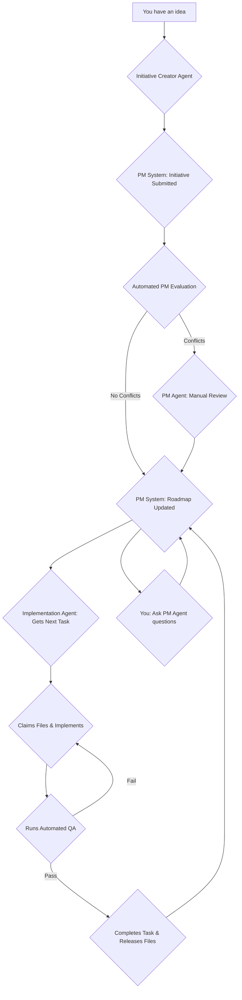

# The Three-Agent Autonomous Development Pipeline (v2)

**A complete guide to using the Initiative Creator, Project Manager, and Implementation Agent workflow for fully autonomous development with automated QA and conflict prevention.**

**Version**: 2.0  
**Created**: November 3, 2025

---

## Overview

This guide outlines a powerful three-agent workflow that enables a fully autonomous development pipeline. It has been enhanced with automated QA, conflict prevention, and a truly autonomous PM system.

**Key Enhancements in v2**:
- **Automated PM Evaluation**: New initiatives are automatically evaluated for conflicts and priority.
- **File Locking System**: Prevents multiple agents from editing the same files.
- **Automated QA Checklist**: Enforces quality standards before an initiative can be completed.
- **Autonomous Task Assignment**: Implementation Agents get their next task automatically.
- **Feedback Loop**: Initiative Creators get immediate feedback on where their idea fits in the roadmap.

**The Three Agents**:

1.  **Initiative Creator Agent**: Takes your high-level ideas and transforms them into well-documented initiatives ready for evaluation.
2.  **Project Manager (PM) Agent**: Acts as the central coordinator, handling manual reviews and providing strategic oversight.
3.  **Implementation Agent**: Autonomously picks up tasks, implements them with full QA, and updates the system upon completion.

**The Workflow (v2)**:

---

## Agent 1: The Initiative Creator (v2)

**Purpose**: To take your raw ideas and create detailed, well-documented initiatives that can be automatically evaluated by the PM system.

### How to Use

1.  Start a new chat session.
2.  Use the `initiative-creator-agent-context-v2.md` prompt.
3.  Provide your idea.
4.  The agent will generate all necessary documentation.
5.  Once you approve, tell the agent: **"Submit this to the PM system."**
6.  The agent will submit the initiative and then **wait for the automated evaluation to complete**. It will then report back with the results.

### The Prompt (v2)

(See `_system/chat-contexts/initiative-creator-agent-context-v2.md`)

---

## Agent 2: The Project Manager (PM) (v2)

**Purpose**: To provide strategic oversight and handle exceptions. Most of the PM work is now automated.

### How to Use

1.  Start a dedicated chat session for project management.
2.  Use the `pm-agent-context-v2.md` prompt.
3.  The PM agent will now mostly be in a monitoring and exception-handling role.

### Key Responsibilities (v2)

- **Handle Manual Reviews**: You only need to get involved when the automated evaluation detects a conflict.
- **Strategic Oversight**: Use the `roadmap-optimizer.py` to run different scenarios and make high-level adjustments to the roadmap.
- **Answer Questions**: Provide you with insights into the project's status, roadmap, and any potential issues.

### The Prompt (v2)

(See `_system/chat-contexts/pm-agent-context-v2.md`)

---

## Agent 3: The Implementation Agent (v2)

**Purpose**: To autonomously implement tasks from the roadmap with built-in quality assurance and conflict prevention.

### How to Use

1.  Start a new chat session for an implementation agent.
2.  Use the `implementation-agent-context-v2.md` prompt.
3.  The agent will then start working on the next available task from the roadmap.

### Key Enhancements in Workflow (v2)

- **Gets Task Automatically**: Runs `pm-evaluator.py get-next-task` to get its assignment.
- **Claims Files**: Uses `file-locker.py claim` to prevent merge conflicts.
- **Runs Automated QA**: Must run `qa-checklist.py run-qa` and get a passing grade before completing the task.
- **Releases Files**: Uses `file-locker.py release` when finished.

### The Prompt (v2)

(See `_system/chat-contexts/implementation-agent-context-v2.md`)

---

## New and Updated Scripts

- **`file-locker.py` (New)**: Manages file locks to prevent conflicts.
- **`pm-auto-evaluator.py` (New)**: Automatically evaluates new initiatives.
- **`qa-checklist.py` (New)**: Runs automated quality checks.
- **`pm-evaluator.py` (Updated)**: Now includes `get-next-task` command.
- **`status-tracker.py` (Updated)**: Now integrated with the auto-evaluator.

---

## Conclusion

This v2 workflow addresses the critical gaps identified in the initial design. It is a more robust, resilient, and truly autonomous system that ensures quality and prevents common multi-agent development issues. It is now ready for production use.
